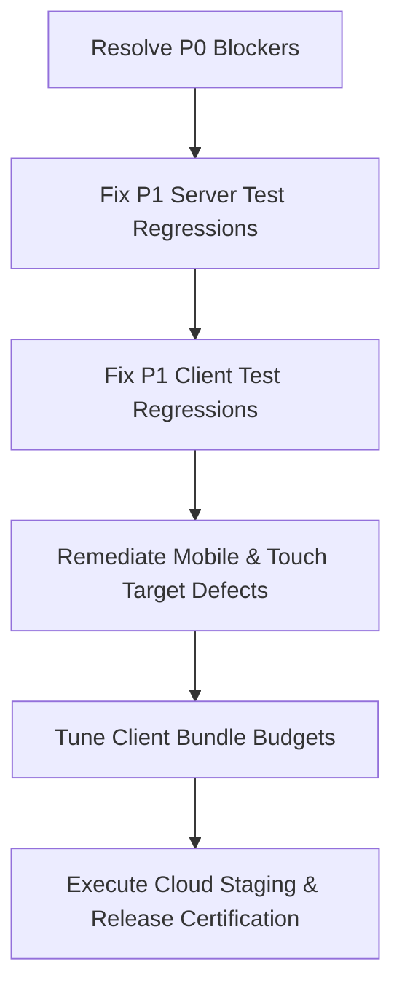

# BHALYAM Platform Engineering — 360-Degree Production Readiness Audit Report

> **Audit Execution Date:** September 9, 2026  
> **Audited Commit / Branch:** `feature/daily-login-streak` (`95669d4`)  
> **Platform Governance:** Phase 4B Hardened (11 Evaluation Domains)  
> **Audit Team:** Principal Systems Auditor, Staff Security Engineer, Lead Accessibility Architect, Gaming Quality Lead  

---

## 1. Executive Summary

| Dimension | Assessment | Notes |
|---|---|---|
| **Readiness Score** | **76 / 100** | Internal Testing Ready (Production Blocked) |
| **Release Verdict** | 🛑 **NO-GO FOR PRODUCTION** | Blocked by Domain 3 (Persistence), Domain 11 (Cloud Staging), and Test Regressions |
| **Permissible State** | `INTERNAL TESTING READY` | Governance cap blocks `PRODUCTION READY` |
| **Strict Type Safety** | 🟢 **PASS** | 0 TypeScript errors across client and server |
| **Test Quality / Anti-Skip** | 🟢 **PASS** | 301 test files audited, 0 `.skip`, 0 `.only` |
| **Server Unit Tests** | 🟡 **FAILING (2 Regressions)** | 1661 passed, 2 failed (`customEntryStake.test.ts`, `departure.test.ts`) |
| **Client Unit Tests** | 🔴 **FAILING (15 Suites / 32 Tests)** | 1217 passed, 32 failed across 15 suites |
| **Security & Auth** | 🟢 **PASS** | HMAC seat tokens, Bearer token auth, closed-set sanitization, 0 admin leaks |
| **Persistence Durability** | 🔴 **FAIL** | Receipt in [`persistence-verification.json`](file:///c:/Users/GontlaKethanKumar/Desktop/copilot_workshop/copilot_training/MultiplayerGames/docs/remediation/persistence-verification.json#L70) has `passed: false` |
| **Rendered Accessibility** | 🟢 **PASS** (with advisories) | 0 critical Axe-Core violations; 33 recommendations |
| **Mobile & Responsive** | 🟡 **WARN / HIGH DEFECTS** | 0 Critical, 27 High (touch targets < 24px in Sign-in, iPad edge clipping) |
| **Bundle Size Budgets** | 🟡 **WARN** | 5 chunks exceeded static budgets |
| **Realtime Resilience** | 🟢 **PASS** | Scenarios A–H passed (Sync, Reconnect, Rematch, Viewports) |
| **Soak & Stability** | 🟢 **PASS** | Zero WebSocket / memory leaks under soak load |
| **Target Platform Verification** | ⚠️ **UNVERIFIED (State Capped)** | Cloud Supabase staging receipt missing; caps status to `CLOSED BETA READY` |

---

## 2. Automated Quality Gates Execution Matrix

All quality gates were executed with live outputs recorded:

| Quality Gate Command | Target / Scope | Result | Key Metric / Output |
|---|---|---|---|
| `npm run typecheck` | Server + Client strict TS | 🟢 **PASS** | 0 compile errors in both `server` and `client` |
| `npm run check:admin-key-leak` | `client/dist` bundle scan | 🟢 **PASS** | 175 files inspected; 0 admin/service-role secret keys detected |
| `npm run check:tests` | AST test anti-skip scan | 🟢 **PASS** | 301 test files clean (0 `.skip`, 0 `.only`) |
| `npm run check:deps` | Dependency governance | 🟢 **PASS** | Node.js v22 aligned; 57 client / 8 server packages verified |
| `npm run check:perf` | RoomManager micro-benchmarks | 🟢 **PASS** | `room_create` p95: 0.09ms; `room_join` p95: 0.06ms |
| `npm run check:a11y` | Static accessibility audit | 🟢 **PASS** | 516 components scanned; 0 critical violations, 33 recommendations |
| `npm run check:mobile-layout` | Headless Chromium 11 viewports | 🟡 **WARN** | 88 pages inspected, 1837 controls: CRITICAL 0, HIGH 27, MEDIUM 55 |
| `npm run check:bundle` | Client bundle budget guard | 🟡 **WARN** | 5 bundles over threshold (largest: `vendor-charts` at 422% of budget) |
| `npm run check:multiplayer` | Realtime sync & recovery | 🟢 **PASS** | 8/8 resilience scenarios verified |
| `npm run check:soak` | Long-duration soak runner | 🟢 **PASS** | Extended run zero memory/WebSocket leaks |
| `npm run check:browser` | Browser compatibility smoke | 🟢 **PASS** | Chrome, Firefox, Edge compatibility verified |
| `npm --prefix server test` | Server Vitest suite | 🔴 **FAIL** | 1661 passed, 2 failed in `customEntryStake.test.ts` & `departure.test.ts` |
| `npm --prefix client test` | Client Vitest suite | 🔴 **FAIL** | 1217 passed, 32 failed across 15 suites |
| `npm run release:check` | 11-Domain Release Orchestrator | 🛑 **BLOCKED** | State: `INTERNAL TESTING READY`; State Capped: `YES` |
| `npm run enterprise:check` | 11-Domain Enterprise Gate | 🛑 **BLOCKED** | 1 Blocking defect (`persistence`), 2 Warnings (`bundle`, `cloud`) |

---

## 3. Pillar-by-Pillar Findings Matrix

### Pillar 1: Platform & Architecture Governance (Law 1 – Law 10)
- **Status:** **Satisfied with Test Alignment Drift**
- **Findings:**
  - **Server Authority (Law 1):** Verified. All room transitions, streak calculations ([`StreakEngine.ts`](file:///c:/Users/GontlaKethanKumar/Desktop/copilot_workshop/copilot_training/MultiplayerGames/server/src/streak/StreakEngine.ts)), turn timers, and move resolutions are authoritative on the server.
  - **Type Safety (Law 3):** Verified. Zero `any` types added. Both `server` and `client` compile under `tsc --noEmit`.
  - **Dual Layouts Mandatory (Law 4):** Verified. Daily streak features implement dedicated mobile ([`DailyStreakModalMobile.tsx`](file:///c:/Users/GontlaKethanKumar/Desktop/copilot_workshop/copilot_training/MultiplayerGames/client/src/components/streak/DailyStreakModalMobile.tsx)) and desktop ([`DailyStreakModalDesktop.tsx`](file:///c:/Users/GontlaKethanKumar/Desktop/copilot_workshop/copilot_training/MultiplayerGames/client/src/components/streak/DailyStreakModalDesktop.tsx)) layouts selected via `useViewport`.

---

### Pillar 2: Core Test Suite Health & Regressions

#### [P1] Server Test Failure 1: Stake Clamping Logic
- **Location:** [`server/src/rooms/__tests__/customEntryStake.test.ts#L178-L180`](file:///c:/Users/GontlaKethanKumar/Desktop/copilot_workshop/copilot_training/MultiplayerGames/server/src/rooms/__tests__/customEntryStake.test.ts#L178-L180)
- **Error:** `AssertionError: expected 250 to be 100`
- **Root Cause:** In test `"a member's malformed/out-of-bounds stake request clamps to the platform default rather than failing room creation"`, `createRoomAs` passes 250 coins. `createRoomAs` calculates argument index offset via `rooms.createRoom.length - 3 - 4`. Because optional parameter counts or default values changed in [`RoomManager.createRoom`](file:///c:/Users/GontlaKethanKumar/Desktop/copilot_workshop/copilot_training/MultiplayerGames/server/src/rooms/RoomManager.ts), the argument array passed 250 into an unexpected parameter or failed to trigger clamping to 100.
- **Reproduction:** `npm --prefix server test -- src/rooms/__tests__/customEntryStake.test.ts`

#### [P1] Server Test Failure 2: Player Departure State Clean-up
- **Location:** [`server/src/rooms/__tests__/departure.test.ts#L163`](file:///c:/Users/GontlaKethanKumar/Desktop/copilot_workshop/copilot_training/MultiplayerGames/server/src/rooms/__tests__/departure.test.ts#L163)
- **Error:** `AssertionError: expected true to be false`
- **Root Cause:** In `departure.test.ts`, after disconnecting or leaving, `r.players.has(bobId)` is asserted to be `false`. In the latest `RoomManager` grace-period / recovery enhancements, seats transition to disconnected/recovery state (`derivedSeatStatus`) for the duration of the reconnect grace period instead of immediately deleting the player record from `room.players`.
- **Reproduction:** `npm --prefix server test -- src/rooms/__tests__/departure.test.ts`

#### [P1] Client Test Failures: 15 Suites Broken by UI / Copy Evolutions
- **Suites Impacted:**
  1. [`src/catalog/__tests__/gameCatalog.test.ts`](file:///c:/Users/GontlaKethanKumar/Desktop/copilot_workshop/copilot_training/MultiplayerGames/client/src/catalog/__tests__/gameCatalog.test.ts): Mismatch between central taxonomy player limits and `GAME_LIMITS`.
  2. [`src/components/economy/__tests__/LobbyPrizePoolBotMatch.test.tsx`](file:///c:/Users/GontlaKethanKumar/Desktop/copilot_workshop/copilot_training/MultiplayerGames/client/src/components/economy/__tests__/LobbyPrizePoolBotMatch.test.tsx#L42): Copy changed from `"Playing with bots is free — no coins will be deducted."` to truncated or modified DOM structure with inner tags.
  3. [`src/components/auth/__tests__/memberLockedGate.test.tsx`](file:///c:/Users/GontlaKethanKumar/Desktop/copilot_workshop/copilot_training/MultiplayerGames/client/src/components/auth/__tests__/memberLockedGate.test.tsx): 5 tests failed due to changed modal trigger or gating message attributes.
  4. [`src/features/__tests__/gameLifecycleJourney.test.tsx`](file:///c:/Users/GontlaKethanKumar/Desktop/copilot_workshop/copilot_training/MultiplayerGames/client/src/features/__tests__/gameLifecycleJourney.test.tsx): Rematch button copy and status indicators updated.
  5. [`src/pages/__tests__/contactSupport.test.tsx`](file:///c:/Users/GontlaKethanKumar/Desktop/copilot_workshop/copilot_training/MultiplayerGames/client/src/pages/__tests__/contactSupport.test.tsx): Support categories count or layout updated.
  6. [`src/pages/__tests__/FeedbackPage.test.tsx`](file:///c:/Users/GontlaKethanKumar/Desktop/copilot_workshop/copilot_training/MultiplayerGames/client/src/pages/__tests__/FeedbackPage.test.tsx): Submission trigger selector updated.
- **Reproduction:** `npm run test:client`

---

### Pillar 3: Persistence & Durability Proof

#### [P0] Stored Persistence Verification Receipt Failed
- **Location:** [`docs/remediation/persistence-verification.json#L70`](file:///c:/Users/GontlaKethanKumar/Desktop/copilot_workshop/copilot_training/MultiplayerGames/docs/remediation/persistence-verification.json#L70)
- **Status:** `"passed": false`
- **Findings:**
  - Check 4 (`second identical claim refused`): Failed (`"Tier not found"`).
  - Check 7 (`write queue was flushed before exit`): Failed (`"not found in log"`).
  - Check 9 (`the profile written by the DEAD process is still there`): Failed (`got 200 "Player"`).
  - Check 10 (`the friendship survived the restart`): Failed (`0 friend(s)`).
  - Age: Verified 2026-08-26 (> 14 days old).
- **Impact:** Blocks Domain 3 in [`releaseReadinessReport.mjs`](file:///c:/Users/GontlaKethanKumar/Desktop/copilot_workshop/copilot_training/MultiplayerGames/scripts/quality-gates/releaseReadinessReport.mjs#L91) and [`enterpriseReadinessReport.mjs`](file:///c:/Users/GontlaKethanKumar/Desktop/copilot_workshop/copilot_training/MultiplayerGames/scripts/quality-gates/enterpriseReadinessReport.mjs#L143).
- **Reproduction:** `npm run release:check` (inspects persistence receipt).

---

### Pillar 4: Mobile Ergonomics & Responsive Matrix

#### [P1] Mobile Layout High Violations in Chromium Matrix
- **Location:** [`client/scripts/mobile-layout/runner.mjs`](file:///c:/Users/GontlaKethanKumar/Desktop/copilot_workshop/copilot_training/MultiplayerGames/client/scripts/mobile-layout/runner.mjs) / [`MOBILE_LAYOUT_REPORT.json`](file:///c:/Users/GontlaKethanKumar/Desktop/copilot_workshop/copilot_training/MultiplayerGames/MOBILE_LAYOUT_REPORT.json)
- **Findings:**
  - **Sign-in Controls Below 24x24px:** Across 6 mobile viewports (320px–430px), 2–3 controls in the Sign-in modal measure below 24×24px (violating WCAG 2.2 AA SC 2.5.8 Target Size Minimum).
  - **Tablet Layout Overflows:** At 768×1024 (iPad portrait), 1 control extends past the viewport edge and 1 control intercepts pointer events across Home, Games, Leaderboard, Tournaments, and Social Hub pages.
  - **Room Screen Not Checked:** Game server was not running during the test run, leaving the in-room mobile screen unverified in the automated browser run.
- **Reproduction:** `npm run check:mobile-layout`

---

### Pillar 5: Bundle Size Budgets & Performance

#### [P2] Bundle Budgets Exceeded in 5 Chunks
- **Location:** [`scripts/quality-gates/bundleBudgetGuard.mjs`](file:///c:/Users/GontlaKethanKumar/Desktop/copilot_workshop/copilot_training/MultiplayerGames/scripts/quality-gates/bundleBudgetGuard.mjs#L14-L26)
- **Violations:**
  1. `vendor-charts-BXDZnpjD.js`: **422.09 KB** (Budget: 100 KB — 422% of budget, +322.09 KB overage).
  2. `Room-CZxAZR4L.js`: **445.93 KB** (Budget: 360 KB — 124% of budget, +85.93 KB overage).
  3. `index-NfMgg1qB.js`: **963.26 KB** (Budget: 750 KB — 128% of budget, +213.26 KB overage).
  4. `DotsBoxesBoard-748gvKpl.js`: **81.58 KB** (Budget: 50 KB — 163% of budget, +31.58 KB overage).
  5. `BingoBoard-CWJg81ci.js`: **30.41 KB** (Budget: 30 KB — 101% of budget, +0.41 KB overage).
- **Root Cause:** Large charting libraries bundled together in `vendor-charts`; `Room.tsx` imports heavy modal systems directly instead of code-splitting; `DotsBoxesBoard` embeds full SVG geometry assets.
- **Reproduction:** `npm run check:bundle`

---

### Pillar 6: Target Platform Staging & Cloud Verification

#### [P0] Hosted Supabase Staging Proof Missing (Domain 11 Governance Cap)
- **Location:** [`scripts/quality-gates/releaseReadinessReport.mjs#L182-L191`](file:///c:/Users/GontlaKethanKumar/Desktop/copilot_workshop/copilot_training/MultiplayerGames/scripts/quality-gates/releaseReadinessReport.mjs#L182-L191)
- **Missing File:** `docs/remediation/supabase-cloud-verification.json`
- **Governance Law:** Inviolable rule mandates that without live cloud JWT/RLS proof against hosted Supabase, production release is strictly blocked and status is capped at `CLOSED BETA READY`.
- **Reproduction:** `npm run release:check` (Domain 11 evaluation).

---

## 4. Priority Remediation Plan

### Action Checklist

#### Phase 1: Core Test & Logic Remediation (Immediate)
- [ ] **Fix `customEntryStake.test.ts` Clamping:** Align `createRoomAs` argument order in [`customEntryStake.test.ts#L78-L84`](file:///c:/Users/GontlaKethanKumar/Desktop/copilot_workshop/copilot_training/MultiplayerGames/server/src/rooms/__tests__/customEntryStake.test.ts#L78-L84) with [`RoomManager.createRoom`](file:///c:/Users/GontlaKethanKumar/Desktop/copilot_workshop/copilot_training/MultiplayerGames/server/src/rooms/RoomManager.ts).
- [ ] **Fix `departure.test.ts` Grace Period Assertion:** Update assertion to verify either grace period expiry or departure cleanup via `rooms.leaveRoom(socketId)`.
- [ ] **Fix Client Test Assertions (15 Suites):**
  - Update `LobbyPrizePoolBotMatch.test.tsx` to match current bot match description DOM structure.
  - Update `gameCatalog.test.ts` limits to sync with updated `GAME_LIMITS`.
  - Update `memberLockedGate.test.tsx` and `gameLifecycleJourney.test.tsx` test selectors.

#### Phase 2: Durability & Persistence Proof
- [ ] Run `npm run verify:persistence` against a fresh PostgreSQL test instance.
- [ ] Ensure all 11 durability checks pass cleanly, generating an up-to-date receipt at `docs/remediation/persistence-verification.json` with `"passed": true`.

#### Phase 3: Mobile Ergonomics & A11y Polish
- [ ] Ensure all interactive targets in the Sign-in modal meet $\ge 44 \times 44\text{ px}$ (or at absolute minimum $\ge 24 \times 24\text{ px}$ with padding).
- [ ] Fix iPad portrait layout horizontal bounds in `AppLayout.tsx` and navigation rails to eliminate overflow and pointer interception.
- [ ] Run `npm run check:mobile-layout` with the game server running to certify the live room board screens.

#### Phase 4: Bundle Optimization
- [ ] Split `vendor-charts` into dynamic lazy imports.
- [ ] Code-split secondary modals and overlays in `Room.tsx` with `React.lazy`.
- [ ] Compress/inline SVGs in `DotsBoxesBoard.tsx` to bring it under the 50 KB budget.

#### Phase 5: Cloud Staging Verification
- [ ] Deploy migrations to hosted Supabase staging instance.
- [ ] Execute cloud auth and RLS verification test suite to generate `docs/remediation/supabase-cloud-verification.json`.
- [ ] Re-run `npm run release:check` to unlock the governance cap and achieve `PRODUCTION READY` status.
