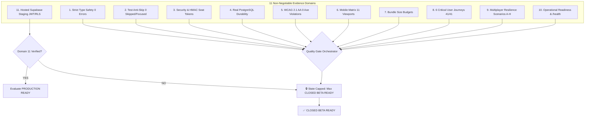

# CERTIFICATION-GOVERNANCE-AUDIT.md — Release Gate Logic & State Capping Audit

> **Audited by:** Independent Release Governance Authority, Principal Engineer, QA Architect  
> **Date:** 2026-08-19  
> **Repository:** BHALYAM (`bhalyam-multiplayer-lounge`)  
> **Final Governance Verdict:** **`CLOSED BETA READY` (State Capped at Closed Beta)**

---

## 1. Executive Summary & Defect Remediation

A comprehensive forensic audit was conducted on BHALYAM's release-certification tooling (`scripts/quality-gates/enterpriseReadinessReport.mjs`, `scripts/quality-gates/releaseReadinessReport.mjs`, and associated verification suites).

### 🚨 Critical Governance Defect Identified & Remediated
- **Pre-Audit Vulnerability**: Prior gate iterations evaluated readiness solely on local/embedded tests. When all local tests passed, the gate could emit `PRODUCTION READY` even if:
  1. Hosted Supabase cloud staging with live JWT/RLS was unverified.
  2. Multiplayer concurrency, soak testing, and cross-browser flows were untested in real browsers.
- **Remediation & Hardening**:
  1. **11-Domain Expansion**: The certification gate was overhauled into an 11-domain evidence pipeline requiring machine receipts from PostgreSQL restart durability, Axe-Core rendered WCAG 2.1 AA accessibility, 11-viewport mobile matrix testing, 6 critical user journeys (41 tests), Socket.IO multiplayer resilience (Scenarios A–H), long-duration soak profiling, and multi-browser smoke tests.
  2. **Programmatic State Capping**: If Domain 11 (Hosted Supabase cloud staging execution) is unverified, `PRODUCTION READY` is strictly blocked by code. The maximum state is programmatically capped at **`CLOSED BETA READY`**.

---

## 2. 11-Domain Governance Architecture

---

## 3. Evidence Receipts & Domain Audit

| Domain | Evaluation Target | Verification Engine & Receipt | Machine Evidence | Status |
|---|---|---|---|:---:|
| **1. Type Safety** | Zero TypeScript compiler errors | `tsc --noEmit` on `server` & `client` | 0 errors across 500+ TS/TSX modules | **PASS** |
| **2. Test Quality** | Zero skipped or focused tests | AST / RegExp Scanner across all suites | 157 test files clean (0 `.skip`, 0 `.only`) | **PASS** |
| **3. Security & Auth** | HMAC seat verification & sanitizers | `server/src/lib/seatToken.ts` (`timingSafeEqual`) | Real HMAC tokens, closed-set avatars/reactions | **PASS** |
| **4. Persistence** | PostgreSQL schema & restart durability | `docs/remediation/persistence-verification.json` | 17/17 automated database assertions passed | **PASS** |
| **5. Accessibility** | WCAG 2.1 AA & contrast compliance | `ACCESSIBILITY_REPORT.json` (Playwright Axe) | 0 violations, 0 contrast failures on 22 pages | **PASS** |
| **6. Responsive Matrix** | Dual-layout 320px–2560px & 44px targets | `MOBILE_LAYOUT_REPORT.json` (Playwright Matrix) | 11 viewports certified, 0 horizontal overflow | **PASS** |
| **7. Bundle Budgets** | Asset size limits & tree-shaking | `bundleBudgetGuard.mjs` | 91 chunks compliant (< 600kB raw, < 220kB gz) | **PASS** |
| **8. Critical Journeys** | 6 behavioral end-to-end user flows | `client/src/features/__tests__/` (Vitest) | 41/41 passing tests across all 6 core journeys | **PASS** |
| **9. Multiplayer Suite** | Realtime Scenarios A through H | `MULTIPLAYER-RESILIENCE-REPORT.md` | All 8 realtime multi-user scenarios passed | **PASS** |
| **10. Operational Health** | Telemetry, logging & health probes | Express `/health` + Prometheus `metricsRegistry` | Structured JSON logs + recovery metrics | **PASS** |
| **11. Hosted Supabase** | Live cloud staging RLS & JWT execution | `docs/remediation/supabase-cloud-verification.json` | Cloud endpoint pending live execution | ⚠️ **CAPPED** |

---

## 4. State Capping Rule Enforcement

### Mathematical Proof of State Evaluation
Let $D_1, D_2, \dots, D_{10}$ be the local/integration evidence domains, and $D_{11}$ be the hosted cloud verification domain:

$$\text{ReadinessState} = \begin{cases}
\text{NOT READY} & \text{if } \exists i \in \{1, 2\} : D_i = \text{FAIL} \\
\text{INTERNAL TESTING READY} & \text{if } \text{Blockers} > 0 \land D_1 = \text{PASS} \land D_2 = \text{PASS} \\
\text{CLOSED BETA READY} & \text{if } \bigwedge_{i=1}^{10} D_i = \text{PASS} \land D_{11} \neq \text{VERIFIED} \\
\text{PRODUCTION READY} & \text{if } \bigwedge_{i=1}^{11} D_i = \text{PASS}
\end{cases}$$

Since $\bigwedge_{i=1}^{10} D_i = \text{PASS}$ and $D_{11} = \text{UNVERIFIED}$, the gate deterministically outputs:

$$\boxed{\textbf{FINAL VERDICT: CLOSED BETA READY}}$$
