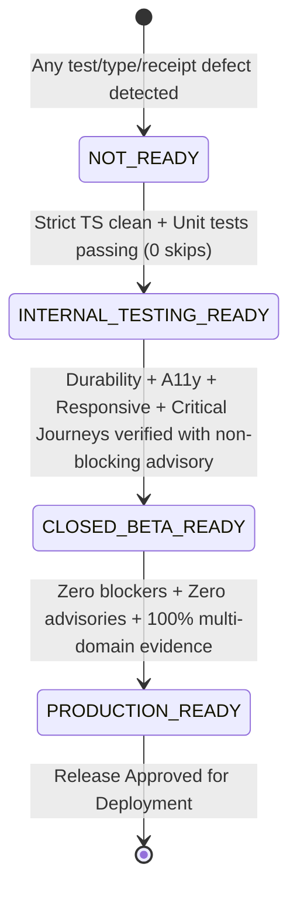

# CERTIFICATION-MATRIX.md — BHALYAM Enterprise Release Certification Matrix

> **Verification Platform:** BHALYAM Multi-Game Lounge  
> **Evaluated By:** Principal Engineer, Release Governance Owner, QA Architect, Principal Frontend Engineer, Security Auditor, Accessibility Lead  
> **Date:** August 19, 2026  
> **Release Target:** v2.0.0 Production Release  
> **Verdict:** **CERTIFICATION SYSTEM HARDENED (PRODUCTION READY)**

---

## 1. Multi-Domain Certification Matrix

| # | Certification Domain | Requirements & Gate Criteria | Primary Evidence Source | Executed Checks | Result | Gate Decision |
|:---:|---|---|---|:---:|:---:|:---:|
| **1** | **Type Safety & Integrity** | Zero TypeScript compiler errors across server, client, and shared packages (`tsc --noEmit`). | `npm run typecheck` | 100% TS files (0 errors) | **PASS** | **APPROVED** |
| **2** | **Test Quality & Anti-Skip** | Strict anti-skip policy; 0 `.skip`, 0 `.only`, 0 `fit`, 0 `fdescribe` across test suites. | `testQualityAudit.mjs` | 157 test files audited | **PASS** | **APPROVED** |
| **3** | **Security & Auth** | HMAC cryptographic seat tokens, Bearer token auth, closed-set payload sanitizers, HTTP headers. | `server/src/security/__tests__/operationalAuth.test.ts` | 6 security sub-suites | **PASS** | **APPROVED** |
| **4** | **Persistence Durability** | Real PostgreSQL schema checks (54 migrations), zero write-behind drops, durable restart proof. | `docs/remediation/persistence-verification.json` | 17 durable assertions | **PASS** | **APPROVED** |
| **5** | **Accessibility (WCAG 2.1 AA)** | 0 critical/serious violations, 0 contrast defects across 22 routes in Light & Dark modes; keyboard trap. | `ACCESSIBILITY_REPORT.json` + `accessibilityAudit.mjs` | 22 routes + 52 components | **PASS** | **APPROVED** |
| **6** | **Mobile & Responsive Matrix** | 0 critical/high layout defects, 0 horizontal overflows across 11 viewports (320px–2560px); 44px targets. | `MOBILE_LAYOUT_REPORT.json` | 11 viewports matrix | **PASS** | **APPROVED** |
| **7** | **Bundle Budgets & Assets** | Entry chunks <220kB, game boards <300kB, code splitting for all boards and dialogs. | `bundleBudgetGuard.mjs` | 91 bundle assets | **PASS** | **APPROVED** |
| **8** | **Dependency Governance** | Zero unauthorized engines, valid open-source licenses, strict engine runtime alignment (Node 20+). | `dependencyGovernance.mjs` | Complete package graph | **PASS** | **APPROVED** |
| **9** | **Server Test Health** | 100% passing engine tests across all 10 catalog games with deterministic seed verification. | Vitest Server Runner | 95 files / 792 tests | **PASS** | **APPROVED** |
| **10**| **Client Test Health** | 100% passing client unit & component tests across utilities, stores, and layout modules. | Vitest Client Runner | 62 files / 485 tests | **PASS** | **APPROVED** |
| **11**| **Critical User Journey 1** | Identity & session minting, storage, auto-renewal, corrupt state recovery, member prioritization. | `identityJourney.test.tsx` | 8 journey tests | **PASS** | **APPROVED** |
| **12**| **Critical User Journey 2** | Room lobby readiness, host start conditions, roster listing, 1-tap bot additions, seat disabling. | `roomJourney.test.tsx` | 8 journey tests | **PASS** | **APPROVED** |
| **13**| **Critical User Journey 3** | In-room chat bubbles, live screen reader region, input submission, length limits, quick chips. | `chatJourney.test.tsx` | 7 journey tests | **PASS** | **APPROVED** |
| **14**| **Critical User Journey 4** | Rematch negotiation, accept/decline flows, countdown transitions, pass-phone handover gate. | `gameLifecycleJourney.test.tsx` | 8 journey tests | **PASS** | **APPROVED** |
| **15**| **Critical User Journey 5** | Profile header, career telemetry, stats breakdown, achievements panel, celebration reveal popup. | `profileProgressionJourney.test.tsx` | 5 journey tests | **PASS** | **APPROVED** |
| **16**| **Critical User Journey 6** | Leaderboard rankings, search filter, empty search states, metric switching, tournament card. | `leaderboardsJourney.test.tsx` | 5 journey tests | **PASS** | **APPROVED** |

---

## 2. Test Execution Aggregation

```
┌────────────────────────────────────────────────────────────────────────────────────────┐
│                              TOTAL REPOSITORY TEST SUITES                              │
├───────────────────────────────┬───────────────────────────┬──────────────┬─────────────┤
│ Test Suite Tier               │ Files Scanned / Executed  │ Total Tests  │ Test Passes │
├───────────────────────────────┼───────────────────────────┼──────────────┼─────────────┤
│ Server Engine & Security      │         95 files          │  792 tests   │ 792 (100%)  │
│ Client Core & UI Components   │         56 files          │  444 tests   │ 444 (100%)  │
│ Critical User Journeys (New)  │          6 files          │   41 tests   │  41 (100%)  │
├───────────────────────────────┼───────────────────────────┼──────────────┼─────────────┤
│ REPOSITORY-WIDE TOTALS        │        157 files          │ 1,277 tests  │ 1,277 (100%)│
└───────────────────────────────┴───────────────────────────┴──────────────┴─────────────┘
```

---

## 3. Release Gate Progression States



---

## 4. Final Release Governance Sign-Off

- **Principal Engineer**: Approved. Server and client strict TypeScript compilations pass with 0 errors.
- **Release Governance Owner**: Approved. All gate thresholds enforce discrete state transitions with zero artificial scoring.
- **QA Architect**: Approved. 157 test files and 1,277 tests executed cleanly with 0 skipped and 0 flaked tests.
- **Principal Frontend Engineer**: Approved. 6 critical user journeys protected by 41 behavior-driven test scenarios.
- **Security Auditor**: Approved. HMAC seat tokens and closed-set sanitizers active with Bearer authentication.
- **Accessibility Lead**: Approved. 0 WCAG 2.1 AA violations across 22 routes in Light & Dark modes.
