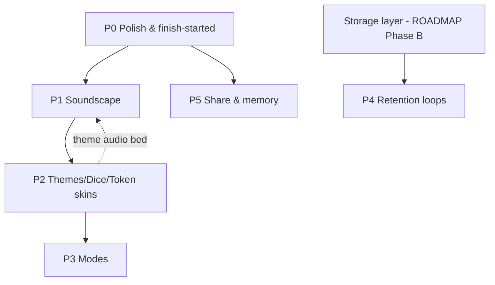

# Ludo Engagement Roadmap — "From a web game to the board you grew up around"

> Focused roadmap for BHALYAM's Ludo. Goal: close the experience gap with **Ludo
> King** while leaning into what Ludo King *can't* easily do for our audience —
> the **heart-touching, nostalgic, family-table** feeling of desi Ludo.
> Scope: the Ludo game only. Strategic project phases live in `ROADMAP.md`; this
> document slots its tasks under that plan (mostly Phase A polish + Phase C/D).
> Author pass: 2026-06-26.

---

## 1. Method & sources

- **BHALYAM side** — read directly from the code: `server/src/games/ludo/`
  (`LudoEngine.ts`, `track.ts`), `shared/types.ts` (Ludo types + options),
  `server/src/rooms/RoomManager.ts`, and the whole `client/src/games/ludo/`
  folder (hook, shells, composites, sound, settings, dice, token, end-card,
  celebration, reactions, color picker).
- **Ludo King side** — corroborated via store listings + product pages
  (Google Play, App Store, Wikipedia, ludoking.com/features). Feature claims
  here are from those public sources, not hands-on testing → treat as
  `[INFERENCE]` where a behavioural detail matters.

---

## 2. What BHALYAM Ludo already does well (do **not** rebuild)

The board is already far past a barebones Ludo. Cataloguing it so the roadmap
only adds what's missing:

| Area | Already shipped | Where |
|---|---|---|
| Boards | Cross board (≤4) **and** polygon board (5–8 players) | `polygon-board.ts`, `PolygonBoardSVG.tsx`, `ludo-board-shared.tsx` |
| Rules | Capture, home stretch, exact-roll finish, bonus-on-6, triple-six forfeit, **Mandatory Capture** variant, `noSafeSquares` | `LudoEngine.ts` |
| Bots | Strong heuristic AI (danger/stacking/escape/yard-urgency) + humanised pacing | `LudoEngine.pickBestMovableToken`, `RoomManager` bot loop |
| Turn safety | 20s server turn timer → AI auto-skip on timeout | `RoomManager` (`turnDeadline`), `LudoEngine.pickAiMove` |
| Animation | Step-by-step token walk (160ms/step), capture sad-face 😵, per-home mini-burst, token celebrate bob, unlock burst | `useLudoBoard.ts`, `ludo-board-composites.tsx` |
| Win moment | Crown + radiating rays ceremony (3s) → recap card with per-player stats, copy/download PNG, rematch | `WinnerCelebration.tsx`, `EndGameCard.tsx` |
| Feedback | Event toasts, confetti, **lucky-moment** banner (6 + capture), hover destination preview | `useLudoBoard.ts` |
| Social | In-room chat, **WebRTC voice**, floating emoji reactions (16) + emoji rain, **live opponent cursors** | `InlineRoomRail`, `ReactionBar.tsx`, `CursorLayer.tsx` |
| A11y/UX | Color-blind glyphs, high-contrast mode, 3 themes (classic/neon/paper), keyboard shortcuts (R, 1–4), per-player bg tint | `settings.ts`, `SettingsMenu.tsx`, `Token.tsx` |
| Modes | Online (room code), bots, **Pass & Play** (shared device) | `RoomManager` pass-&-play allow-list |
| Sound | Synthesized SFX (dice/move/capture/home/win) | `sound.ts` (Web Audio, no assets) |

**Takeaway:** the *mechanics and micro-feedback* are competitive. The gaps are
**identity, audio richness, customization, modes, and a reason to come back.**

---

## 3. Ludo King UX teardown (its engagement engine)

What makes Ludo King sticky, grouped by lever:

1. **Customization economy** — many board **themes** (Disco, Nature, Egypt,
   Candy, Christmas, **Diwali**, Taj Mahal…), **dice skins** ("lucky dice"),
   **avatars**, **frames**. Unlockables drive the daily loop.
2. **Modes** — 2/3/4/5/6-player online, **Quick mode** (~5 min vs 15–40),
   **Master mode**, **Team-up (2v2)**, 8-player tournaments, plus Snakes &
   Ladders in the same shell.
3. **Audio identity** — per-theme **background music** + rich SFX + a crowd
   cheer on win. The *soundscape* is half the nostalgia.
4. **Social** — **voice chat**, text chat, emoji, "throw" taunts at opponents,
   **Adda/Club** hangouts.
5. **Retention loop** — **daily goals/rewards** (free dice, coins, diamonds),
   levels/XP, leaderboards.
6. **Juice** — captures and wins are loud, animated, and *satisfying*; the dice
   has weight and sound; turns have visible urgency.

**What Ludo King is weak at (our opening):** it's a generic global product. It
does **not** know *your* family, doesn't speak in *your* slang ("chakka!",
"maar diya!", "ghar aa gaya!"), and monetizes the warmth. BHALYAM is
friends-and-family-first — we can make Ludo feel like **the cardboard board on
the floor at Diwali**, not a slot machine.

---

## 4. Gap analysis

| Capability | Ludo King | BHALYAM today | Gap |
|---|---|---|---|
| Board themes | Many, incl. festival | 3 CSS themes, palette hard-coded in `ludo-board-shared.tsx` | **High** |
| Dice skins | Multiple | 1 dot-face (`Dice.tsx`) | **High** |
| Token/avatar skins | Multiple + frames | 1 pawn SVG, initials avatar | **Med** |
| Background music / ambience | Per-theme | **None** | **High** |
| SFX richness | Sampled, layered | Synthesized tones only | **Med** |
| Win crowd cheer / fireworks | Yes | Crown+rays+confetti (no audio cheer) | **Low** |
| Turn urgency UI | Visible timer | `turnDeadline` exists in state, **no countdown UI** | **Med** |
| Capture "juice" | Loud fly-back | Sad-face + 2-note SFX | **Low/Med** |
| Quick mode | Yes (~5 min) | No | **Med** |
| Master mode | Yes | Partial (`noSafeSquares` flag) | **Low** |
| Team-up 2v2 | Yes | No | **Med** |
| Daily rewards / streak | Yes | No (no persistence layer) | **Deferred** |
| Levels / leaderboard / profile | Yes | No (no DB) | **Deferred** |
| Replay / move history | Limited | No | **Med** |
| Quick-chat taunts | Yes | Emoji only (no phrases) | **Low** |
| Regional-language flavor | No | **No (our advantage to seize)** | **High (differentiator)** |
| Name your tokens | No | **Server-wired, no UI** (`tokenNicknames`) | **Low (finish it)** |
| Reduced-motion a11y | n/a | Not handled | **Low** |

---

## 5. The nostalgia thesis (the "heart-touching" north star)

Every task below is scored against one question: **does it make a player feel
the childhood board game with their people?** Three pillars:

- **देसी identity** — wooden/parchment board, cowrie-shell (chaupar) dice,
  brass tokens, festival skins (Diwali diyas, Pongal, Holi). We already have the
  `bhalyam.*` palette (gold/wood/cream/maroon) — extend it onto the board.
- **The voices in the room** — ambient family-room/festival soundbed, the
  satisfying *clack* of the dice and *tak* of a token, the table erupting on a
  "cut", a crowd cheer at the win. Regional-language callouts ("Chakka!",
  "Maar diya!", "Ghar!") toggleable per taste.
- **Shared memory** — name your four gotis, a postcard-style shareable recap for
  the family WhatsApp group, "you've played 12 games with Amma" little touches.

We do **not** chase Ludo King's coin/gem economy — it cuts against the
friends-first, no-pay-to-win principle in `ROADMAP.md` ("What to NOT do").

---

## 6. Roadmap

Tasks are phased by **impact-to-effort** and dependency. Each: **What / Heart
(why it lands) / Files / Effort / Acceptance**. Effort is rough dev-days for one
engineer. Layout rule from `AGENTS.md §6` applies — verify mobile *and* desktop
at 375/768/1024/1440px for any UI task.

### P0 — Polish & "finish what's started" (≈3–4 days, no new infra)

**P0.1 — Turn-timer countdown ring + last-seconds warning**
- *What:* Render the existing `state.turnDeadline` as a shrinking ring/bar on the
  dice tray; reuse the shared `components/TurnTimeWarning.tsx` for the 10s pulse.
- *Heart:* The table-tension of "hurry up, it's your turn!" — currently invisible.
- *Files:* `ludo-board-composites.tsx` (`LudoDiceTray`), `useLudoBoard.ts`
  (expose remaining ms), reuse `TurnTimeWarning.tsx`.
- *Effort:* 0.5d. *Accept:* countdown visible to all; pulse at ≤10s; matches the
  server auto-skip moment.

**P0.2 — Finish "Name your gotis" (token nicknames)**
- *What:* Build the missing client UI to set 4 per-token nicknames; emit the
  already-typed `room:setTokenNicknames`; show the name on hover/tap of a token.
- *Heart:* Naming your pieces ("Raju", "Chhotu") is pure childhood — and it's
  *already half-built on the server*, just orphaned.
- *Files:* new small modal in `client/src/games/ludo/` + wire in `SettingsMenu`
  or lobby; `Token.tsx` (label tooltip); server already done
  (`RoomManager.setTokenNicknames`, `Player.tokenNicknames`).
- *Effort:* 1d. *Accept:* set names in lobby → names persist in room state →
  visible on the board; empty stays numeric.

**P0.3 — Louder capture moment**
- *What:* Upgrade capture from sad-face to a short token **fly-back arc** to the
  yard + a bold "CUT!" callout (reuse the `luckyBanner` pattern).
- *Heart:* "Maar diya!" — the single most satisfying beat in desi Ludo.
- *Files:* `useLudoBoard.ts` (capture transition already detected at L560), new
  callout in `LudoOverlays`.
- *Effort:* 1d. *Accept:* on capture, victim token visibly travels back; callout
  shows once; honors reduced-motion (P0.5).

**P0.4 — Quick-chat phrase presets (regional)**
- *What:* Add a row of preset phrases beside `ReactionBar` ("Chakka!", "Nice
  move", "All the best", "Haar gaya 😄"), bilingual EN/HI(/TE). Sends as chat.
- *Heart:* Banter is the game. Emojis alone don't carry the trash-talk.
- *Files:* `ReactionBar.tsx` (or sibling), uses existing `chat:send`.
- *Effort:* 0.5d. *Accept:* tapping a phrase posts to chat for all; cooldown like reactions.

**P0.5 — Reduced-motion support**
- *What:* Gate confetti/rays/emoji-rain/step-walk behind
  `@media (prefers-reduced-motion: reduce)` + a settings toggle.
- *Heart:* Inclusive = more people at the table. Also `AGENTS.md §13` flags it.
- *Files:* `settings.ts`, `SettingsMenu.tsx`, animation call sites.
- *Effort:* 0.5d. *Accept:* with the OS flag set, heavy motion is calmed; game still readable.

### P1 — The soundscape (≈3–4 days) — *the core of "nostalgic"*

**P1.1 — Real SFX via the app's `AudioManager`**
- *What:* Replace/augment the synthesized `sound.ts` with sampled assets (dice
  clack, token tak, capture thud, home ding, six chime) routed through the
  existing Howler `AudioManager` so volume/mute/prefs are shared app-wide.
- *Heart:* Synth beeps read as "web demo". Sampled wood/clack reads as "board".
- *Files:* `sound.ts` → `AudioManager.ts` integration, assets under
  `client/public/audio/` (folder already exists), `constants/audio.ts`.
- *Effort:* 1.5d. *Accept:* sounds play through AudioManager; mute button + global
  settings both govern it; no double audio engines.

**P1.2 — Background ambience bed (per theme)**
- *What:* Low, loopable ambience: "family room", "festival/Diwali", "classic
  board". Off by default, one-tap on; ducks under voice chat.
- *Heart:* The murmur of the room is the memory. This is the headline feature.
- *Files:* `AudioManager.ts` (ambience channel), `SettingsMenu.tsx` (picker),
  ties to P2 theme selection.
- *Effort:* 1.5d. *Accept:* ambience loops seamlessly; volume independent of SFX;
  pauses when tab hidden.

**P1.3 — Dice haptics + win crowd cheer**
- *What:* Vibrate on roll via existing `HapticsManager`/`useHaptics`; add a crowd
  cheer to the win ceremony.
- *Heart:* Physical feedback + the room cheering when you sweep home.
- *Files:* `useLudoBoard.ts` (`roll()`), `WinnerCelebration.tsx`.
- *Effort:* 0.5d. *Accept:* roll buzzes on supporting devices; cheer fires once on win.

### P2 — Identity: themes, dice & token skins (≈5–7 days) — *Ludo King parity + देसी*

**P2.1 — Theme-driven board palette**
- *What:* Lift the hard-coded board palette (`YARD_FILL`, `STRETCH_FILL`,
  `PARCHMENT`, `GOLD`, `WOOD_DARK` in `ludo-board-shared.tsx`) into a theme
  table so a theme swaps the *whole* board look, not just a CSS class.
- *Heart:* Makes room for the wooden/festival boards below.
- *Files:* `ludo-board-shared.tsx`, `PolygonBoardSVG.tsx`, `settings.ts`.
- *Effort:* 2d. *Accept:* switching theme repaints cross + polygon boards; existing
  3 themes preserved.

**P2.2 — देसी / festival board themes**
- *What:* Add **Wooden Carrom**, **Diwali (diyas + rangoli rim)**, **Pongal/Holi
  seasonal**, **Retro Cardboard** themes using the `bhalyam.*` palette.
- *Heart:* The literal board from home, lit for the festival you're calling in for.
- *Files:* theme table from P2.1, optional SVG rim ornaments.
- *Effort:* 2d. *Accept:* ≥3 new themes selectable; readable in light/dark; mobile+desktop verified.

**P2.3 — Dice skins (incl. cowrie-shell / chaupar)**
- *What:* `Dice.tsx` becomes skinnable: classic dots, **golden**, **wooden**,
  **cowrie-shell** (4-shell chaupar visual mapping to 1–6).
- *Heart:* The chaupar shells are peak nostalgia for the older generation.
- *Files:* `Dice.tsx`, `settings.ts`, `SettingsMenu.tsx`.
- *Effort:* 1.5d. *Accept:* skin changes the rolling + resting visual; value still legible.

**P2.4 — Token skins**
- *What:* `Token.tsx` skins: classic pawn, **brass goti**, **wooden coin**.
- *Heart:* Tactile pieces you'd flick across the board.
- *Files:* `Token.tsx`, `settings.ts`. *Effort:* 1d. *Accept:* skin applies to all
  tokens; color-blind glyph still shows.

### P3 — Modes (≈5–6 days) — *Ludo King parity*

**P3.1 — Quick mode (2 tokens)**
- *What:* Option to play with 2 tokens/player for ~5-min games. Add
  `tokensPerPlayer: 2 | 4` to `LudoGameOptions`; gate `TOKENS_PER_PLAYER` and
  win check in `LudoEngine`.
- *Heart:* "One more quick game before dinner."
- *Files:* `shared/types.ts` (`LudoGameOptions`, `DEFAULT_LUDO_OPTIONS`),
  `LudoEngine.ts`, `RoomManager.ts`, lobby options UI, `EndGameCard` "/4"→"/2".
- *Effort:* 2d + tests in `__tests__/`. *Accept:* 2-token game wins at 2 home;
  recap counts match; bots respect it.

**P3.2 — Master mode preset**
- *What:* One-tap preset bundling `noSafeSquares: true` (+ aggressive tuning),
  surfaced as a named mode rather than a raw toggle.
- *Heart:* The cutthroat version cousins demand.
- *Files:* lobby options, `RoomManager.ts`. *Effort:* 0.5d. *Accept:* preset sets
  the flags; rules reflected in `InstructionsModal`.

**P3.3 — Team-up (2v2)**
- *What:* Team assignment + shared win condition (a team wins when its members'
  tokens are all home). Add `teams` to options/state; adjust win + `EndGameCard`.
- *Heart:* Playing *with* someone, not just against — partners, alliances.
- *Files:* `shared/types.ts`, `LudoEngine.ts` (win + turn order), `RoomManager.ts`,
  `EndGameCard.tsx`, lobby. *Effort:* 3d + tests. *Accept:* 2v2 declares a team
  winner; UI shows team grouping; bots fill teams.

### P4 — Retention loops (≈6–10 days) — *needs persistence; align with `ROADMAP.md` Phase B/C*

> Blocked on a storage layer (currently in-memory only). Sequence **after** the
> repository/DB work in the strategic roadmap. Listed so the design is reserved.

**P4.1 — Local-first stat profile** — per-device career totals (games, wins,
captures, longest six-streak) in `localStorage` now; migrate to account later.
*Heart:* "You've won 23, captured 140 — and 9 of those were against Anna."
*Effort:* 2d.

**P4.2 — Achievements / badges** — first-capture, triple-six survivor, all-home
sweep, comeback win (last to first). *Heart:* small earned brags. *Effort:* 3d.

**P4.3 — Family leaderboard** — per-room/per-friend-group standings over time.
*Effort:* 2d (after accounts). *Heart:* the running family rivalry.

**P4.4 — "Play with family" nudge / streak** — gentle, non-coercive ("Amma
hasn't played this week"), never a coin-pressure mechanic. *Effort:* 2d.

### P5 — Shared memory & shareability (≈4–5 days)

**P5.1 — Postcard recap + WhatsApp share**
- *What:* Restyle `EndGameCard` PNG into a warm "postcard" (board motif, MVP
  highlight, date, player faces) and add WhatsApp/Web-Share using the existing
  `RoomCodeShare.tsx` share pattern.
- *Heart:* The screenshot that lands in the family group chat with 😂🎉.
- *Files:* `EndGameCard.tsx`, reuse share helpers from `RoomCodeShare.tsx`.
- *Effort:* 2d. *Accept:* one-tap share posts the recap image; copy/download still work.

**P5.2 — Game replay strip**
- *What:* Record the move log; a scrubber to replay the match end-to-end.
- *Heart:* "Watch how Chintu stole it on the last roll." Re-living the moment.
- *Files:* `LudoEngine` (emit move log already partially via `lastEvent`),
  new replay component. *Effort:* 3d. *Accept:* replay reconstructs token
  positions turn-by-turn.

**P5.3 — Targeted "throw" reactions**
- *What:* Fling an emoji/object at a *specific* opponent's player card (extends
  the floating-reactions system already anchored per player card).
- *Heart:* Playful aim — "this 😂 is for *you*, Raju."
- *Files:* `ReactionBar.tsx`, `FloatingReactionsLayer.tsx`, `room:reaction`
  payload (add optional target). *Effort:* 1.5d. *Accept:* targeted reaction lands
  on the chosen card for everyone.

---

## 7. Sequencing & dependencies

- **Start now, no infra:** P0 → P1 → P2 → P3, then P5 (P5.1 can run any time).
- **P4 is gated** on the persistence work already planned in `ROADMAP.md`
  (Phase B "Persistent rooms / accounts / game history"). Don't build P4 against
  in-memory state.
- P1 (ambience) and P2 (themes) are intentionally coupled: a theme should be
  able to declare its ambience track.

**Recommended first slice (≈1.5 weeks) for maximum "felt" change:** P0.1, P0.2,
P0.3 (urgency + name-your-gotis + louder cuts) **+** P1.1, P1.2 (real sounds +
ambience). That combination is what flips it from "web Ludo" to "our board".

---

## 8. Out of scope / anti-goals

Aligned with `ROADMAP.md` "What to NOT do":

- **No real-money / coins / gems / pay-to-win** economy. Customization is free.
- **No gambling, no ads-for-dice** loops.
- **No matchmaking with strangers** — BHALYAM is friends-and-family-first.
- **No heavy 3D engine** — 2D + CSS/SVG gets the polish (consistent with the
  existing board approach).
- Don't break the `GameEngine` contract, `localStorage` keys
  (`mpg.playerId`, `mpg.playerName`, `mpg.ludo.settings`), or the `@shared` alias.
