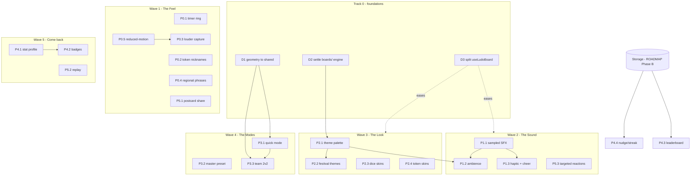

# Ludo — Prioritized Implementation Roadmap

> Ranks **all remaining work** from `LUDO_ENGAGEMENT_ROADMAP.md` (features P0–P5)
> **plus** the enabling debt surfaced by `LUDO_AUDIT.md` (D1–D3). Each item scored
> on the five axes you asked for; sequenced into dependency-aware waves.
> **No code written — planning only.** Drafted 2026-06-26.
>
> *Note on method:* the `ponytail-gain` skill is a fixed benchmark scoreboard for
> the ponytail toolset, not a prioritizer — so the ENG/NOST numbers below are my
> **design judgments (1–5)**, presented scoreboard-style, **not measured
> benchmarks**. The honesty boundary applies: no invented "you saved X" figures.

---

## 1. Scoring model (transparent + reproducible)

- **ENG** — user-engagement impact, 1–5 (5 = changes how often / how long people play).
- **NOST** — nostalgia / heart-touching impact, 1–5 (5 = "this is the board from home").
- **Effort** — dev-days, inherited from the roadmap estimates.
- **Risk** — Low / Med / High, with the audit risk it touches (`R1`–`R7`).
- **Deps** — what must ship first.
- **RAP** — Risk-Adjusted Priority = `(ENG + NOST) / Effort − riskPenalty`
  (penalty: Low 0, Med 1, High 2). A *guide*, not gospel — it under-rates
  enablers (whose value is indirect) and high-value/high-effort items, so the
  **waves** in §4 apply dependency-aware judgment on top.

---

## 2. Master ranking (every item, sorted by RAP)

| Rank | Item | ENG | NOST | Effort | Risk (audit) | Deps | RAP |
|---|---|:--:|:--:|:--:|---|---|:--:|
| 1 | **P0.4** Quick-chat regional phrases | 4 | 4 | 0.5d | Low | — | 16.0 |
| 2 | **P1.3** Dice haptic + win crowd cheer | 3 | 4 | 0.5d | Low | P1.1 (cheer only) | 14.0 |
| 3 | **P0.1** Turn-timer countdown ring | 4 | 2 | 0.5d | Low (reuse `TurnTimeWarning`) | — | 12.0 |
| 4 | **P3.2** Master-mode preset | 3 | 2 | 0.5d | Low | lobby opts | 10.0 |
| 5 | **P0.3** Louder capture (fly-back + "CUT!") | 4 | 5 | 1d | Low | P0.5 | 9.0 |
| 6 | **P0.2** Finish token nicknames UI | 3 | 5 | 1d | Low (server done) | — | 8.0 |
| 7 | **P0.5** Reduced-motion support | 2 | 1 | 0.5d | Low | — | 6.0 |
| 7 | **P2.4** Token skins (brass/wood goti) | 2 | 4 | 1d | Low | — | 6.0 |
| 9 | **P2.3** Dice skins (cowrie/chaupar) | 3 | 5 | 1.5d | Low | — | 5.3 |
| 10 | **P1.1** Sampled SFX via `AudioManager` | 4 | 5 | 1.5d | Med (`R5` cutover) | — | 5.0 |
| 10 | **P5.1** Postcard recap + WhatsApp share | 5 | 5 | 2d | Low | — | 5.0 |
| 12 | **P5.3** Targeted "throw" reactions | 4 | 3 | 1.5d | Low | — | 4.7 |
| 13 | **P1.2** Background ambience bed | 3 | 5 | 1.5d | Med (ducking/license) | P1.1, P2.1 | 4.3 |
| 14 | **P2.2** Desi / festival board themes | 4 | 5 | 2d | Med (`R4` two renderers) | P2.1 | 3.5 |
| 15 | **P4.1** Local-first stat profile | 3 | 3 | 2d | Low | — | 3.0 |
| 16 | **P3.1** Quick mode (2 tokens) | 5 | 2 | 2d | Med (`R6`) | **D1** | 2.5 |
| 17 | **P4.2** Achievements / badges | 4 | 3 | 3d | Low-Med | P4.1 | 1.8 |
| 18 | **P5.2** Replay / move-history strip | 3 | 4 | 3d | Med (move-log) | move-log capture | 1.3 |
| 19 | **P2.1** Theme-driven palette *(enabler)* | 2 | 2 | 2d | Med (`R4`) | — | 1.0 |
| 20 | **P3.3** Team-up 2v2 | 4 | 3 | 3d | **High** (`R6`) | **D1** | 0.3 |
| — | **P4.3** Family leaderboard | 4 | 4 | 2d | Med | **Storage (Phase B)** | *blocked* |
| — | **P4.4** Play-with-family nudge/streak | 3 | 4 | 2d | Med | **Storage + push** | *blocked* |

**Foundational debt (no direct user value; gates features — see §4 Track 0):**

| Item | What | Effort | Risk | Gates |
|---|---|:--:|---|---|
| **D1** | Hoist Ludo geometry into `shared/` (kill `board-layout.ts`↔`track.ts` dup; remove dead `track.ts:50-63`) | 1.5d | Low-Med | **P3.1, P3.3** (`R1` drift) |
| **D2** | Decide `boards/` + `PreviewLudo` fate (delete or repoint to live `PolygonBoardSVG`) | 0.5d | Low | **P2.2** (don't theme two engines) |
| **D3** | Decompose the 720-line `useLudoBoard.ts` god-hook into focused hooks | 2.5d | Med-High (`R3`) | **P1, P2** (slows pile-on) |

---

## 3. Engagement × Nostalgia scoreboard (recommended first wave)

Bars are 1–5 **design judgments**, not measured data. Effort/risk in the label.

```
  ludo · first-wave gain                       design judgment (1–5), not measured

  P5.1 Postcard share   ENG █████ 5   NOST █████ 5   2d  · Low  · viral re-engage loop
  P0.3 Louder capture   ENG ████· 4   NOST █████ 5   1d  · Low  · "maar diya!"
  P0.2 Name your gotis  ENG ███·· 3   NOST █████ 5   1d  · Low  · finish orphaned server feat
  P0.4 Regional banter  ENG ████· 4   NOST ████· 4   ½d  · Low  · uses chat:send
  P0.1 Turn-timer ring  ENG ████· 4   NOST ██··· 2   ½d  · Low  · reuse TurnTimeWarning
  P0.5 Reduced-motion   ENG ██··· 2   NOST █···· 1   ½d  · Low  · gate for all motion work

  wave 1 total ≈ 5.5 dev-days · all Low risk · 0 new deps · reuses 2 shipped components
```

---

## 4. Implementation waves (dependency-aware sequence)

Two tracks run in parallel: **feature waves** (player-facing) and **Track 0**
(debt that must land *before* the waves it gates).

### Track 0 — Foundations (interleave, don't batch at the front)
- **D1 before Wave 4** — geometry → `shared/`. Cheapest insurance against the
  client/server mispredict that 2-token & team modes would otherwise cause.
- **D2 before Wave 3** — settle the second board engine before theming touches
  board rendering twice.
- **D3 early, incremental** — peel audio, reactions/cursors, celebration, and
  theme state out of `useLudoBoard.ts` *as* Waves 2–3 need them (don't do a big-bang refactor).

### Wave 1 — "The Feel" *(Now · ~5.5d · all Low risk)*
`P0.1 · P0.2 · P0.3 · P0.5 · P0.4 · P5.1`
Cheapest, highest-heart, zero new infra. Reuses `TurnTimeWarning` (P0.1) and
`RoomCodeShare` share helpers (P5.1) already in the repo. Ship **P0.5 with
P0.3** so the new capture motion is born reduced-motion-aware.
*Exit:* a turn has visible urgency; captures feel like a "cut"; you can name
your gotis and trash-talk; the recap lands in the family WhatsApp.

### Wave 2 — "The Sound" *(Next · ~4d)*
`P1.1 → P1.3 → P1.2`  (+ optional `P5.3`)
`P1.1` first (it's the cutover from `sound.ts`, audit `R5` — replace, don't
duplicate). `P1.3` cheer rides on the AudioManager channel; the dice haptic is
an independent freebie that can even slip into Wave 1. `P1.2` ambience after
`P1.1` and after `P2.1` exists enough to bind a track per theme. `P5.3` targeted
reactions slot here as a social add if capacity allows.
*Exit:* the board *sounds* like wood and a room full of family.

### Wave 3 — "The Look" *(identity · ~6.5d)*
`D2 → P2.1 → { P2.2 · P2.3 · P2.4 }`
`P2.1` is the enabler (palette as data, covering **both** cross + polygon
renderers — audit `R4`). Then the high-nostalgia payload: festival/desi themes
(`P2.2`), chaupar dice (`P2.3`), brass/wood tokens (`P2.4`). `P2.3`/`P2.4` are
largely independent of `P2.1` and can parallelize.
*Exit:* Diwali board + cowrie dice on demand.

### Wave 4 — "The Modes" *(~5.5d)*
`D1 → P3.2 → P3.1 → P3.3`
`D1` first (geometry in `shared/`). `P3.2` is a near-free preset to bundle with
the lobby-options work. `P3.1` Quick mode (engine win/init + tests). `P3.3`
Team-up last — highest effort/risk (`R6`), most engine surface.
*Exit:* "one more quick game before dinner" + 2v2 with a partner.

### Wave 5 — "Come back tomorrow" *(local-first · ~6d)*
`P4.1 → P4.2`, `P5.2`
Start retention **local-first** (`localStorage`) so it ships without the DB:
career stats (`P4.1`) → badges (`P4.2`). `P5.2` replay needs a small move-log
capture in the engine. Migrate to accounts when storage lands.

### Blocked — needs the strategic storage layer (`ROADMAP.md` Phase B)
`P4.3` family leaderboard, `P4.4` nudge/streak. **Do not build against in-memory
state** (audit `R2`). Reserve the design; revisit post-Phase-B.

---

## 5. Dependency graph



---

## 6. Recommended first sprint (2 weeks, one engineer)

**Wave 1 in full + start Wave 2.** Concretely: `P0.1, P0.2, P0.3, P0.4, P0.5,
P5.1` (~5.5d) then `P1.1, P1.3` (~2d), with `D3` extraction done opportunistically
as Wave 2 touches audio. This is the maximum "felt" change for the least risk —
every Wave-1 item is Low risk, two of them reuse components already shipped, and
nothing requires new infrastructure.

**Single highest-leverage item:** `P5.1` (postcard recap + WhatsApp share) —
ENG 5 / NOST 5, low risk, reuses `RoomCodeShare` + the existing `EndGameCard`
SVG→PNG. It's the re-engagement loop that pulls the family back to the table.

**Cheapest insurance:** `D1` before Wave 4 — without it, `P3.1`/`P3.3` ship a
client that mispredicts (audit `R1`).
