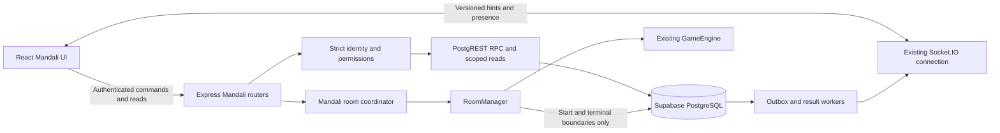

# Mandali — architecture and domain design

Date: 2026-09-16. Proposed design; product name and restart boundary confirmed. Read with [implementation plan](MANDALI_IMPLEMENTATION_PLAN.md) and [acceptance/release checks](MANDALI_ACCEPTANCE_AND_RELEASE.md).

## 1. System boundary



Controllers validate inputs and translate errors. Focused services orchestrate workflows. Transaction functions enforce multi-row invariants. RoomManager alone applies game rules. The outbox records committed events; Socket.IO is delivery, never message storage.

No NestJS migration, Redis, second websocket connection, direct browser writes to Mandali tables, or database call per game move. Use the existing PostgREST adapter's RPC support. Supabase exposes database functions through its API; function privileges must be explicitly restricted. [Supabase database functions](https://supabase.com/docs/guides/database/functions)

Shared staging/production require verified auth and durable Postgres. An in-memory unit-test double must never become a silently selected production backend.

## 2. Identity and authorization

- Account identity is the verified Supabase subject, stored through the existing `player_identities.player_id` text key.
- Room seat ID is `Player.id`, local to a room. HMAC seat ownership does not establish Mandali membership.
- Group, proposal, binding and round IDs are immutable server-generated UUIDs.
- A guest pass grants a named recipient access to one proposal/round; it never grants membership. R1 recommends a verified signed-in non-member. Anonymous signed-guest support requires separate claim/recovery tests and a feature gate.
- Derive actor ID from verified credentials, never from body/path claims. Add a strict Mandali guard; do not inherit `requireMember`'s auth-off promotion.

### Permissions

Base roles are OWNER, MODERATOR, MEMBER. Probation, mute and suspension are membership conditions, so muting does not erase a moderator's underlying role. Project the PRD's effective membership states in DTOs.

| Capability | Owner | Moderator | Member | Probation | Muted |
|---|---|---|---|---|---|
| Read allowed chat/info/members | Yes | Yes | Yes | Since joining | Yes |
| Send/reply/react | Yes | Yes | Yes | React only | No |
| Create proposal | Yes | Yes | If enabled | No | No |
| Join existing game | Yes | Yes | Yes | Yes | Unless game-restricted |
| Invite/approve/reject/create link | Yes | Yes | No by default | No | No |
| Revoke link | All | Own links | No | No | No |
| Mute/remove/ban | Below owner | Standard/probation members | No | No | No |
| Moderate/pin/announce | Yes | Yes | No | No | No |
| Identity/settings/assign moderator | Yes | No | No | No | No |
| Transfer/archive/delete request | Yes | No | No | No | No |
| Report/block/mute notifications/leave | Transfer before leaving | Yes | Yes | Yes | Yes |
| Administrative audit | Full group scope | Moderation subset | No | No | No |

Suspended, left, removed and banned members cannot read group content. Suspended memberships retain capacity until resolved; LEFT/REMOVED/BANNED do not. The owner cannot be restricted through ordinary member commands. Platform enforcement is separately authorized and audited.

Use central capability identifiers and shared resolution for UI affordances; database RPCs independently enforce actor, target hierarchy, current membership and restrictions. Account-wide blocks differ from group-wide bans.

### Revocation and privacy

Recheck membership on every read and mutation, including search, parent replies, reactions, invite acceptance, result reads and game-token resolution. Every resource ID must match the authorized group. Inaccessible private objects return generic not-found results.

Removal commits a membership version, invalidates pending seats/pass rights, writes audit and durable revocation, and immediately evicts known subscriptions. Serialize the local revocation barrier with admission before acknowledging removal. Socket hints contain versions/object IDs rather than private bodies; subsequent HTTP reads deny removed users even if eviction delivery is delayed.

Client clears caches/drafts/visible content on removal, sign-out and identity switch. Previously viewed/copied information cannot be recalled; the guarantee is denial of future access. Remove lobby seats immediately. During active play, use existing removal/forfeit/bot-takeover behavior without destroying opponents' match or inventing financial outcomes.

Blocking prevents new direct invitations, mentions/notifications, presence visibility and co-seating between the two identities. It does not erase shared membership or abort an already-started game. Shared-chat hiding uses a collapsed placeholder. Group removal/ban is the tool for excluding a member from the entire Mandali.

## 3. Persistence design

Use additive timestamped migrations, `timestamptz` deadlines, UUID domain IDs, existing text identity FKs, and bigint counters serialized as decimal strings. Create R1 tables as their slices land; no speculative R2/R3 schema.

| Table/group | Fields and constraints |
|---|---|
| `player_handles` | Identity unique FK; normalized unique handle; discovery/invite preferences; display name remains separate |
| `player_blocks` | Blocker/blocked composite key; no self-block; both directions checked for invitations/admission |
| `mandalis` | ID, unique display code, owner identity, identity/settings, status, member limit, version, deadlines; display code is not access |
| `mandali_memberships` | Group/identity PK; lifecycle, base role, probation/mute/game restrictions, visibility floor, join time, version; audit keeps prior episodes |
| `mandali_invitations` | Direct target or hashed link token; issuer, status, expiry, limits/use count; partial unique pending direct invite |
| `mandali_join_requests` | Group/requester/link/status/deadline/reviewer; unique pending request per requester/group |
| `mandali_channels` | One general channel per group; message-order counter and version |
| `mandali_messages` | Group/channel/author, ID, sequence, structured kind/payload, root/reply IDs, revision/tombstone; unique channel/sequence and author/client-request ID with request hash |
| Message support | Revision history, unique reactions, read cursors, pins, user hides and scoped search index |
| `mandali_change_log` | Per-group monotonic cursor, entity ID/version, event ID, kind and audience; edits/deletes/restrictions included |
| `mandali_proposals` | Creator/group/game/config snapshot, lifecycle/version, bounds, expiry, guest/bot policy, cost/config consent version |
| `mandali_participants` | Proposal/identity unique; participant state, server order, hold deadline, consent version |
| `mandali_active_participation` | Unique live claim per identity; proposal reference/expiry; includes confirmed and reserved claims, not waitlist |
| `mandali_guest_passes` | Hashed token, recipient/issuer, proposal, expiry/revocation/claim; bounded uses |
| `mandali_room_bindings` | Proposal unique, logical room UUID, reserved room code, operation ID, status/version, authority epoch/fence |
| `mandali_rounds` / result intents | Immutable round ID, lineage, stable roster, outcome payload/hash, terminal and replay state |
| `mandali_match_results` | One projection per round; finalized/draw/interrupted/cancelled distinction; viewer-specific DTO |
| Notifications/preferences | Per-recipient inbox, group/category preferences, unique event/recipient/category; read/dismiss; no raw tokens |
| Reports/moderation/appeals | Evidence snapshot, actor/reason/action, escalation/appeal, access and retention/hold policy |
| Audit/idempotency/outbox | Append-only actor/action metadata; actor/command/key/hash/outcome; event payload/audience/version and consumer deliveries, leases/retries |

Index membership by identity/status; pending requests by group/status/time; invite hash; messages by channel/sequence; changes by group/cursor; proposals by group/state/expiry; participants by proposal/state/order; history by group/time/ID; inbox by recipient/unread/time; outbox due/lease-expired work. All cursors and searches are authorization scoped.

### Exactly one owner

The non-null `mandalis.owner_identity_id` pointer is authoritative. Use a deferred composite FK to that group's membership plus a deferred eligibility constraint trigger at transaction commit. Derive OWNER from the pointer rather than storing two competing owner declarations. Transfer locks the group, verifies actor and target, changes the pointer, demotes former owner to MEMBER, writes audit/outbox and commits. A unique index alone proves at most one owner, not at least one.

### Database security and deletion

Enable RLS; deny browser `anon`/`authenticated` access to Mandali tables and privileged functions. Service credentials stay server-side. Because service-role queries bypass RLS, every RPC still checks the explicit server-verified actor and target. Revoke default function execution and grant only necessary server roles; use invoker functions, or an explicitly restricted search path for any necessary definer function. Test real PostgREST roles, not just privileged SQL.

Deletion is staged: remove live visibility, preserve/anonymize required audit/report/result references, then purge due private content under the approved policy. Holds override ordinary purge. Account deletion cannot silently cascade through unresolved evidence, economic references or ownership. Update privacy inventory/notice and export/delete flows; do not claim that this proposed policy establishes legal compliance.

## 4. Transactions and tokens

Each important command uses actor+command+scope+idempotency key and a normalized payload hash. Same key/same payload returns the recorded operation after current read authorization; same key/different payload conflicts. Losing membership must prevent replay from exposing historical private responses.

One RPC transaction performs checks, mutation, audit, change log, outbox and idempotency outcome. Multiple REST writes are not a transaction. Lock affected identities in sorted order, then group, membership/request/link, proposal, participants and counters as needed. Retry deadlocks/serialization errors with bounded jitter and the same key. Never hold a transaction while waiting for a socket or game.

| Command | Atomic rule |
|---|---|
| Create | User quota, group+owner+channel+audit/outbox all commit or none |
| Approve/accept | Recheck group/request/link/actor/blocks/capacity/deadlines; one membership and one successful link use |
| Transfer | Exactly one eligible owner after concurrent transfers |
| Remove/ban | Membership version and pending rights revoked with durable event |
| Send | Author/reply authorization, sequence, message/revision/change/event inserted once |
| Reserve/confirm | Remaining capacity and identity claim protected; consent matches configuration |
| Launch | Conditional READY transition, one operation/binding, cancellation wins consistently |
| Finalize | Immutable authoritative result intent; projection/consumer dedup once |

Generate share tokens from at least 32 cryptographically random bytes and persist only hashes. Membership invites, game locators and guest passes have separate scopes, targets, deadlines and revocation. Return new raw tokens once. Never put them in idempotency responses, notification bodies, audit, outbox or logs.

If create succeeded but the raw-token response was lost, replay returns the link record with `TOKEN_NOT_REDISPLAYABLE`; explicit rotation revokes the old token and pending claims. This preserves hash-only storage without falsely promising to replay a secret the server no longer stores.

Redact token-bearing paths in hosting and application logs. Resolver pages use no-referrer policy and no third-party analytics/media. Resolve through authenticated POST, then replace history with a token-free route. Login continuation is short-lived and same-origin allowlisted. Do not persist token URLs in local drafts.

## 5. HTTP and realtime contracts

Use `/api/mandali` and existing authenticated `apiFetch`; keep `getSocket()` singleton. All commands enforce server rollout controls. Typed response: data/request ID/resource version or bounded error code/message/retryable/field errors.

| Resource | Operations |
|---|---|
| Root and `/:id` | Create/list mine/detail/edit/versioned settings |
| Lifecycle actions | Archive/unarchive/delete request/transfer/leave |
| Handles/blocks | Own handle claim; opted-in lookup; own block management |
| Members | Paginated list; role/restriction/remove/ban/promote |
| Invitations/inbox | Direct/link create; list; accept/reject/revoke/rotate |
| Invite resolve/requests | POST token resolution; minimal preview; request/withdraw/approve/reject |
| Channel/messages | History/send/thread/reply/edit/delete/react/pin/search |
| Sync/read cursors | Canonical snapshot/deltas; monotonic authorized read cursor |
| Proposals | Create/list/read/reserve/confirm/leave/waitlist/cancel/launch; guest pass issue/revoke |
| Game resolve/admission | Token locator plus current authorization; short-lived identity-bound admission |
| Pulse/history | Privacy-filtered coordination and results |
| Notifications/preferences | Inbox/read/dismiss; group/category preference |
| Reports/moderation/appeals | Report/review/action/escalate/appeal |
| `/api/admin/mandali/*` | Existing operational authorization for reports/workflows/metrics/audited repair |

Use 401 for no identity, 403 for insufficient action rights, 404 for inaccessible private objects, 409 for version/capacity/idempotency conflicts, 410 for safe-to-disclose expired locators, 429 with retry delay and 503 for unavailable dependencies. Stable codes distinguish archived, expired, revoked, full, started, interrupted, pending result, disabled feature and reset-required cursor. Never return SQL details or disclose member existence to strangers.

Typed client events: `mandali:authenticate`, `mandali:subscribe`, `mandali:unsubscribe`, `mandali:presence`, `mandali:typing`. Server events: `mandali:changed`, `mandali:accessRevoked`, `mandali:presenceChanged`, `mandali:typingChanged`, `mandali:sessionExpired`. Declare through `shared/types.ts`, importing DTOs from `shared/mandali/`; register handlers in the existing socket entry point.

Authenticate Mandali subscriptions on the existing connection, revalidate token expiry and current rights, refresh without retaining old identity subscriptions. Do not force ordinary guest game sockets through a global member gate. Durable hints carry event/aggregate ID, schema version, server time and aggregate version/change cursor as strings, not private bodies. Presence/typing are current-member and block filtered.

Socket.IO defaults to at-most-once delivery. Persisted application data and replay are necessary for missed server events; a socket acknowledgment is not durable recipient delivery. [Socket.IO delivery guarantees](https://socket.io/docs/v4/delivery-guarantees/)

### Client reconciliation

1. Fetch authorized snapshot plus high-watermark cursor.
2. Subscribe with cursor, then fetch deltas after it to close the subscription race.
3. Deduplicate event/message IDs and compare entity versions; channel sequence governs message order, not arrival time.
4. Match optimistic sends by client request ID; retry uncertain sends with the same ID.
5. Reconnect/foreground/gaps trigger canonical delta fetch, including edits/deletes and restrictions.
6. A cursor outside retained history returns reset-required; replace cache with authorized snapshot.
7. Read cursor advances only for visible messages while active and is clamped to authorized high-watermark. Tombstones/filtered messages must not cause endless gap retries.

## 6. Outbox and deadlines

Claim due events in bounded batches using a Postgres RPC with `FOR UPDATE SKIP LOCKED`; persist lease owner/token/expiry/attempts, then commit before side effects. SKIP LOCKED fits queue consumption, not canonical membership/seat reads. [PostgreSQL row locking](https://www.postgresql.org/docs/current/sql-select.html#SQL-FOR-UPDATE-SHARE)

Each durable consumer tracks event/consumer dedup and completion. A successful inbox write and failed fan-out are independent outcomes. Lease expiry permits reclaim; stale workers cannot complete/retry under a replaced lease token. Bounded backoff/jitter ends in visible failed work with audited replay.

Poll initially every 1–2 seconds with bounded batches, then tune from measurements. LISTEN/NOTIFY is deferred: existing server transport is PostgREST, and polling suffices for correctness. Persist deadlines for invites/requests/holds/proposals/restrictions/retention. Workers reconcile after downtime; permission checks use current database/server time immediately, not cleanup timing.

## 7. Proposal and private room lifecycle

```text
Membership: ACTIVE -> SUSPENDED | LEFT | REMOVED | BANNED
SUSPENDED -> ACTIVE after explicit review, or LEFT/REMOVED/BANNED
LEFT/REMOVED -> ACTIVE only through a fresh invitation/request
BANNED -> REMOVED through explicit unban; no automatic re-entry
Probation/mute are conditions on ACTIVE, preserving base role

Request: PENDING -> APPROVED | REJECTED | WITHDRAWN | EXPIRED | CANCELLED | BLOCKED

Proposal: RECRUITING <-> READY -> CREATING_ROOM -> ROOM_CREATED -> STARTED
STARTED -> FINALIZING -> COMPLETED
RECRUITING/READY -> CANCELLED | EXPIRED
CREATING_ROOM -> FAILED | CANCELLED under coordinated cancellation
FAILED -> CREATING_ROOM only for retryable, unexposed creation
ROOM_CREATED -> CANCELLED | EXPIRED | INTERRUPTED
STARTED/FINALIZING -> INTERRUPTED or FINALIZATION_FAILED with explicit reason

Participant: WAITLISTED -> RESERVED -> CONFIRMED
RESERVED/CONFIRMED -> LEFT | REMOVED | EXPIRED
```

INTERRUPTED/FINALIZING/FINALIZATION_FAILED refine the source PRD to represent confirmed restart behavior and existing economy finalization truthfully. READY returns to RECRUITING if a player leaves/confirmation expires. Configuration or cost changes invalidate affected consent.

### Reservation rules

Proposal participation precedes actual room seats. Organizer must confirm too. Bounds and options come from the authoritative catalog; creator cannot enlarge capacity. FIFO waitlist offers are reauthorized with bounded expiry; no automatic charge/navigation. Bot fill never satisfies the two-Mandali-human minimum or exceeds capacity.

Unique identity claims prevent concurrent Mandali reservations; also check existing ordinary-room activity. Joining another room requires an explicit leave operation. Do not overwrite the singleton socket's `socketToRoom` and orphan its old seat. Presence and party membership are not active-room authority.

### Room creation is a cross-system workflow

There is no transaction spanning Postgres and an in-memory RoomManager:

1. Lock the READY proposal and recheck confirmed participants/policy/config/organizer. Persist one logical binding, reserved room code, operation ID and authority fence; mark CREATING_ROOM.
2. Materialize one private lobby through a typed object adapter. Register access metadata before broadcasts. Preserve the positional API for unrelated callers; no broad refactor.
3. Use the organizer's actual verified socket for the initial host and existing seat minting. Offline organizer means bounded waiting/failure, not a fake socket. Other confirmed identities join through scoped admission.
4. Acknowledge materialization conditionally on binding operation/version; only then expose Join. Lost response retries the same binding; local binding lookup prevents double creation in the same process.
5. Cancellation revokes admission immediately. Destroy an unexposed orphan if cancellation wins; otherwise use controlled lobby cancellation with notifications.
6. If the process dies after a room was exposed, mark its binding INTERRUPTED. Never recreate that advertised room under the same proposal. Explicit user retry creates a fresh proposal with `retryOfProposalId`. Never-exposed creation may retry only after confirming the prior authority is fenced/dead.

Enforce one serving process plus an authority epoch/lease for Mandali materialization. Lease loss suspends new creation/admission; replacement activation waits for fencing. Overlapping rolling deploys must not both accept the same binding. This prevents accidental double authority; it does not implement horizontal game scaling.

### Close alternate access paths

Internal room metadata holds access kind, Mandali/proposal/binding IDs, allowed identity claims, epoch and access generation. Clients cannot set it through ordinary `room:create`; it does not expose private membership in public room DTOs.

Enforce access at raw room-code join, `/room/:code`, seat-token reclaim, `/tv/:code`, spectator entry, host migration, add-local/add-bot, start, rematch and late join. Default Mandali spectating/pass-and-play off in R1. Normal rooms retain their behavior. Replace private-room raw code/WhatsApp sharing controls with member/guest-pass actions.

Resolver tokens only locate a proposal. Final socket admission verifies credential identity/current membership or pass/reservation/state/capacity/version. Serialize local mutation against cancellation/removal; revalidate generation after asynchronous work. If removal commits during admission, the revocation barrier removes the seat and suppresses further private delivery before removal is acknowledged.

Mandali reconnect requires both seat HMAC and current permitted identity. Retain existing normal-room reclaim rules. Authentication expiry requests refresh and follows existing disconnect behavior if unresolved; do not invent financial penalties.

### Rematch

Keep the familiar Rematch interaction but create a durable child proposal/round admission record. Reconfirm identity, guest rights, cost/config and bots. The same live room may be reused only under a new binding generation with no overlapping active proposal association. Old tokens cannot enter a new round. Each completed round has an immutable separate result ID.

## 8. Results and restart boundary

**Confirmed:** membership, chat, invitations, proposals, audit, committed result/settlement intents and saved results survive restart. Presence reconstructs. Active game engines do not resume.

Persist round ID and stable roster at start. At terminal decision, capture immutable server-authoritative outcome including departed participants, then durably record intent before reporting Mandali completion. Replay projects history/notifications once per round.

Economy games retain `requestGameStart` and existing durable settlement intent processing. Link the Mandali projection to persisted intents/results, not merely a volatile callback. Non-economic rounds still require a durable Mandali result intent. Guest pass is access, not free entry or exemption from consent/balance rules.

| Crash/failure point | Recovery |
|---|---|
| Before domain commit | No success acknowledged; retry same key |
| After commit before realtime delivery | Outbox retry or HTTP sync |
| Binding allocated before exposure | Retry same binding only after authority is fenced; otherwise pending repair |
| Exposed lobby/mid-game process loss | Interrupted/unavailable; release social reservations; explicit fresh proposal |
| Result intent committed before projection | Worker replays once after restart |
| Outcome existed only in memory | Unknown/interrupted; no fabricated winner or durable-completion claim |
| Economy entry committed without terminal decision | Existing audited settlement recovery; never infer refund/forfeit from missing room |
| DB outage during play | Moves continue in memory; final result pending; DB-dependent Mandali commands fail closed |

A fresh proposal never silently settles an older economic obligation. Surface unresolved settlement where relevant and apply existing entry eligibility before another charge.

## 9. Frontend, presence and operations

Proposed feature layout:

```text
client/src/features/mandali/
  MandaliPage.tsx, MandaliMobile.tsx, MandaliDesktop.tsx
  pages/       list, invite resolver, game resolver, settings
  components/  shared chat, cards, members, forms, states
  hooks/       queries, realtime bridge, draft lifecycle
  __tests__/   behavior and access-state tests
client/src/lib/mandaliApi.ts
client/src/store/mandaliStore.ts
shared/mandali/
server/src/mandali/
```

Use a bounded account-scoped Mandali cache, separate from room chat. Narrow Zustand selectors; local form/animation state; abort or discard stale reads after identity/group switches. Use existing virtualization only when measured list sizes justify it. Lazy-load routes, use router navigation in the same tab, and remove only Mandali listeners on unmount rather than disconnecting the shared game socket.

Drafts use account/group-scoped session storage with bounded length and are cleared on logout/removal. Private API responses, invite pages, member lists and tokens must not enter service-worker caches. Inspect existing worker/hosting behavior and verify offline/sign-out before enabling R1; PWA infrastructure is not assumed complete from the PRD alone.

Presence is per group/identity with multi-tab leases, explicit opt-in and selected availability. No unrelated activity inference, exact last-seen/device/location. Bound maps and update rates; expire on disconnect/lease timeout. Notifications derive from committed events/preferences, reauthorize when opened, and never embed raw tokens. In-app delivery only in R1.

A real moderation queue needs an assigned human operator and escalation/appeal workflow. Capture evidence at report time; normal deletion does not erase it. Restrict reporter identity and moderator notes. URLs remain escaped text unless explicitly allowed; only backend-issued objects render as trusted game cards. No uploads in R1.

Reuse logger, MetricsRegistry, operational auth and admin surfaces. Correlate request/event/group/proposal/round/operation IDs in protected logs without tokens/private bodies. Measure latency/errors, proposal conversion, seat conflicts, interrupted rooms, finalization age, outbox lag/retries, reconnect recovery and moderation queue age. Avoid per-user high-cardinality metric labels.
