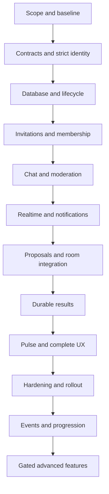

# Mandali — end-to-end implementation plan

## Current proposal — private groups and existing-wallet donations

Updated: 2026-09-17. **Analysis and planning only; not implementation approval.**

This section supersedes conflicting requirements in the September 16 draft below and its companion architecture/acceptance documents. The older material remains historical design input, not a second active release contract. Before implementation, reconcile those companion documents and ADRs against this proposal. No source code, migrations, dependencies, or deployments were changed for this update.

### 1. Confirmed requirements and recommended release boundary

Confirmed in the current conversation:

- Any verified signed-in account may create a private group, subject to ordinary abuse limits. Platform-admin status is not required.
- Every new membership requires the group owner/admin's approval. Opening a link, entering a code, or accepting an invitation does not grant membership. Creating the group atomically establishes its creator as owner; that is not a join request.
- Members can chat, request coins, donate existing wallet coins, and share game-room joining information.
- Example: A requests 100 coins; B chooses Donate; B loses 100 and A receives 100.

Recommended interpretation for the first complete release: one donor funds the full request, exactly once, with no fee. No partial contributions, automatic deductions, loans, group treasury, cash-out, or new currency. B sees a confirmation naming A and the amount. Admin approval is required for membership, not for each donation. These donation details are proposed defaults beyond the confirmed debit/credit example.

The core release includes creation, approval, membership administration, persistent text chat, structured coin-request cards, full-request donations, structured game-share cards, unread state, essential moderation, and durable in-app notifications. Deliver internal slices incrementally, but do not describe chat-only delivery as completion of this request.

Defer custom channels, uploads, voice/video, polls, advanced discovery, unique handles, probation, guest passes, reservation/waitlist machinery, seasons, and generated recaps. They are not necessary for the requested first loop. Existing draft features are not automatically mandatory. A direct member-to-member gift without a request can later reuse the transfer primitive; request-backed donations are the initial contract.

Privacy means access-controlled private groups, not WhatsApp-equivalent end-to-end encryption. The proposed server can process message bodies for moderation; do not market E2EE without a separate cryptographic/key-management design. Previously viewed or copied information cannot be recalled after removal.

### 2. Source-backed project assessment

Paths are relative to the repository root. This was a cross-project architecture review, not an exhaustive audit of every game implementation or proof of production configuration.

| Area | Observed evidence | Implementation consequence |
|---|---|---|
| Server stack | `server/src/index.ts`; `server/src/persistence/postgrest.ts:61` | Extend Express, Socket.IO and existing Supabase PostgREST/RPC; no NestJS, Redis or new server ORM required. |
| Authentication | `server/src/auth/identity.ts:295` promotes callers in auth-off mode | Introduce strict verified-account authorization for groups and transfers. Never inherit the development bypass. |
| Live rooms | `server/src/rooms/RoomManager.ts:1415`, `:1553`, `:1619` | Rooms are process-local and normally unsealed. Persistent groups are a separate domain; a room code is not membership. |
| Chat | `server/src/rooms/RoomManager.ts:5725`; `client/src/components/Chat.tsx:21`; `client/src/store/roomStore.ts:301` | Existing chat is socket-bound and ephemeral, capped at 200 client messages. Reuse presentation selectively, not its storage/identity model. |
| Parties | `shared/party/Party.ts:11`; progression migration party tables | Parties already exist but have different lifecycle/capacity rules, including one party per player. Do not turn parties into groups or migrate them silently. |
| Social page | `client/src/pages/SocialHubPage.tsx:16` | Current page is gated/mock, not a working private-group implementation. Add a real lazy-loaded group route. |
| Economy | `server/src/economy/EconomyService.ts`; `server/src/persistence/SupabaseEconomyRepository.ts`; economy migrations | Existing durable wallets, ledgers, stakes, rewards, cosmetics and settlement must be extended, not replaced. Peer donations are missing. |
| Wallet UI | `client/src/hooks/useEconomy.ts:132`, `:264`; `client/src/lib/economyApi.ts:22` | Refresh the existing authoritative wallet cache; ledger updates follow wallet version changes. Do not create a second balance store. |
| Game sharing | `client/src/components/room/RoomShareCard.tsx:21`; `client/src/pages/Room.tsx:1692` | This is the active share surface. Code sharing alone does not make the underlying game member-only. |
| Notifications | `client/src/lib/profileNotifications.ts:14`; `client/src/components/layout/AppLayout.tsx:130` | Existing profile notices include sample data. Approval/donation notifications need real durable records. |
| Feature flags | `client/src/lib/featureFlags.ts:20` | URL/local-storage overrides are presentation only. Authorization and rollout controls belong on the server. |
| Validation | Root `package.json:6`; client/server scripts and CI | Client tests and persistence tooling exist despite stale overview docs. New behavior needs explicit added coverage. |

Existing September 16 Mandali documents provide useful transaction, outbox, permission-revocation and private-room designs, but defer/isolate transfers and allow a direct-invitation membership path. Both conflict with this conversation. Recommendations or claimed historical approvals in those documents are not treated as fresh user authorization.

Current working-tree changes to streak code/tests, accessibility output, and persistence verification receipts are unrelated and must remain untouched.

### 3. Architecture decision

| Option | Assessment |
|---|---|
| Existing Express + Socket.IO + Postgres transactions | Recommended: one authoritative identity/economy boundary, existing deployment and tooling, least unnecessary migration. |
| Browser-direct Supabase group writes/realtime | Possible, but creates another authorization path alongside game/economy APIs and complicates atomic workflows. Not recommended here. |
| Separate chat/group microservice | Independently scalable later, but introduces distributed identity, transaction and room-admission coordination before there is evidence it is needed. Defer. |

Recommended flow:

```text
React group UI -> authenticated Express API -> focused group/economy services
              -> existing PostgREST RPC adapter -> PostgreSQL transaction
PostgreSQL outbox -> worker -> existing Socket.IO -> authorized refetch/sync
Game share/admission -> narrow room adapter -> existing RoomManager/GameEngine
```

Postgres owns memberships, requests, messages, transfers, audit and delivery intent. Socket.IO only delivers notifications of committed changes. Live gameplay remains RoomManager-owned; no database call per move. Do not use the progression write-behind queue for accepted messages or financial transfers.

Groups and donations fail closed when verified auth, required schema, or durable storage is unavailable. Test doubles are explicitly selected in tests; never silently substitute an in-memory production backend. A database timeout after a command may mean an uncertain commit, not a definite failure.

### 4. Membership, roles and invitations

Use stable verified account identity, not room seat IDs, display names, localStorage membership flags, or client-supplied actor IDs.

| Action | Owner | Admin | Member | Pending/outsider |
|---|---|---|---|---|
| Read permitted chat and member list | Yes | Yes | Yes | No |
| Send, request/donate coins, share games | Yes | Yes | Yes, subject to restrictions | No |
| Approve/reject applicants | Yes | Yes | No | No |
| Remove/ban ordinary members; moderate | Yes | Yes | No | No |
| Appoint/demote admins; transfer ownership; archive | Yes | No | No | No |
| Leave | Transfer or archive first | Yes | Yes | Withdraw request only |

Admins cannot remove the owner or modify peer admins. Group-admin status never grants platform-admin or wallet-adjustment powers. Suspension, chat mute and transfer restrictions are conditions separate from base role. An owner/admin can never spend another person's wallet.

Joining is always `PENDING -> APPROVED | REJECTED | WITHDRAWN | EXPIRED | CANCELLED`. Approval and membership creation are one transaction. Direct-invite acceptance creates a pending request; there is no auto-join exception. Approval requires an applicant-initiated request, so admins cannot silently enroll unwilling recipients.

Within that transaction recheck reviewer rights, applicant eligibility, ban/block status, group state, invitation validity and remaining capacity. Repeated approval creates one membership. Two approvals for the final slot yield one success. Unban does not restore membership or previous admin privileges; rejoining requires a fresh approval.

Exactly one eligible owner must exist for an active group. Use an authoritative owner pointer and a relational commit-time constraint to its active membership, not just an index that permits zero owners. Owner transfer, leave/archive, suspension and deletion have explicit audited workflows.

Invite URLs use cryptographically random tokens stored only as hashes. Human-entry codes are separate, rate-limited, expiring request locators, never authorization credentials; do not reuse six-character game codes. Use generic invalid/unavailable responses to limit enumeration. Limit preview to group name, approved description and curated avatar; no chat/member list/presence. Tokens must be redacted from logs and analytics. Revocation prevents future requests and cancels linked pending requests; use limits are consumed only by committed approvals.

Proposed configurable pilot defaults: 32 members/group, 5 memberships/account, 2 owned groups/account, 7-day invitation expiry, 10 successful uses/link, 1 active coin request/member/group, and 24-hour coin-request expiry. These are product defaults for review, not confirmed requirements or security guarantees.

New members see chat from their latest approved membership episode onward by default. Replies, search, cards and previews respect that visibility floor. They cannot fund a request whose underlying card they are not authorized to view. Rejoin does not restore access to previous private history.

### 5. Chat, delivery and private data

One general conversation per group. Initial trusted message kinds: `TEXT`, `SYSTEM`, `COIN_REQUEST`, `GAME_SHARE`. Only server workflows may create system/financial/game cards; user text cannot impersonate a transaction or trusted Join button.

Persist text before acknowledging success. Assign server ordering plus immutable IDs. A client-generated request ID and normalized payload hash make retries deduplicate; same key with different content conflicts. Use cursor pagination, bounded client memory, deletion tombstones and monotonic read cursors. Start with 50-message pages and a proposed 2,000-character maximum. Defer complex threads/search/edit history unless explicitly restored to release scope.

In the same database transaction, write the domain change and an outbox event. Workers claim bounded batches with leases, retry/backoff and deduplicated consumers. Socket delivery may duplicate or be missed; after reconnect/foreground, fetch canonical changes after the stored cursor. Changes must include deletion, card-status and access updates, not just new text. An expired cursor requires a clean authorized snapshot. Subscription setup must close the snapshot/subscribe race with a follow-up delta fetch.

Use the existing singleton socket with namespaced group subscriptions, account authentication/refresh and membership checks. Sensitive message bodies are fetched through authorized APIs; realtime hints carry IDs/versions rather than private bodies. Clear group cache, draft, subscriptions and stale in-flight responses on logout, account switch or membership loss. Disable caching of private API responses in browser/service-worker intermediaries.

Removal prevents all future reads/writes/subscriptions, cancels open requests and updates member-only game access. A delayed notification must not restore access. Use an authorization generation/revocation barrier to resolve concurrent admission or delivery; do not promise to erase information already downloaded.

Essential moderation: report message/member, remove or tombstone content, chat mute, ban, block-aware notifications/donations, slow-mode/rate limits, audit and a staffed escalation path. Preserve restricted report evidence when visible content is deleted. Start with in-app notifications only: approval needed, request decided, request funded, removal and permitted game-share updates. Wallet balance details never appear in group notifications.

### 6. Coin requests and donations: financial contract

Example with no fee:

```text
Before: A = 50 coins; B = 300 coins; request = OPEN for 100
B confirms Donate 100
After:  A = 150 coins; B = 200 coins; request = FUNDED
Ledger: B -100 and A +100, linked to one immutable transfer ID
```

Request lifecycle: `OPEN -> FUNDED | CANCELLED | EXPIRED`. Failed attempts do not mark it funded. The requester may cancel only while open. Amount is immutable; changing it means cancelling and creating a new request. Full funding closes the card across all clients. No donor identity/amount is inferred from untrusted card JSON.

The browser sends the group/request ID and idempotency key; the server derives B from verified credentials and A/amount from the stored request. There is a dedicated confirmation step, no automatic payment on opening a card, and no offline queued automatic transfer.

**One Postgres transaction must:**

1. Verify feature availability and current actor, group, membership, request, block and transfer eligibility under the established lock protocol.
2. Lock the relevant request and both wallet rows in a globally consistent order compatible with existing spending operations; serialize membership removal/cancellation against funding.
3. Resolve actor/operation/scope/key plus normalized payload hash before applying new-funding status checks. A committed retry returns only the actor's authorized sanitized receipt without moving funds again; changed payload conflicts. Coordinate concurrent uses of the same key. A different donor/key cannot fund an already funded request.
4. For a new transfer, check request is open/unexpired and visible to B, A and B are different active members of that group, both wallets are usable, B has sufficient transferable balance, and all caps hold atomically. A membership-lost caller may read their own prior wallet receipt through the wallet API, not regain group access through replay.
5. Debit B and credit A by the same positive integer amount; update both wallet versions and transfer-specific lifetime counters.
6. Insert one transfer record and exactly two linked append-only ledger entries; mark the request funded and update its card version.
7. Commit audit, safe receipt, change log and outbox notification intent together with the financial changes.

Any failure before commit rolls back all financial changes. Notification delivery happens after commit and cannot roll back or repeat money movement. Return success only for a confirmed committed receipt. If the HTTP response is lost, retry with the same key or fetch operation status; show Processing/Checking rather than encourage a second payment.

Two donors racing to fund A's request: one succeeds; the other receives Already funded and pays nothing. Double-clicks, multiple tabs, duplicate outbox deliveries and server restarts cannot produce another transfer. Donation versus game-entry debit, cosmetics purchase, account freeze or another donation must share wallet-row serialization; a process-local lock is not sufficient.

Use Postgres bigint and decimal-string API amounts; never JavaScript floating-point arithmetic for balances. Extend the existing ledger vocabulary with transfer-out/transfer-in categories and explicit cumulative counters rather than disguising donations as prizes, grants, or admin adjustments. Update the wallet reconciliation equation to include incoming minus outgoing transfers, preserving legacy counter meanings. Update every affected DTO, view, SQL constraint, repository implementation, wallet/history presentation and reconciliation test. The two transfer ledger legs sum to zero; total wallet supply is unchanged. No World Bank revenue, XP, game win or donation-volume reward is created.

An immutable transfer receipt is independent of the chat card. Deleting the message, leaving the group or closing the group must not delete financial records or refund a settled donation. Participants retain access to their own sanitized wallet receipt after group access ends, without revealing group history. Future reversal is a separate privileged, audited, compensating operation linked to the original; never edit ledger history or silently claw back coins after they were spent.

Additional source-backed donation prerequisites: match participant debit locking currently follows supplied participant order (`supabase/migrations/20260910000000_economy_idempotent_participant_debits.sql:125`), so align multi-wallet ordering across operations or explicitly support safe rollback/retry; sorting only the new donation path is insufficient. Review cosmetic refund correctness (`supabase/migrations/20260925000000_cosmetics_refund_capability.sql:109`): bound refunds to the original paid amount and atomically consume refund eligibility once before transferable balances launch. These are source-level review findings, not runtime-reproduced defects. Funding must not implicitly mint starter grants. Extend `WalletDrawer.tsx:39` with explicit transfer direction/labels because unknown entry types currently default to credit.

**Economy launch gate:** existing starter coins, recurring rewards, vouchers and cosmetic refunds acquire new abuse implications when transferable. Verified sign-in alone does not establish unique-human identity. Product/economy review must choose eligible sources, account-age requirements, per-transfer/day/recipient limits, shared-network-safe abuse detection, and handling of frozen/deleted accounts before enabling donations. If promotional coins are nontransferable, balance provenance or restricted-balance accounting and all relevant spend/refund paths must be designed and tested; an arbitrary lifetime-total formula is not a safe substitute. Keep donations disabled until this policy and cross-operation concurrency tests pass.

### 7. Database and API implementation map

Add only tables required by each implemented slice:

| Domain | Planned records/invariants |
|---|---|
| Groups | `mandalis`, `mandali_memberships`: stable IDs, owner relationship, versions, membership episode/visibility floor and indexes by account/status. |
| Approval | `mandali_invites`, `mandali_join_requests`: token hash/code lookup, deadlines, reviewer, unique pending request per group/account, limited uses. |
| Chat | `mandali_messages`, `mandali_read_cursors`, `mandali_changes`: group-scoped order/cursor, author/client-key dedup, structured object references, tombstones. |
| Donations | `mandali_coin_requests`, `coin_transfers`: immutable amount/recipient, request status/version, unique successful funding per request, sender/recipient receipt indexes. Extend existing wallets/ledgers, do not add competing wallets. |
| Reliability | Command receipts/idempotency, transactional rate-limit buckets where needed, outbox leases/deliveries, per-recipient inbox/preferences. |
| Safety | Audit, reports/evidence, membership restrictions and block integration; reuse existing primitives where verified adequate. |
| Games | Group-scoped share records; member-only games additionally need durable binding/access metadata and authority epoch. |

Use group-scoped composite relationships to stop cross-group message/request references. Index foreign keys and actual query patterns: group/message order, pending approvals, account memberships, open request expiry, wallet/transfer history, unread inbox and due outbox work. Use cursor rather than offset pagination for growing chat/ledger lists. Use timestamptz deadlines checked at command time, not only by cleanup workers.

Enable RLS and deny direct browser access to privileged tables/functions. Revoke default RPC execution grants; grant only required server roles. Because the existing service credential bypasses RLS, each privileged RPC must validate the server-verified actor and object scope. Use constrained search paths where security-definer functions are required. Verify real anon/authenticated/service-role behavior through actual PostgREST, not just SQL running as an owner.

Proposed modules: `shared/mandali/{types,permissions,validation}.ts`; `server/src/mandali/` controllers, authorization, focused services and repository; `server/src/economy/` transfer orchestration using existing repository/RPC infrastructure; `client/src/features/mandali/`, `client/src/lib/mandaliApi.ts`, `client/src/store/mandaliStore.ts`. Extend shared socket interfaces and centralized registration; do not put the whole feature into `RoomManager.ts` or `shared/types.ts`.

HTTP resource families under `/api/mandali`: groups/members, invite resolution, join requests and decisions, messages/read/sync, coin requests/fund/status, game shares, notification preferences and reports. All mutations have typed runtime validation, bounded error codes and idempotency where applicable. Use 401 for unauthenticated callers, 404 for inaccessible private objects, 403 for forbidden actions on visible objects, 409 for state/version conflicts, 429 for limits, and 503 for unavailable durability. Do not return SQL details or another member's wallet balance.

### 8. Game-code sharing versus private game admission

These are different features and must be labelled honestly:

- **Ordinary room shared to group:** an authorized member posts a validated game-share card; the server resolves current game/lobby availability. The underlying ordinary room retains existing code-based admission. A forwarded code can still work outside the group. Label it as a shared ordinary room, not a members-only game.
- **Members-only group game, recommended for the private-group experience:** creation registers explicit server-owned group/access metadata before exposing the lobby. Every join path checks current verified membership. The code locates the room; it does not grant entry. This costs more than placing a Join button in chat.

Build structured sharing first behind internal rollout, then enable member-only game creation through a narrow typed RoomManager adapter. Normal game code creation/join behavior must remain unchanged. Do not silently convert existing ordinary rooms into private rooms.

For member-only rooms, cover raw `room:join`, direct `/room/:code`, reclaim with an old seat token, `/tv/:code`, spectating, start, rematch, host migration, bot/local-seat changes and post-await revalidation. Reclaim requires current account authorization plus seat ownership. Default anonymous/guest access and spectating off for these rooms. Existing eligible bots follow catalog rules. Removing a member removes lobby access; during play use the existing departure/takeover/settlement lifecycle rather than inventing refunds or corrupting opponents' match.

Joining uses the existing singleton socket and same-tab room route, with explicit confirmation before leaving another active room. Provide Return to group. Shared cards show full/started/closed/interrupted states and current entry stakes. Sharing or approving group membership never charges game entry; preserve existing ready/consent and settlement flow.

Live rooms are in memory. Recommended initial restart contract: durable groups/chat/transfers survive; a lost advertised game becomes interrupted/unavailable, not silently recreated or resumed. A durable logical binding and fenced serving authority protect against duplicate room creation during retries and overlapping deploys. Do not claim horizontal game scaling from database persistence alone. If results are shown, project only authoritative durable outcomes with stable identities; a missing room is not proof of a winner or refund.

### 9. User experience

Routes: lazy-loaded `/mandali`, `/mandali/:id`, invite resolution, and existing game routes. Add navigation via the existing sidebar/header configuration without replacing friends/parties. Use Mandali as the existing working feature name, not a requirement to rename unrelated concepts.

Mobile: group list -> group conversation, compact header, accessible Chat/Games/Members sections and admin approval badge. Requests appear as cards: requester, amount, expiry/status and Donate. Confirmation sheet names the recipient and uses the existing wallet display. Keep composer above the mobile keyboard/safe area; history pagination preserves scroll position. Show pending membership without chat previews.

Desktop: group list, conversation, optional member/game context rail; dedicated layout rather than enlarged mobile markup. Share data/hooks/cards across layouts. Use existing DLS buttons, accessible Modal, error/empty/loading states, themes and reduced-motion preferences. Refresh both donor and recipient wallets authoritatively after committed events; wallet versions trigger existing ledger refresh. Never optimistically claim a changed financial balance.

Required unhappy states: pending/rejected membership, invalid/revoked code, group full, muted/removed, message sending/uncertain/retry, request expired/cancelled/funded, insufficient or ineligible coins, frozen wallet, feature read-only, database outage, game full/ended/interrupted, expired login and account switch.

### 10. Delivery plan and release gates

Each milestone includes real backend/frontend integration and focused tests. Schema ownership and economy changes must be coordinated; frontend work can proceed against typed fixtures, but fixtures are not acceptance evidence.

| Milestone | Work and dependencies | Exit proof |
|---|---|---|
| P0 — contract and baseline | Reconcile older docs; settle provisional defaults, transfer eligibility/caps, history/retention and game-sharing scope; capture current test/build baseline and deployment topology. | Approved scoped contract; unrelated failures identified; no unresolved financial/privacy policy hidden in implementation. |
| P1 — identity/schema foundation | Strict verified auth, server flags, domain contracts, repository/RPC approach, migration/grant tests, idempotency/outbox foundation. | Auth-off cannot grant access; direct browser RPC denied; durability unavailable means fail-closed. |
| P2 — groups and approval | Atomic creation/ownership, invites/codes, requests/approval, capacity, roles, removal/ban/archive and first usable group UI. | Two real accounts complete create -> request -> approve; outsider cannot read; concurrency/owner invariants pass. |
| P3 — durable chat | Message/card types, pagination/read cursors, sync, notifications, basic moderation, mobile/desktop layouts. | Committed message survives restart; lost/duplicate events converge; removal closes every private-data path. |
| P4 — wallet donations | Requires P2/P3 and approved economy policy. Request cards, atomic transfer RPC, counters/ledger/views/DTO updates, confirmations, receipts and wallet refresh. | A requests 100, B pays 100, one receipt/two balanced entries; all concurrent-spend, retry and crash cases pass. |
| P5 — game integration | Share existing rooms honestly; add explicitly member-only creation/admission, same-tab entry/return, lifecycle/card updates and existing economy regression tests. Can run alongside P4 after contracts stabilize. | Leaked code/old seat cannot enter member-only game; ordinary rooms unchanged; restart produces correct unavailable state. |
| P6 — production readiness | Real PostgREST security tests, multi-account browser journey, load/chaos, deletion/export, monitoring, restore/rollback, human support and independent privacy/economy review. | Evidence-backed release sign-off; server-controlled internal -> invited cohort -> wider rollout. |

Rough planning estimate, not a commitment: 12–18 engineer-weeks for this narrower core including request-backed donations and limited member-only game certification; about 8–12 calendar weeks with two engineers and dedicated QA/design/review support. Transferable-balance provenance, live-game restoration or broad game certification can add substantial scope. Re-estimate after the first real donation transaction and first private-room integration. The older 14–22 engineer-week estimate covers a broader feature bundle and is not additive.

### 11. Acceptance tests that define completion

- Identity/permissions: verified and expired accounts; auth-off refusal; actor spoofing; cross-group object IDs; role hierarchy; direct API/socket access; logout/account-switch stale responses; owner transfer/deletion.
- Membership: duplicate approvals; two applicants/final slot; approve versus revoke/ban/archive/expiry; direct invite still requires approval; leave/rejoin cannot recover former privileges/history.
- Chat: loss before/after commit; duplicate sends and changed-payload idempotency; reconnect gaps; deletion/card updates; cursor retention reset; private-body denial after removal; evidence survives visible deletion.
- Donations: exact 100-coin example; self-donation refusal; insufficient/frozen/ineligible balance; two donors/one request; same donor/two requests; donation versus game entry and cosmetics; cancel/expire/remove/freeze versus funding; duplicate HTTP retries/new connections; response lost after commit; crash before/after commit; notification failure; wallet/ledger/version reconciliation; no supply creation; safe receipt after group exit.
- Games: ordinary sharing retains ordinary policy; member-only raw code/URL/spectator/reclaim paths deny outsiders; removal/admission race; another active-room conflict; consent/entry charges preserved; retry/deploy interruption cannot duplicate live authority; normal room/guest/solo/pass-and-play regressions unchanged.
- Database: fresh additive migration and upgrade with existing wallets/data; backfill defaults; old/new app compatibility; FK/grant/RLS checks; simultaneous transactions on separate connections; bounded locks/retries; real PostgREST role matrix; backup restore and outbox lease recovery.
- Browser: separate A/B/admin/outsider contexts complete approval -> chat -> request -> donate -> play -> return. Verify 320px minimum and 375/768/1024/1440 layouts, mobile keyboard, 44px targets, zoom, screen reader/focus, both themes and reduced motion. Label emulated versus physical-device evidence.

Existing root commands to run during implementation: `npm run typecheck`, `npm test`, `npm run build`, `npm run check:bundle`, `npm run check:deps`, `npm run check:admin-key-leak`, `npm run verify:persistence`, `npm run coverage`, `npm run check:mobile-layout`, `npm run check:a11y-rendered`, `npm run check:multiplayer`, `npm run check:deployment`, and the applicable release/enterprise gates. Extend real-Postgres and browser harnesses with group/transfer scenarios; existing passing reports alone cannot certify this feature. Isolated configured services are required for persistence/staging/restore checks; never run destructive scenarios against production. Verify current package scripts before execution and record whether a separate lint command exists rather than assuming one. The current schema harness targets the progression migration, not the entire migration chain; explicitly load and exercise group/transfer migrations. Release/enterprise reports are aggregations, not substitutes for executed tests, and the enterprise report's actual certification states differ from older governance descriptions. Rendered mobile checks do not prove every 44px touch target by their passing score alone; explicitly exercise the new authenticated routes and room integration.

### 12. Operations, privacy and rollout

Use independent server flags for groups, invitations, chat writes, coin requests, donations and private-game creation. A transfer kill switch stops new funds movement but preserves receipt/history access and committed-event recovery. Disabling game creation must not abandon active matches or settlement recovery. Client flags never grant eligibility.

Proposed pilot capacity test: 200 authenticated clients across 20 groups, 20 aggregate chat writes/second, burst funding contention and concurrent games for 60 minutes. Measure rather than claim this capacity. Initial targets: ordinary API p95 under 500ms excluding external-auth latency, committed-change visibility p95 under 2 seconds, bounded reconnect recovery. Tune to the real hosting tier before rollout.

Monitor oldest outbox work, failed deliveries, denied membership/admission, transfer conflicts, uncertain operations, wallet reconciliation failures, database latency, memory and moderation queue age. Alert on any reconciliation mismatch or private-data incident; log correlation IDs, never tokens/private chat bodies. Assign an operator to reports and financial investigation before external launch.

Privacy/deletion is a prerequisite, not cleanup: the current account deletion path deletes `auth.users`, progression cascades to identities, while economy tables restrict deletion of wallet-bearing identities. Resolve this through an explicit transfer/archive and retained/pseudonymized financial-record workflow; do not promise simple cascading erasure. Integrate export, restricted evidence, retention holds and account disabling with existing privacy surfaces. Proposed chat retention is 90 days; evidence/financial retention requires an approved purpose-specific policy, not automatic adoption of the chat lifetime. This plan makes no legal-compliance claim.

Deployment: backup/restore drill -> additive migrations -> compatible backend with flags off -> lazy frontend -> isolated acceptance -> internal accounts -> invited cohort -> wider rollout. Verify actual single-authority behavior during rolling replacement. Roll back through server flags and compatible application versions; never drop ledgers/groups or truncate evidence to undo a UI release. Keep committed transfer/outbox and existing game-settlement recovery running.

### 13. Consolidated risk register

Libraries support safeguards; they do not establish transaction correctness, private access or live-game scalability by themselves. Severity below is a planning assessment, not a claim of reproduced production incidents.

| Risk | Severity | Required mitigation and evidence | Delivery gate |
|---|---|---|---|
| Duplicate or inconsistent donations | Critical | One transaction for both wallets, paired ledger entries and request closure; unique successful funding; retry/response-loss/crash and two-donor tests. | P4 |
| Concurrent spending across features | Critical | Wallet-row serialization shared with game entry, cosmetics and other transfers; compatible multi-wallet lock order; bounded idempotent retries and real concurrent transactions. | P4 |
| Private data exposed across membership boundaries | Critical | Central authorization and group-scoped RPC checks; no content for pending members; revoke subscriptions and discard stale caches/responses; exercise all read/write paths. | P1–P3/P6 |
| Account disabled while cached/JWT credentials remain valid | Critical | Explicit current-account eligibility/revocation mechanism in addition to signature/expiry verification; test disabling an account with active sockets and cached credentials. Define fail-closed outage behavior and revocation propagation bounds. | P1/P4/P6 |
| Coin farming and economy imbalance | High | Approve eligible coin sources, account-age/transfer limits and abuse policy; review promotional grants, vouchers and original-payment-bounded refunds; no donation-volume XP. | P0/P4 |
| Lost, repeated or outdated chat/card updates | High | Persist before acknowledgement; transactional outbox; monotonic change cursor, deduplication and canonical reconnect recovery, including deletions/funded status. | P3 |
| Member-only game entered through an alternate route | High | Reauthorize raw code, direct URL, seat reclaim, TV/spectator, start/rematch and asynchronous admission; ordinary-room regression tests. | P5 |
| Multiple servers claim the same live game | High | One authoritative room worker, explicit routing and fencing; test replacement/lease loss/reconnect. Socket fan-out alone is insufficient. | P5/P6; later scale gate |
| Personal-data deletion conflicts with financial retention | High | Resolve owner succession, pending requests, balance policy, restricted evidence and retained/pseudonymized receipts; export/delete tests against actual schema. | P0/P6 |
| Spam, harassment and moderation overload | High | Rate limits, report evidence, member restrictions and human escalation ownership; measure queue age and prevent reporting abuse. | P3/P6 |
| Database, fan-out and client-history growth | High | Indexed scoped queries, cursor pagination, bounded listeners/caches, selective subscriptions, retention and measured load/heap tests. | P3/P6 |
| Hosting downtime, operating cost and dependency failure | High | Appropriate always-on compute, database capacity, restore-tested backups, bounded retries/backpressure and provider outage runbooks; budget from measured traffic. | P6 |
| Added packages increase supply-chain and integration risk | Medium | Minimal dependency set, compatible versions, lockfile review, license/security checks and maintenance ownership; no incidental framework migration. | Every dependency change |

Account authentication and account eligibility are distinct: the existing verifier's cached success or locally valid JWT does not establish that the account is still active. Define whether verified membership requires confirmed email or another account policy; neither local flags nor a library alone supplies that policy. Removal/account revocation must remain effective even when notification delivery is disabled.

### 14. External libraries and infrastructure strategy

The package inventory below was inspected during planning; it is not an installed-version/security audit. Recheck manifests, resolved versions, Node/TypeScript support and peer dependencies before implementation. Nothing in this section authorizes installation or deployment.

#### Reuse dependencies already present

| Existing dependency/tool | Planned use |
|---|---|
| Express, Socket.IO and socket.io-client | Authenticated APIs and realtime committed-change hints; preserve the singleton connection. |
| Client `@supabase/supabase-js` | Existing account session integration; keep the server's fetch-based PostgREST/RPC adapter. |
| Zustand | Bounded account/group-scoped state without a competing wallet cache. |
| Client Zod and React Hook Form | Form validation and compatible runtime contract schemas. |
| `@tanstack/react-virtual` | Long message/member list virtualization when profiling justifies it; preserve scroll anchoring and accessibility. |
| Existing Radix/Base UI and DLS components | Accessible dialogs, confirmations, menus and responsive controls; do not introduce another UI kit. |
| Vitest, Testing Library and Playwright | Permission/state tests, component behavior and multi-account browser journeys. |
| Root development `embedded-postgres` and `pg` | Actual transaction/concurrency tests; not a requirement to add a production SQL driver. |

No new ORM, chat platform, frontend framework or data-fetching framework is necessary for the initial release.

#### Recommended initial additions, subject to dependency review

| Candidate | Purpose | Scope/decision |
|---|---|---|
| Server `zod` | Validate untrusted HTTP/socket payloads at runtime and share compatible schemas. | Declare explicitly in the server package if imported there. Match the existing client schema major version or plan a deliberate coordinated upgrade; TypeScript types are not runtime checks. |
| `rate-limiter-flexible` | Consistent request/socket abuse throttling rather than further bespoke implementations. | Evaluate against existing limiter utilities. Shared enforcement across replicas needs a shared backend; financial quotas remain atomic in Postgres, not merely limiter counters. |
| `@opentelemetry/api`, `@opentelemetry/sdk-node`, selected instrumentation and exporter packages | Backend traces/metrics across request, database and outbox work. | Extend existing logging/metrics rather than duplicate them. Export to a chosen collector/backend; redact tokens, private bodies and sensitive identifiers. Current documentation treats browser instrumentation as experimental, so it is not a launch dependency. |
| Development `fast-check` | Property-based tests of balance conservation, idempotency and state transitions. | Complements, not replaces, real Postgres concurrency and browser tests. |
| Optional `@sentry/node` and `@sentry/react` | Error reporting and actionable release diagnostics. | Alternative/complement to the chosen observability system; avoid duplicate tracing. Private chat session replay stays disabled unless explicitly justified and consented. Review data residency, scrubbing and cost. |

These are recommendations, not a mandatory bulk installation. The minimum viable implementation can use existing utilities where they meet the same verified requirements. No package establishes exactly-once financial effects without the database invariants in section 6.

#### Add only at the multi-server or heavier-worker stage

| Candidate/infrastructure | Use | Preconditions and limitations |
|---|---|---|
| `@socket.io/redis-streams-adapter` | Fan out events among multiple Socket.IO servers; supports connection-state recovery. | Does not persist canonical chat/wallets, distribute RoomManager state, or replace authorization. Recovered subscriptions must not restore revoked membership. Keep database cursor recovery. |
| `redis` or `ioredis` | Redis connectivity for the chosen adapter/worker stack. | Select deliberately based on compatibility; do not add both without justification. |
| Managed Redis | Shared transport, presence leases and distributed throttling. | Extra infrastructure, cost and outage behavior; never the authoritative wallet store. Bound stream/presence retention and test disconnect recovery. |
| Optional `bullmq` | Dedicated background processing for push/email delivery, reminders, exports or media workloads. | Evaluate when workload warrants it; the common Redis-backed deployment adds Redis operations. Keep the Postgres outbox as the committed source of work and make enqueue/consumers idempotent. Jobs may run again after failures. |

Initially use a bounded Postgres outbox worker; do not operate a second competing queue merely to deliver chat updates. If later adopting a job library, define the outbox-to-queue handoff, duplicate handling, leases, shutdown, retry/dead-letter ownership and rollback explicitly. A job queue must never split donor debit and recipient credit into separate jobs.

For Socket.IO multi-node deployment with HTTP long-polling enabled, configure appropriate session affinity. Affinity for a socket connection is not room ownership: players on different connections still need routing to their game's authoritative worker. WebSocket-only transport avoids the polling affinity requirement but loses that fallback and does not solve game ownership.

#### Optional future features

| Capability | Candidate | Required design before adoption |
|---|---|---|
| Browser push/reminders | `web-push` | Opt-in subscriptions, service-worker/browser support, renewal/revocation and privacy-safe payloads. Push is best-effort, never proof of financial completion. |
| Group voice/video | `livekit-client`, `livekit-server-sdk` | SFU service/deployment, TURN/network capacity, moderation and cost planning. Do not stretch existing mesh voice to large groups. |
| Attachments | Existing Supabase Storage SDK plus selected file-validation/scanning service | Private buckets, authorized upload/download, size/type limits, untrusted-file scanning, retention and signed-link expiry. Filenames/MIME claims are not proof of safe content. |
| Group search | Postgres full-text search initially | Apply membership, history floor, deletion and retention to every result; no new search engine until measured need. |
| Rich text | Editor/sanitization library selected later | Plain text is the initial scope; review rendering, link policy, sanitization and moderation before expansion. |
| AI summaries/translation | Provider SDK only after product/privacy approval | Explicit consent, group-level visibility controls, provider processing/retention policy and prompt/output isolation. No silent forwarding of private messages to an AI provider. |

E2EE is not an optional package toggle. It requires a separate protocol/key lifecycle, multi-device/recovery, member-removal and metadata threat model, and decisions about server-side search, moderation and AI features. Do not imply the above libraries provide WhatsApp-equivalent privacy.

#### Dependency adoption controls and reference documentation

For each accepted package: name the responsible maintainer, document why existing utilities are insufficient, review license/security advisories and transitive dependencies, choose compatible versions, update the lockfile through the package manager, and run relevant typecheck/tests/build/dependency and bundle gates. Pin the agreed dependency policy rather than blindly installing latest versions. Treat hosted telemetry, Redis, SFU and scanning as separately budgeted infrastructure, not free library capabilities.

Documentation consulted during planning:

- [Socket.IO Redis Streams adapter](https://github.com/socketio/socket.io-redis-streams-adapter)
- [BullMQ](https://docs.bullmq.io/)
- [OpenTelemetry JavaScript](https://opentelemetry.io/docs/languages/js/)

Documentation capability statements are not a compatibility certification for the repository's resolved versions.

### 15. Measured scalability roadmap

1. **Reliable initial launch — P1–P6:** existing stack, strict authorization, atomic wallet transactions, database-backed chat/outbox, indexed pagination, monitoring and real storage tests. Use appropriate production compute and restore-tested backups.
2. **Optimize measured bottlenecks:** profile database plans, chat rendering, subscription/fan-out volume and memory; apply indexes, virtualization, batching and bounded caches. Avoid synchronous per-member work on the message-write request path.
3. **Separate heavy background workers:** move exports, media or large notification jobs away from latency-sensitive gameplay. Keep committed source records and replayable outcomes in Postgres; choose a queue only after identifying actual operational requirements.
4. **Scale API/realtime replicas:** introduce shared transport/throttling/revocation as needed, load-balancer affinity where required, distributed presence leases and compatible deployments. Test Redis outage and subscription recovery. Database transactions remain authoritative.
5. **Scale live games independently:** assign each room one authoritative worker with explicit routing/fencing, replacement behavior and capacity limits. Mid-game restoration needs its own checkpoint/replay design; do not promise it through a Socket.IO adapter.
6. **Add optional capabilities incrementally:** push, media, voice or AI each receives a focused privacy, moderation, cost and recovery review. Stable IDs, versioned contracts/events, focused modules and immutable transfer receipts preserve extension points without speculative tables or services.

Advance stages based on measured CPU/event-loop delay, database latency/locks, outbox backlog, socket counts, reconnect behavior and capacity forecasts—not an arbitrary user-count promise. Record load-test topology and hosting tier with results. Always-on compute, database headroom, backup retention, restore drills and incident ownership are operational prerequisites that libraries cannot replace.

### 16. Review status and remaining decision gates

Confirmed: verified-account private groups; admin approval for every join; existing-wallet debit/credit donation example. Proposed: full-request-only funding, no fee, no per-payment admin approval, configurable quotas, history floor, retention, restricted game defaults and restart boundary. Donation-source eligibility, financial caps and account lifecycle/retention are mandatory release decisions before their dependent implementation.

Verification for this planning update: repository/source and existing plan review; read-only working-tree status and recent commit inspection. No tests/builds, live database checks, migration execution or production capacity measurements were performed. No implementation success is claimed.

---

## Historical September 16 draft — superseded where it conflicts above

Date: 2026-09-16  
Status: Planning complete for review; development has not started.  
Confirmed product decision: the feature is **Mandali**, not Circles.  
Companion documents: [Architecture and domain design](MANDALI_ARCHITECTURE.md) · [Acceptance and release checks](MANDALI_ACCEPTANCE_AND_RELEASE.md)

## 1. Intent and source of truth

Build a private, persistent place for trusted Bhalyam players to gather, communicate, form a game, join in the same tab, and return to their shared group afterward. Success means more successfully completed games with familiar players, not more messages.

This plan translates all three source documents into the current repository:

- `PlanningIdea.md`: original broad blueprint; Redis and NestJS suggestions are superseded below.
- `Bhalyam_Circles_Team_Discussion.md`: product principles and staged scope.
- `Bhalyam_Circles_PRD_and_Planning.md`: FR-001 through FR-033 and launch acceptance requirements.

Keep those source documents unchanged as historical inputs. Use `Mandali`, `mandali`, `/mandali`, `/mandali-game/:token`, and `/api/mandali` in new implementation. There are no existing Circles routes to migrate. Avoid renaming unrelated party, friend, or game concepts.

This is an architectural addition, delivered as tested vertical slices. The user requested planning before development. This document authorizes neither implementation nor deployment. Product defaults below are recommendations for review, not previously agreed requirements.

## 2. Repository findings that change the original blueprint

| Observed implementation | Consequence for Mandali |
|---|---|
| `server/src/index.ts` mounts Express REST routers and Socket.IO. The server package contains no NestJS. | Extend Express and the existing socket connection. A framework migration is outside scope. |
| `server/src/persistence/postgrest.ts` already exposes `rpc`; production persistence uses Supabase service credentials. | Use Postgres transaction functions through this adapter. No server Supabase SDK or new production SQL driver is needed. |
| `server/src/auth/identity.ts` resolves verified account/guest identities, but `requireMember` promotes callers when verification is off. | Add a strict Mandali member guard. Never reuse that development bypass for private persistent data. |
| `server/src/rooms/economyIdentity.ts` distinguishes a stable verified identity from a room-local seat ID. | Membership, bans, invitations, and proposal seats use stable identity IDs. `mpg.playerId` is never Mandali identity. |
| `RoomManager.createRoom` has a long positional API; `joinRoom` can reclaim by seat token; ordinary rooms are currently created with `sealed: false`. | Add a narrow typed Mandali room adapter and explicit access metadata. A room code or existing seat token must not bypass current Mandali authorization. Do not change global guest-room policy incidentally. |
| `requestGameStart`, terminal settlement intents, and `DurableSettlementWorker` already govern game economy. | Mandali cannot bypass entry consent, balance checks, settlement, or refunds. No new wallet transfer feature is included. |
| `recordPostMatchStats` uses room-local participant IDs; game state and some not-yet-persisted terminal payloads remain in memory. | Create a stable-identity result projection and explicit crash boundary. Existing match-history callbacks alone do not establish Mandali durability. |
| `SocialController`, friends, party, presence, and persistence already exist. A durable unique username/block service was not found in the inspected social/profile surfaces. | Reuse identity and friend edges; add handle lookup and blocking deliberately. Do not confuse a short-lived party with a persistent Mandali. Confirm absence repository-wide in milestone M1. |
| The app uses typed fetch helpers, `apiFetch`, Zustand, and a singleton `getSocket`. React Query is not an installed dependency. | Follow existing fetch/store patterns. Do not add another data-fetching framework just for this feature. |
| `AppLayout` uses `INITIAL_NOTIFICATIONS`; source inspection does not establish a durable notification inbox. | Implement real Mandali inbox records and preferences; do not count mock notification UI as delivery infrastructure. |
| `shared/catalog.ts` supplies game limits and `registry.ts` contains 17 engine registrations. | Use the actual catalog. The older overview's ten-game list is stale. Enable Mandali games only after game-specific certification. |
| Root scripts include client/server tests, rendered accessibility/mobile checks, persistence checks, and coverage. | Extend these runners with Mandali scenarios. The older claim that there are no client tests is stale. |
| Client feature flags can be overridden through URL/local storage. | Add server-enforced Mandali rollout controls; client flags are presentation only. |

Existing uncommitted cosmetics/streak work and `docs/ai/application-memory-map.md` were observed. They are outside this planning change and must be preserved during implementation.

## 3. Architecture choices

| Approach | Benefits | Cost / limitation | Decision |
|---|---|---|---|
| Extend Express + Socket.IO, with Supabase RPC transactions and a Postgres outbox | Fits current deployment, identity, persistence, and game lifecycle; no Redis | Requires disciplined admission and room-creation coordination | **Recommended** |
| Separate NestJS Mandali service | Independent deployment and framework boundaries | Duplicates authentication/realtime plumbing; distributed room authority; extra operations | Defer unless an independently operated social service becomes necessary |
| Browser-direct Supabase writes and Supabase Realtime | Less API plumbing | Splits permissions/game admission across transports; transactional workflows still need database functions | Do not use for the initial implementation |

Deploy one Express/Socket.IO process serving live rooms and Mandali, backed by the existing Supabase Postgres. The outbox worker initially runs in that process. PostgreSQL owns durable Mandali data; `RoomManager` continues to own active game rules, turns, timers, and bot behavior. No database access is added to each game move.

## 4. Release boundaries

### R1: Complete private coordination loop

- Private identity/settings, exactly one owner, moderators, member restrictions, transfer, leave, archive, deletion request.
- Unique-handle invitations, invitation inbox, hashed invite links, approval, expiry, revocation, capacity protection.
- Durable text, one general channel, one-level threads/replies, reactions, mentions, edit history, deletion tombstones, pagination, unread cursors, announcements, pinning, retention-scoped search.
- Reporting, blocking, content hiding, mute, ban, slow mode, thread lock, audit history, platform escalation and appeal intake.
- Proposals, reservations, explicit confirmations, waitlists, structured cards, one room binding per proposal, same-tab game entry, guest passes, eligible bot fill.
- Opt-in presence and initial Pulse: available members, compatible certified games, active proposals, open seats, permitted pending approvals.
- Durable in-app notifications, preferences, basic aggregate analytics, minimal finalized match history.
- Recovery, operational dashboards, feature controls, accessible mobile/desktop layouts, staged rollout.

R1 does **not** include custom channels, attachments, push/email providers, Circle voice, cross-Mandali games, resource transfers, reward-bearing seasons, advanced recommendations, or a game-engine rewrite. Future-only Pulse cards stay absent rather than appearing as empty or fake features.

### R2: Shared activity and identity

Events, polls, timezone-aware reminders, optional operational roles, richer match memories, explicit-consent share cards, weekly recaps, post-match Mandali formation, saved game presets, collaborative challenges, cosmetic progression, and seasons. Basic match history ships in R1; narrative memories and generated sharing ship here.

### R3: Separately gated extensions

Approved isolated non-withdrawable resources with a balanced ledger; advanced recruitment; cross-Mandali competition; voice; multi-instance realtime. Each requires a focused design and the audits identified in the source PRD. None is a prerequisite for useful R1 delivery.

## 5. Product decisions and proposed defaults

The name and restart boundary are confirmed. Accepting the plan should explicitly settle D03–D08 before their dependent work starts. Remaining tunable values can use the documented defaults, subject to launch review.

| ID | Decision / recommended policy | Gate |
|---|---|---|
| D01 | **Confirmed:** product name Mandali; technical prefix `mandali`. | Settled by user |
| D02 | **Confirmed:** preserve durable Mandali state across restart; interrupted live games become unavailable and require a fresh proposal. Do not promise mid-game restoration. | Settled by user |
| D03 | R1 guest pass targets a verified Bhalyam account that is not a Mandali member. Anonymous/signed-guest admission is a separately enabled extension with claim/recovery policy. | M0; explicit narrowing of ambiguous PRD guest terminology |
| D04 | Initial certification cohort: Ludo, UNO, RPS. Expand the same adapter to remaining catalog games individually. Existing game entry economics apply, with explicit participant consent; this plan does not introduce free tables. | M0; validate choices with product before M6 |
| D05 | 5 active Mandali memberships per account, at most 2 owned; 32 members per Mandali. Active, probationary, muted and suspended memberships count toward capacity; pending invitations and game-seat reservations do not. | M1 configuration |
| D06 | Normal messages/edit history retained 90 days; editing allowed for 15 minutes; deletion hides body immediately. Proposed report evidence/audit retention 180 days; archived group restoration window 30 days. Holds override purge. | Product/privacy policy approval before production; no legal-compliance claim |
| D07 | Link-approved users enter probation for 24 hours, owner/moderator may promote earlier. They see content from join time onward, may react/join games, cannot send text/create proposals/invite. Direct-invite acceptance creates a normal member. | M2–M4 |
| D08 | No automatic ownership promotion. Owner suspension freezes administrative mutations; account deletion requires transfer or archive through an audited support flow. Owner-only Mandali can be archived before account deletion. | M2/privacy integration |
| D09 | Invite links: 7-day expiry, 10 successful memberships, max configurable 30 days/100 uses. Direct invites: 7 days. Revoking a link cancels its pending requests; use is consumed only by committed membership. | M3 |
| D10 | Immediate proposal expiry: 30 minutes. Reservation hold: 2 minutes. Waitlist offer: 60 seconds. Explicit organizer launch only after confirmed minimum is met. | M6 |
| D11 | At most one guest seat per R1 proposal and at least two Mandali human members; bots do not satisfy that minimum. Guest pass bound to recipient identity, expires no later than proposal/game lifecycle. | M6 |
| D12 | General channel only; 2,000-character messages; pages of 50, max 100; one-level threads; mentions reference real authorized identities; curated avatar/banner/reaction IDs only. | M4 |
| D13 | Presence opt-in, 30-second heartbeat, 90-second expiry, aggregate multi-tab connections; no exact last-seen. In-app notifications only; default mentions/games/administration, with explicit per-category preferences. | M5/M8 |
| D14 | Private metadata preview through a valid invite contains name, curated avatar, and a short owner-approved description only. No member names, presence, chat, or counts unless explicitly approved later. | M3 |
| D15 | Proposed rename cooldown 24 hours; names 3–40 characters, Unicode-normalized display text. Handles 3–20 lower-case ASCII letters/digits/underscore, unique and reserved-name filtered; existing display names remain unchanged. | M1/M2 |
| D16 | Proposed limits: create 2/day/account; invitations 20/hour/account and 100/day/Mandali; requests 10/hour/account; proposals 10/hour/account; reports 10/hour/account. Chat burst 5/10 seconds and 30/minute. Add measured network-wide ceilings that tolerate shared networks. | M3/M4 and load calibration |

Blocking prevents direct invitations, mentions/notifications, presence visibility, and new co-seating between the two identities. It does not erase existing shared membership or cancel a match already in progress. Shared-chat hiding is explicit; the blocking member receives a collapsed placeholder. Mandali removal/ban is the mechanism for group-wide exclusion.

## 6. User experience before implementation

### Mobile: 320–767px

`/mandali` lists the user's groups, invitations, and Create action. A group opens a compact header and tabs for Pulse, Chat, Games, and More. More contains members, history, info, preferences, and permission-gated management. Use full-screen thread/member views and bottom sheets for invites/proposals/actions. Chat composer stays above the virtual keyboard and safe area; history preserves scroll position when older messages load. The game card shows state, confirmed count, cost/eligibility, and one primary action. Never navigate automatically when a room becomes ready.

### Tablet: 768–1023px

Use the mobile interaction model with a wider content column; optionally show the group list beside the current content when measured space allows. No squeezed three-column desktop layout.

### Desktop: 1024px+

Use the existing application shell. Inside it, show a narrow Mandali/channel list, the main chat/Pulse/proposal area, and a collapsible context rail for available members and game details. Keep composer and relevant controls persistent. Threads can occupy the context rail. Keyboard actions and visible focus must reach the same operations as mobile.

### Shared components

`MandaliHeader`, `MandaliCard`, `MemberRow`, `RoleBadge`, `MessageRow`, `MessageComposer`, `ThreadView`, `ProposalCard`, `InvitePreview`, `PermissionGate`, `PresenceBadge`, `UnreadMarker`, `NotificationRow`, confirmation dialogs, loading/empty/error states. Only shells differ. Use existing DLS, accessible dialog primitives, `useViewport`, audio/haptic preferences, and reduced motion. Never introduce `Sparkles`.

### Required journeys

1. Verified account → Create → private Mandali with owner → invite by handle → recipient accepts.
2. Open invite → sign in and safely return → limited preview → request → approval → probation view.
3. Member sends a message → committed server response → realtime update; disconnect/reconnect restores canonical history without duplicates.
4. Create proposal → reserve/confirm → organizer launches → one room → choose Join → `/room/:code` lobby in the same tab → existing ready/entry-consent flow → play.
5. Finish → durable result appears → Return to Mandali; guest sees only the result for their game and an optional membership invitation.
6. Moderator removes member → current subscriptions, cached content, pending seats and guest grants are invalidated; refresh/direct room URL cannot recover access.
7. Failed/expired/full/cancelled/interrupted routes explain the state and offer Return, Retry where safe, or Create another proposal.

## 7. Delivery sequence and file ownership

Names below are planned file targets, not existing implementation claims. Each milestone ends with a reviewable, independently testable slice behind disabled-by-default server controls. Database correctness is tested against real Postgres, not only mocks.

### M0 — Confirm scope and establish baseline

Dependencies: none. Owner: product + technical lead.

1. Resolve D03–D08, accept source-to-repository deviations, confirm language/age/moderation policy and R1 games.
2. Record ADRs in `docs/ai/bhalyam-decision-log.md`: existing stack, durable social boundary, strict identity, restart behavior, scoped room admission, and result finalization.
3. Capture current typecheck/tests/build/persistence results and identify unrelated baseline failures. Review current deployment/runtime configuration without copying secrets.
4. Approve written mobile/desktop flows above, then create UI references before frontend implementation.

Exit: concrete R1 acceptance contract, decision owners, and baseline report. No need to migrate engines or replace parties.

### M1 — Shared contracts, strict identity, handles and blocks

Dependencies: M0. Owner: backend/shared engineer.

Targets: new `shared/mandali/{types,permissions,validation}.ts`; extend socket interfaces in `shared/types.ts`; new `server/src/mandali/MandaliAuthorization.ts`; targeted changes to `server/src/auth/identity.ts`, profile/social surfaces, and account/profile UI.

1. Define DTOs, error codes, enum transitions, permission bundles, explicit member versus guest-pass identity, and server capability responses.
2. Implement strict verified-member guard without changing legacy `requireMember` semantics globally. Disable Mandali when verified auth or durable storage is unavailable.
3. Add durable handle registration and opt-in lookup preferences; reserve names; no guessed mapping from duplicate display names.
4. Add durable block relationships, invite preferences, and account-eligibility checks shared by all Mandali workflows.
5. Adopt runtime boundary validation. Reuse installed Zod on the client; if shared Zod schemas run on the server, declare a matching server dependency explicitly and pass dependency governance. No `any` or trust-only casts at input boundaries.

Tests: identity spoofing, auth-off refusal, guest restrictions, duplicate handles, normalization, block symmetry, permission target hierarchy, malformed inputs, cross-tenant IDs.

### M2 — Database foundation and Mandali lifecycle

Dependencies: M1. Owner: persistence/backend engineer.

Targets: additive `supabase/migrations/<timestamp>_mandali_foundation.sql`; `server/src/mandali/{MandaliRepository,SupabaseMandaliRepository,MandaliService,MandaliController}.ts`; `server/src/index.ts`; repository/SQL tests.

1. Add groups/memberships/preferences/blocks/handles/audit/idempotency/outbox schema and indexes described in the architecture document.
2. Implement transactional create/edit/transfer/leave/archive/unarchive/delete-request commands, actor checks inside RPCs, and membership-scoped reads.
3. Enforce exactly one eligible owner using the owner pointer plus deferred relational invariant; capacity and per-user limits use locked records.
4. Add configuration/schema readiness and health reporting. No automatic memory fallback for Mandali.
5. Integrate owner suspension/deletion with existing account deletion flow; prevent cascades from destroying audit/evidence unexpectedly.

Tests: owner transfer races, final membership slot, simultaneous create-limit requests, archive-versus-write, account deletion, RPC privilege/RLS denial, commit/rollback, idempotency hash conflict.

### M3 — Invitations and membership administration

Dependencies: M2. Owner: membership backend engineer, then frontend slice owner.

Targets: `server/src/mandali/{MandaliInvitations,MandaliMemberships}.ts`, invitation transaction migration, `/api/mandali` routes, invitation/create/settings/member pages under `client/src/features/mandali/`.

1. Add direct invites, inbox, secure links, privacy-safe resolve, request/withdraw, approve/reject, expiration, rotate/revoke.
2. Recheck inviter authority, blocks, capacity, target eligibility, link use and expiry atomically. Accepting a stale invite must not restore an old administrative role.
3. Add moderation/probation/promotion/mute/suspend/remove/ban/unban with audited reasons and timers persisted as deadlines.
4. Implement transactional critical rate limits and meaningful 401/403/404/409/410/429 responses.
5. Deliver the first usable UI slice: create Mandali, manage membership, open a deep link after login, and display all non-success states.

Tests: duplicate acceptance, final link use, revoked-link approval, stale moderator, role escalation, owner removal refusal, forwarding to another account, invite response lost, expiry after restart.

### M4 — Durable chat and moderation

Dependencies: M3. Owner: chat backend + frontend engineers.

Targets: chat/evidence migration; `server/src/mandali/{MandaliChat,MandaliModeration}.ts`; chat components; `client/src/lib/mandaliApi.ts`; `client/src/store/mandaliStore.ts`.

1. Implement committed message creation, per-channel order, client-request deduplication, revisions/tombstones, threads, replies, reactions, authorized mentions, announcements/pins, read cursors, search.
2. Implement HTTP delta synchronization for edits/deletes as well as new messages; retention-truncated cursor returns an explicit reset response.
3. Add reports, evidence snapshot, personal hide, block-aware filtering, moderator queue, escalation, appeal intake, thread lock and slow mode.
4. Implement mobile chat shell first, then desktop. Limit local drafts to account-scoped session storage and clear on sign-out/removal; update privacy inventory. Do not service-worker-cache private API bodies.

Tests: optimistic reconciliation, Unicode/length bounds, cursor tampering, hidden parent replies, removed-member search denial, edit/delete recovery, moderation evidence retention, focus and keyboard behavior.

### M5 — Realtime delivery, outbox and notifications

Dependencies: M2/M4. Owner: backend/realtime engineer.

Targets: `server/src/mandali/{MandaliOutboxWorker,MandaliNotifications,MandaliRealtime}.ts`; registration in `server/src/sockets/index.ts`; client socket bridge hook; inbox/preferences UI.

1. Add strict Mandali socket authentication/re-authentication on the existing connection; centralize handler registration in the existing sockets entry point.
2. Publish committed outbox events with claim leases, retry backoff, dead-letter visibility, and independent delivery bookkeeping per durable consumer.
3. Make sockets carry versioned invalidation/reconciliation hints; retrieve sensitive canonical content through authorized APIs. Disconnect/expire tokens and membership removal clear subscriptions.
4. Add durable per-recipient inbox records, deduplication, read/dismiss, batching and preferences. Show real Mandali notices without relabeling existing demo notices as real.
5. Test background/foreground, login/logout, reconnect, multi-tab, and stale notification links. One failed notification never rolls back a committed message or membership.

Exit: database outage and dropped/duplicated/out-of-order socket events cannot create a false successful send or leak private content.

### M6 — Proposals, reservations and room admission

Dependencies: M3/M5. Owner: game integration engineer.

Targets: proposal/guest-pass/room-binding migration; `server/src/mandali/{MandaliProposals,MandaliRoomCoordinator,MandaliRoomAccess}.ts`; targeted `RoomManager.ts` and socket admission changes; `shared/catalog.ts` consumption; proposal UI and resolver route.

1. Implement per-game config validation, confirmation-bound proposal versions, reservation/confirmation/release/expiry, FIFO offers, cancellation, capacity and active-participation locks.
2. Add identity-bound guest passes and bot policy. Every admission path validates Mandali context: direct code, link, reclaim, spectator/TV, bot/local-seat mutation, start, rematch, and late join.
3. Persist one room binding and creation operation per proposal; materialize through a typed `RoomManager` adapter without fake socket IDs or bypassing `requestGameStart`.
4. Implement same-tab `/mandali-game/:token` resolution and authenticated proposal-based Join actions. Keep room-local seat credentials in existing seat storage.
5. Revalidate authorization after awaits and serialize removal/cancellation with room admission. Existing normal room behavior receives regression coverage.
6. Implement explicit interrupted-room states and rematch lineage according to D02 and the architecture document.

Tests: final seat, duplicate launch, lost response, cancellation during create, process crash boundaries, removed member holding seat token, stolen room code, account switch, spectator leak, double tab, active-room conflict, private game-share UI.

### M7 — Durable results and economy integration

Dependencies: M6. Owner: game/economy integration engineer.

Targets: `RoomManager.finalizeMatch` boundary, `server/src/economy/DurableSettlementWorker.ts` integration as needed, new Mandali result repository/projector, result-intent migration, history UI.

1. Give each Mandali round a durable round ID, stable identity roster, room/proposal lineage, and immutable normalized outcome. Never derive member identity from display name or seat ID.
2. Persist authoritative terminal result intent before acknowledging Mandali completion. On economy-enabled games, link to the existing terminal workflow; only settled/authoritatively resolved outcomes can become finalized memories.
3. Project once by round ID; replay after restart even if the room no longer exists. Preserve departed participants and distinguish bots, draws, cancellations, abandonment, and interrupted/unknown outcomes.
4. Keep pending/failed finalization visible and repairable. Never award progress, infer winners, or issue refunds merely because a room disappeared.
5. Keep existing entry-stake approval and settlement logic authoritative. Guest pass means access, not a free game or a wallet exemption.

Tests: settlement retry, duplicate result delivery, crash before/after intent, disconnected participant, invalid ranking, rematch round separation, no double charge/reward, account anonymization, pending settlement history.

### M8 — Presence, Pulse, navigation and complete UX

Dependencies: M5–M7. Owner: frontend + realtime engineers.

Targets: `server/src/mandali/{MandaliPresence,MandaliPulse}.ts`; `client/src/features/mandali/` mobile/desktop shells; lazy routes in `client/src/App.tsx`; `AppSidebar`, `MenuSheet`, social hub and breadcrumb configuration.

1. Add opt-in per-Mandali presence using connection leases and explicit chosen availability; no reuse of unrestricted global presence-query output.
2. Derive compatible-game suggestions from the authoritative catalog and eligible members; suggestions never reserve or create rooms.
3. Wire all entry/return paths, invitation inbox badges, real notification preferences, history, membership loss, archive/read-only and disabled-feature states.
4. Complete 320–1440px UI, keyboard-open layout, focus traps/restoration, screen reader announcements, dark/light themes, reduced motion, zoom and low-bandwidth behavior.

Exit: two or more real test accounts complete the full Mandali-to-game-to-Mandali loop without manual URL construction.

### M9 — Production hardening and controlled release

Dependencies: M1–M8. Owner: QA/security/operations with product release owner.

Targets: Mandali browser/concurrency harnesses, existing quality runners, admin operations surface, `docs/runbooks/mandali.md`, privacy inventory/policy, deployment examples and relevant `docs/ai`/`AGENTS.md` updates.

1. Run the acceptance matrix and actual database/PostgREST/Socket.IO integration tests.
2. Exercise load, token expiry, DB outage, restart, slow/failing outbox, expired leases, cleanup, feature disable and rollback.
3. Add operational metrics, alerts, audited recovery actions, report queue ownership, support instructions and restore drill.
4. Enable internal → QA → invited cohort → broader cohorts only after reliability and safety gates pass.

Exit: evidence bundle meets the companion release checklist. R1 is not complete at backend-only, chat-only, or mock-data UI milestones.

### M10 — R2 delivery packages

Dependencies: measured R1 adoption and stable operations.

| Package | Scope and dependency | Acceptance |
|---|---|---|
| Events/polls | New event/poll tables and RPCs; UTC instants plus IANA timezone; RSVP/waitlist and outbox reminders | DST, reschedule/cancel races, one reminder per recipient/version, frozen polls |
| Memories/recaps | R1 finalized results, richer private milestones, scheduled summaries and consented share artifacts | No private chat leakage; opt-in identity sharing; no inactivity shaming |
| Post-match formation/presets | Eligible recent participants and validated current catalog presets | No auto-membership; no invitations to blocked/removed/penalized players; stale presets rejected |
| Operational roles | Captain/organizer/mentor permission bundles | No accidental moderator powers; all role transitions audited |
| Challenges/progression/seasons | Idempotent per-round contributions, anti-farming review, cosmetic catalog integration | No chat-volume XP; no duplicate rewards; season reset preserves membership and permanent achievements |

### M11 — R3 gated packages

Each starts with a bounded design and its own release decision:

- Resources: define resource type, isolation from current wallet, balanced append-only ledger, transactional contributions, reversals, reconciliation, anti-collusion, independent economy review.
- Cross-Mandali: explicit bilateral consent, scoped participant visibility, abuse/block handling and privacy tests.
- Voice: reuse voice primitives only after network, capacity, mute/block/report and moderation readiness review; no assumption the current WebRTC mesh scales to 32 members.
- Recruitment/recommendations: explicit discoverability opt-in, explainable suggestions, no public directory of private groups.
- Multi-instance: database state alone does not provide Socket.IO fan-out or authoritative game ownership. Design routing/fencing, cross-instance events and presence before increasing replicas.

## 8. Dependencies and work sequencing



Frontend shells can be developed against approved typed fixtures after M1, but fixtures never count as completed integration. Keep SQL/RPC ownership coordinated so parallel membership/proposal work cannot invent conflicting invariants. Avoid concurrent broad edits to `RoomManager.ts`, `shared/types.ts`, and `server/src/index.ts`.

Planning estimate, not a delivery commitment: R1 roughly **14–22 engineer-weeks**, including database/authorization work, game integration and browser/recovery QA. With two engineers and dedicated QA/design/review support, budget approximately **9–13 calendar weeks** after decisions are settled. Full mid-game restart recovery, anonymous guest passes, custom moderation policy, or broad first-release game certification materially increases this. Re-estimate after M2 and the first M6 game integration. R2/R3 require separate estimates after their own design gates.

## 9. Implementation handoff

When development is requested, start at M0/M1, not with the chat screen. Re-read current files and baseline because this repository is actively changing. Each task brief should contain Role, Intent, Context, Examples, Format and Constraints; use the milestone's targets, acceptance cases and exact verification commands from the companion checklist.

Review the decision table and architecture before development. No source code, migration, package installation, live database change, or deployment was performed as part of this plan.
