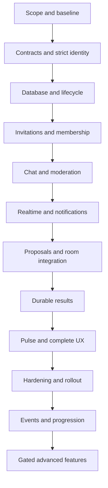

# Mandali — end-to-end implementation plan

Date: 2026-09-16  
Status: Planning complete for review; development has not started.  
Confirmed product decision: the feature is **Mandali**, not Circles.  
Companion documents: [Architecture and domain design](MANDALI_ARCHITECTURE.md) · [Acceptance and release checks](MANDALI_ACCEPTANCE_AND_RELEASE.md)

## 1. Intent and source of truth

Build a private, persistent place for trusted Bhalyam players to gather, communicate, form a game, join in the same tab, and return to their shared group afterward. Success means more successfully completed games with familiar players, not more messages.

This plan translates all three source documents into the current repository:

- `PlanningIdea.md`: original broad blueprint; Redis and NestJS suggestions are superseded below.
- `Bhalyam_Circles_Team_Discussion.md`: product principles and staged scope.
- `Bhalyam_Circles_PRD_and_Planning.md`: FR-001 through FR-033 and launch acceptance requirements.

Keep those source documents unchanged as historical inputs. Use `Mandali`, `mandali`, `/mandali`, `/mandali-game/:token`, and `/api/mandali` in new implementation. There are no existing Circles routes to migrate. Avoid renaming unrelated party, friend, or game concepts.

This is an architectural addition, delivered as tested vertical slices. The user requested planning before development. This document authorizes neither implementation nor deployment. Product defaults below are recommendations for review, not previously agreed requirements.

## 2. Repository findings that change the original blueprint

| Observed implementation | Consequence for Mandali |
|---|---|
| `server/src/index.ts` mounts Express REST routers and Socket.IO. The server package contains no NestJS. | Extend Express and the existing socket connection. A framework migration is outside scope. |
| `server/src/persistence/postgrest.ts` already exposes `rpc`; production persistence uses Supabase service credentials. | Use Postgres transaction functions through this adapter. No server Supabase SDK or new production SQL driver is needed. |
| `server/src/auth/identity.ts` resolves verified account/guest identities, but `requireMember` promotes callers when verification is off. | Add a strict Mandali member guard. Never reuse that development bypass for private persistent data. |
| `server/src/rooms/economyIdentity.ts` distinguishes a stable verified identity from a room-local seat ID. | Membership, bans, invitations, and proposal seats use stable identity IDs. `mpg.playerId` is never Mandali identity. |
| `RoomManager.createRoom` has a long positional API; `joinRoom` can reclaim by seat token; ordinary rooms are currently created with `sealed: false`. | Add a narrow typed Mandali room adapter and explicit access metadata. A room code or existing seat token must not bypass current Mandali authorization. Do not change global guest-room policy incidentally. |
| `requestGameStart`, terminal settlement intents, and `DurableSettlementWorker` already govern game economy. | Mandali cannot bypass entry consent, balance checks, settlement, or refunds. No new wallet transfer feature is included. |
| `recordPostMatchStats` uses room-local participant IDs; game state and some not-yet-persisted terminal payloads remain in memory. | Create a stable-identity result projection and explicit crash boundary. Existing match-history callbacks alone do not establish Mandali durability. |
| `SocialController`, friends, party, presence, and persistence already exist. A durable unique username/block service was not found in the inspected social/profile surfaces. | Reuse identity and friend edges; add handle lookup and blocking deliberately. Do not confuse a short-lived party with a persistent Mandali. Confirm absence repository-wide in milestone M1. |
| The app uses typed fetch helpers, `apiFetch`, Zustand, and a singleton `getSocket`. React Query is not an installed dependency. | Follow existing fetch/store patterns. Do not add another data-fetching framework just for this feature. |
| `AppLayout` uses `INITIAL_NOTIFICATIONS`; source inspection does not establish a durable notification inbox. | Implement real Mandali inbox records and preferences; do not count mock notification UI as delivery infrastructure. |
| `shared/catalog.ts` supplies game limits and `registry.ts` contains 17 engine registrations. | Use the actual catalog. The older overview's ten-game list is stale. Enable Mandali games only after game-specific certification. |
| Root scripts include client/server tests, rendered accessibility/mobile checks, persistence checks, and coverage. | Extend these runners with Mandali scenarios. The older claim that there are no client tests is stale. |
| Client feature flags can be overridden through URL/local storage. | Add server-enforced Mandali rollout controls; client flags are presentation only. |

Existing uncommitted cosmetics/streak work and `docs/ai/application-memory-map.md` were observed. They are outside this planning change and must be preserved during implementation.

## 3. Architecture choices

| Approach | Benefits | Cost / limitation | Decision |
|---|---|---|---|
| Extend Express + Socket.IO, with Supabase RPC transactions and a Postgres outbox | Fits current deployment, identity, persistence, and game lifecycle; no Redis | Requires disciplined admission and room-creation coordination | **Recommended** |
| Separate NestJS Mandali service | Independent deployment and framework boundaries | Duplicates authentication/realtime plumbing; distributed room authority; extra operations | Defer unless an independently operated social service becomes necessary |
| Browser-direct Supabase writes and Supabase Realtime | Less API plumbing | Splits permissions/game admission across transports; transactional workflows still need database functions | Do not use for the initial implementation |

Deploy one Express/Socket.IO process serving live rooms and Mandali, backed by the existing Supabase Postgres. The outbox worker initially runs in that process. PostgreSQL owns durable Mandali data; `RoomManager` continues to own active game rules, turns, timers, and bot behavior. No database access is added to each game move.

## 4. Release boundaries

### R1: Complete private coordination loop

- Private identity/settings, exactly one owner, moderators, member restrictions, transfer, leave, archive, deletion request.
- Unique-handle invitations, invitation inbox, hashed invite links, approval, expiry, revocation, capacity protection.
- Durable text, one general channel, one-level threads/replies, reactions, mentions, edit history, deletion tombstones, pagination, unread cursors, announcements, pinning, retention-scoped search.
- Reporting, blocking, content hiding, mute, ban, slow mode, thread lock, audit history, platform escalation and appeal intake.
- Proposals, reservations, explicit confirmations, waitlists, structured cards, one room binding per proposal, same-tab game entry, guest passes, eligible bot fill.
- Opt-in presence and initial Pulse: available members, compatible certified games, active proposals, open seats, permitted pending approvals.
- Durable in-app notifications, preferences, basic aggregate analytics, minimal finalized match history.
- Recovery, operational dashboards, feature controls, accessible mobile/desktop layouts, staged rollout.

R1 does **not** include custom channels, attachments, push/email providers, Circle voice, cross-Mandali games, resource transfers, reward-bearing seasons, advanced recommendations, or a game-engine rewrite. Future-only Pulse cards stay absent rather than appearing as empty or fake features.

### R2: Shared activity and identity

Events, polls, timezone-aware reminders, optional operational roles, richer match memories, explicit-consent share cards, weekly recaps, post-match Mandali formation, saved game presets, collaborative challenges, cosmetic progression, and seasons. Basic match history ships in R1; narrative memories and generated sharing ship here.

### R3: Separately gated extensions

Approved isolated non-withdrawable resources with a balanced ledger; advanced recruitment; cross-Mandali competition; voice; multi-instance realtime. Each requires a focused design and the audits identified in the source PRD. None is a prerequisite for useful R1 delivery.

## 5. Product decisions and proposed defaults

The name and restart boundary are confirmed. Accepting the plan should explicitly settle D03–D08 before their dependent work starts. Remaining tunable values can use the documented defaults, subject to launch review.

| ID | Decision / recommended policy | Gate |
|---|---|---|
| D01 | **Confirmed:** product name Mandali; technical prefix `mandali`. | Settled by user |
| D02 | **Confirmed:** preserve durable Mandali state across restart; interrupted live games become unavailable and require a fresh proposal. Do not promise mid-game restoration. | Settled by user |
| D03 | R1 guest pass targets a verified Bhalyam account that is not a Mandali member. Anonymous/signed-guest admission is a separately enabled extension with claim/recovery policy. | M0; explicit narrowing of ambiguous PRD guest terminology |
| D04 | Initial certification cohort: Ludo, UNO, RPS. Expand the same adapter to remaining catalog games individually. Existing game entry economics apply, with explicit participant consent; this plan does not introduce free tables. | M0; validate choices with product before M6 |
| D05 | 5 active Mandali memberships per account, at most 2 owned; 32 members per Mandali. Active, probationary, muted and suspended memberships count toward capacity; pending invitations and game-seat reservations do not. | M1 configuration |
| D06 | Normal messages/edit history retained 90 days; editing allowed for 15 minutes; deletion hides body immediately. Proposed report evidence/audit retention 180 days; archived group restoration window 30 days. Holds override purge. | Product/privacy policy approval before production; no legal-compliance claim |
| D07 | Link-approved users enter probation for 24 hours, owner/moderator may promote earlier. They see content from join time onward, may react/join games, cannot send text/create proposals/invite. Direct-invite acceptance creates a normal member. | M2–M4 |
| D08 | No automatic ownership promotion. Owner suspension freezes administrative mutations; account deletion requires transfer or archive through an audited support flow. Owner-only Mandali can be archived before account deletion. | M2/privacy integration |
| D09 | Invite links: 7-day expiry, 10 successful memberships, max configurable 30 days/100 uses. Direct invites: 7 days. Revoking a link cancels its pending requests; use is consumed only by committed membership. | M3 |
| D10 | Immediate proposal expiry: 30 minutes. Reservation hold: 2 minutes. Waitlist offer: 60 seconds. Explicit organizer launch only after confirmed minimum is met. | M6 |
| D11 | At most one guest seat per R1 proposal and at least two Mandali human members; bots do not satisfy that minimum. Guest pass bound to recipient identity, expires no later than proposal/game lifecycle. | M6 |
| D12 | General channel only; 2,000-character messages; pages of 50, max 100; one-level threads; mentions reference real authorized identities; curated avatar/banner/reaction IDs only. | M4 |
| D13 | Presence opt-in, 30-second heartbeat, 90-second expiry, aggregate multi-tab connections; no exact last-seen. In-app notifications only; default mentions/games/administration, with explicit per-category preferences. | M5/M8 |
| D14 | Private metadata preview through a valid invite contains name, curated avatar, and a short owner-approved description only. No member names, presence, chat, or counts unless explicitly approved later. | M3 |
| D15 | Proposed rename cooldown 24 hours; names 3–40 characters, Unicode-normalized display text. Handles 3–20 lower-case ASCII letters/digits/underscore, unique and reserved-name filtered; existing display names remain unchanged. | M1/M2 |
| D16 | Proposed limits: create 2/day/account; invitations 20/hour/account and 100/day/Mandali; requests 10/hour/account; proposals 10/hour/account; reports 10/hour/account. Chat burst 5/10 seconds and 30/minute. Add measured network-wide ceilings that tolerate shared networks. | M3/M4 and load calibration |

Blocking prevents direct invitations, mentions/notifications, presence visibility, and new co-seating between the two identities. It does not erase existing shared membership or cancel a match already in progress. Shared-chat hiding is explicit; the blocking member receives a collapsed placeholder. Mandali removal/ban is the mechanism for group-wide exclusion.

## 6. User experience before implementation

### Mobile: 320–767px

`/mandali` lists the user's groups, invitations, and Create action. A group opens a compact header and tabs for Pulse, Chat, Games, and More. More contains members, history, info, preferences, and permission-gated management. Use full-screen thread/member views and bottom sheets for invites/proposals/actions. Chat composer stays above the virtual keyboard and safe area; history preserves scroll position when older messages load. The game card shows state, confirmed count, cost/eligibility, and one primary action. Never navigate automatically when a room becomes ready.

### Tablet: 768–1023px

Use the mobile interaction model with a wider content column; optionally show the group list beside the current content when measured space allows. No squeezed three-column desktop layout.

### Desktop: 1024px+

Use the existing application shell. Inside it, show a narrow Mandali/channel list, the main chat/Pulse/proposal area, and a collapsible context rail for available members and game details. Keep composer and relevant controls persistent. Threads can occupy the context rail. Keyboard actions and visible focus must reach the same operations as mobile.

### Shared components

`MandaliHeader`, `MandaliCard`, `MemberRow`, `RoleBadge`, `MessageRow`, `MessageComposer`, `ThreadView`, `ProposalCard`, `InvitePreview`, `PermissionGate`, `PresenceBadge`, `UnreadMarker`, `NotificationRow`, confirmation dialogs, loading/empty/error states. Only shells differ. Use existing DLS, accessible dialog primitives, `useViewport`, audio/haptic preferences, and reduced motion. Never introduce `Sparkles`.

### Required journeys

1. Verified account → Create → private Mandali with owner → invite by handle → recipient accepts.
2. Open invite → sign in and safely return → limited preview → request → approval → probation view.
3. Member sends a message → committed server response → realtime update; disconnect/reconnect restores canonical history without duplicates.
4. Create proposal → reserve/confirm → organizer launches → one room → choose Join → `/room/:code` lobby in the same tab → existing ready/entry-consent flow → play.
5. Finish → durable result appears → Return to Mandali; guest sees only the result for their game and an optional membership invitation.
6. Moderator removes member → current subscriptions, cached content, pending seats and guest grants are invalidated; refresh/direct room URL cannot recover access.
7. Failed/expired/full/cancelled/interrupted routes explain the state and offer Return, Retry where safe, or Create another proposal.

## 7. Delivery sequence and file ownership

Names below are planned file targets, not existing implementation claims. Each milestone ends with a reviewable, independently testable slice behind disabled-by-default server controls. Database correctness is tested against real Postgres, not only mocks.

### M0 — Confirm scope and establish baseline

Dependencies: none. Owner: product + technical lead.

1. Resolve D03–D08, accept source-to-repository deviations, confirm language/age/moderation policy and R1 games.
2. Record ADRs in `docs/ai/bhalyam-decision-log.md`: existing stack, durable social boundary, strict identity, restart behavior, scoped room admission, and result finalization.
3. Capture current typecheck/tests/build/persistence results and identify unrelated baseline failures. Review current deployment/runtime configuration without copying secrets.
4. Approve written mobile/desktop flows above, then create UI references before frontend implementation.

Exit: concrete R1 acceptance contract, decision owners, and baseline report. No need to migrate engines or replace parties.

### M1 — Shared contracts, strict identity, handles and blocks

Dependencies: M0. Owner: backend/shared engineer.

Targets: new `shared/mandali/{types,permissions,validation}.ts`; extend socket interfaces in `shared/types.ts`; new `server/src/mandali/MandaliAuthorization.ts`; targeted changes to `server/src/auth/identity.ts`, profile/social surfaces, and account/profile UI.

1. Define DTOs, error codes, enum transitions, permission bundles, explicit member versus guest-pass identity, and server capability responses.
2. Implement strict verified-member guard without changing legacy `requireMember` semantics globally. Disable Mandali when verified auth or durable storage is unavailable.
3. Add durable handle registration and opt-in lookup preferences; reserve names; no guessed mapping from duplicate display names.
4. Add durable block relationships, invite preferences, and account-eligibility checks shared by all Mandali workflows.
5. Adopt runtime boundary validation. Reuse installed Zod on the client; if shared Zod schemas run on the server, declare a matching server dependency explicitly and pass dependency governance. No `any` or trust-only casts at input boundaries.

Tests: identity spoofing, auth-off refusal, guest restrictions, duplicate handles, normalization, block symmetry, permission target hierarchy, malformed inputs, cross-tenant IDs.

### M2 — Database foundation and Mandali lifecycle

Dependencies: M1. Owner: persistence/backend engineer.

Targets: additive `supabase/migrations/<timestamp>_mandali_foundation.sql`; `server/src/mandali/{MandaliRepository,SupabaseMandaliRepository,MandaliService,MandaliController}.ts`; `server/src/index.ts`; repository/SQL tests.

1. Add groups/memberships/preferences/blocks/handles/audit/idempotency/outbox schema and indexes described in the architecture document.
2. Implement transactional create/edit/transfer/leave/archive/unarchive/delete-request commands, actor checks inside RPCs, and membership-scoped reads.
3. Enforce exactly one eligible owner using the owner pointer plus deferred relational invariant; capacity and per-user limits use locked records.
4. Add configuration/schema readiness and health reporting. No automatic memory fallback for Mandali.
5. Integrate owner suspension/deletion with existing account deletion flow; prevent cascades from destroying audit/evidence unexpectedly.

Tests: owner transfer races, final membership slot, simultaneous create-limit requests, archive-versus-write, account deletion, RPC privilege/RLS denial, commit/rollback, idempotency hash conflict.

### M3 — Invitations and membership administration

Dependencies: M2. Owner: membership backend engineer, then frontend slice owner.

Targets: `server/src/mandali/{MandaliInvitations,MandaliMemberships}.ts`, invitation transaction migration, `/api/mandali` routes, invitation/create/settings/member pages under `client/src/features/mandali/`.

1. Add direct invites, inbox, secure links, privacy-safe resolve, request/withdraw, approve/reject, expiration, rotate/revoke.
2. Recheck inviter authority, blocks, capacity, target eligibility, link use and expiry atomically. Accepting a stale invite must not restore an old administrative role.
3. Add moderation/probation/promotion/mute/suspend/remove/ban/unban with audited reasons and timers persisted as deadlines.
4. Implement transactional critical rate limits and meaningful 401/403/404/409/410/429 responses.
5. Deliver the first usable UI slice: create Mandali, manage membership, open a deep link after login, and display all non-success states.

Tests: duplicate acceptance, final link use, revoked-link approval, stale moderator, role escalation, owner removal refusal, forwarding to another account, invite response lost, expiry after restart.

### M4 — Durable chat and moderation

Dependencies: M3. Owner: chat backend + frontend engineers.

Targets: chat/evidence migration; `server/src/mandali/{MandaliChat,MandaliModeration}.ts`; chat components; `client/src/lib/mandaliApi.ts`; `client/src/store/mandaliStore.ts`.

1. Implement committed message creation, per-channel order, client-request deduplication, revisions/tombstones, threads, replies, reactions, authorized mentions, announcements/pins, read cursors, search.
2. Implement HTTP delta synchronization for edits/deletes as well as new messages; retention-truncated cursor returns an explicit reset response.
3. Add reports, evidence snapshot, personal hide, block-aware filtering, moderator queue, escalation, appeal intake, thread lock and slow mode.
4. Implement mobile chat shell first, then desktop. Limit local drafts to account-scoped session storage and clear on sign-out/removal; update privacy inventory. Do not service-worker-cache private API bodies.

Tests: optimistic reconciliation, Unicode/length bounds, cursor tampering, hidden parent replies, removed-member search denial, edit/delete recovery, moderation evidence retention, focus and keyboard behavior.

### M5 — Realtime delivery, outbox and notifications

Dependencies: M2/M4. Owner: backend/realtime engineer.

Targets: `server/src/mandali/{MandaliOutboxWorker,MandaliNotifications,MandaliRealtime}.ts`; registration in `server/src/sockets/index.ts`; client socket bridge hook; inbox/preferences UI.

1. Add strict Mandali socket authentication/re-authentication on the existing connection; centralize handler registration in the existing sockets entry point.
2. Publish committed outbox events with claim leases, retry backoff, dead-letter visibility, and independent delivery bookkeeping per durable consumer.
3. Make sockets carry versioned invalidation/reconciliation hints; retrieve sensitive canonical content through authorized APIs. Disconnect/expire tokens and membership removal clear subscriptions.
4. Add durable per-recipient inbox records, deduplication, read/dismiss, batching and preferences. Show real Mandali notices without relabeling existing demo notices as real.
5. Test background/foreground, login/logout, reconnect, multi-tab, and stale notification links. One failed notification never rolls back a committed message or membership.

Exit: database outage and dropped/duplicated/out-of-order socket events cannot create a false successful send or leak private content.

### M6 — Proposals, reservations and room admission

Dependencies: M3/M5. Owner: game integration engineer.

Targets: proposal/guest-pass/room-binding migration; `server/src/mandali/{MandaliProposals,MandaliRoomCoordinator,MandaliRoomAccess}.ts`; targeted `RoomManager.ts` and socket admission changes; `shared/catalog.ts` consumption; proposal UI and resolver route.

1. Implement per-game config validation, confirmation-bound proposal versions, reservation/confirmation/release/expiry, FIFO offers, cancellation, capacity and active-participation locks.
2. Add identity-bound guest passes and bot policy. Every admission path validates Mandali context: direct code, link, reclaim, spectator/TV, bot/local-seat mutation, start, rematch, and late join.
3. Persist one room binding and creation operation per proposal; materialize through a typed `RoomManager` adapter without fake socket IDs or bypassing `requestGameStart`.
4. Implement same-tab `/mandali-game/:token` resolution and authenticated proposal-based Join actions. Keep room-local seat credentials in existing seat storage.
5. Revalidate authorization after awaits and serialize removal/cancellation with room admission. Existing normal room behavior receives regression coverage.
6. Implement explicit interrupted-room states and rematch lineage according to D02 and the architecture document.

Tests: final seat, duplicate launch, lost response, cancellation during create, process crash boundaries, removed member holding seat token, stolen room code, account switch, spectator leak, double tab, active-room conflict, private game-share UI.

### M7 — Durable results and economy integration

Dependencies: M6. Owner: game/economy integration engineer.

Targets: `RoomManager.finalizeMatch` boundary, `server/src/economy/DurableSettlementWorker.ts` integration as needed, new Mandali result repository/projector, result-intent migration, history UI.

1. Give each Mandali round a durable round ID, stable identity roster, room/proposal lineage, and immutable normalized outcome. Never derive member identity from display name or seat ID.
2. Persist authoritative terminal result intent before acknowledging Mandali completion. On economy-enabled games, link to the existing terminal workflow; only settled/authoritatively resolved outcomes can become finalized memories.
3. Project once by round ID; replay after restart even if the room no longer exists. Preserve departed participants and distinguish bots, draws, cancellations, abandonment, and interrupted/unknown outcomes.
4. Keep pending/failed finalization visible and repairable. Never award progress, infer winners, or issue refunds merely because a room disappeared.
5. Keep existing entry-stake approval and settlement logic authoritative. Guest pass means access, not a free game or a wallet exemption.

Tests: settlement retry, duplicate result delivery, crash before/after intent, disconnected participant, invalid ranking, rematch round separation, no double charge/reward, account anonymization, pending settlement history.

### M8 — Presence, Pulse, navigation and complete UX

Dependencies: M5–M7. Owner: frontend + realtime engineers.

Targets: `server/src/mandali/{MandaliPresence,MandaliPulse}.ts`; `client/src/features/mandali/` mobile/desktop shells; lazy routes in `client/src/App.tsx`; `AppSidebar`, `MenuSheet`, social hub and breadcrumb configuration.

1. Add opt-in per-Mandali presence using connection leases and explicit chosen availability; no reuse of unrestricted global presence-query output.
2. Derive compatible-game suggestions from the authoritative catalog and eligible members; suggestions never reserve or create rooms.
3. Wire all entry/return paths, invitation inbox badges, real notification preferences, history, membership loss, archive/read-only and disabled-feature states.
4. Complete 320–1440px UI, keyboard-open layout, focus traps/restoration, screen reader announcements, dark/light themes, reduced motion, zoom and low-bandwidth behavior.

Exit: two or more real test accounts complete the full Mandali-to-game-to-Mandali loop without manual URL construction.

### M9 — Production hardening and controlled release

Dependencies: M1–M8. Owner: QA/security/operations with product release owner.

Targets: Mandali browser/concurrency harnesses, existing quality runners, admin operations surface, `docs/runbooks/mandali.md`, privacy inventory/policy, deployment examples and relevant `docs/ai`/`AGENTS.md` updates.

1. Run the acceptance matrix and actual database/PostgREST/Socket.IO integration tests.
2. Exercise load, token expiry, DB outage, restart, slow/failing outbox, expired leases, cleanup, feature disable and rollback.
3. Add operational metrics, alerts, audited recovery actions, report queue ownership, support instructions and restore drill.
4. Enable internal → QA → invited cohort → broader cohorts only after reliability and safety gates pass.

Exit: evidence bundle meets the companion release checklist. R1 is not complete at backend-only, chat-only, or mock-data UI milestones.

### M10 — R2 delivery packages

Dependencies: measured R1 adoption and stable operations.

| Package | Scope and dependency | Acceptance |
|---|---|---|
| Events/polls | New event/poll tables and RPCs; UTC instants plus IANA timezone; RSVP/waitlist and outbox reminders | DST, reschedule/cancel races, one reminder per recipient/version, frozen polls |
| Memories/recaps | R1 finalized results, richer private milestones, scheduled summaries and consented share artifacts | No private chat leakage; opt-in identity sharing; no inactivity shaming |
| Post-match formation/presets | Eligible recent participants and validated current catalog presets | No auto-membership; no invitations to blocked/removed/penalized players; stale presets rejected |
| Operational roles | Captain/organizer/mentor permission bundles | No accidental moderator powers; all role transitions audited |
| Challenges/progression/seasons | Idempotent per-round contributions, anti-farming review, cosmetic catalog integration | No chat-volume XP; no duplicate rewards; season reset preserves membership and permanent achievements |

### M11 — R3 gated packages

Each starts with a bounded design and its own release decision:

- Resources: define resource type, isolation from current wallet, balanced append-only ledger, transactional contributions, reversals, reconciliation, anti-collusion, independent economy review.
- Cross-Mandali: explicit bilateral consent, scoped participant visibility, abuse/block handling and privacy tests.
- Voice: reuse voice primitives only after network, capacity, mute/block/report and moderation readiness review; no assumption the current WebRTC mesh scales to 32 members.
- Recruitment/recommendations: explicit discoverability opt-in, explainable suggestions, no public directory of private groups.
- Multi-instance: database state alone does not provide Socket.IO fan-out or authoritative game ownership. Design routing/fencing, cross-instance events and presence before increasing replicas.

## 8. Dependencies and work sequencing

Frontend shells can be developed against approved typed fixtures after M1, but fixtures never count as completed integration. Keep SQL/RPC ownership coordinated so parallel membership/proposal work cannot invent conflicting invariants. Avoid concurrent broad edits to `RoomManager.ts`, `shared/types.ts`, and `server/src/index.ts`.

Planning estimate, not a delivery commitment: R1 roughly **14–22 engineer-weeks**, including database/authorization work, game integration and browser/recovery QA. With two engineers and dedicated QA/design/review support, budget approximately **9–13 calendar weeks** after decisions are settled. Full mid-game restart recovery, anonymous guest passes, custom moderation policy, or broad first-release game certification materially increases this. Re-estimate after M2 and the first M6 game integration. R2/R3 require separate estimates after their own design gates.

## 9. Implementation handoff

When development is requested, start at M0/M1, not with the chat screen. Re-read current files and baseline because this repository is actively changing. Each task brief should contain Role, Intent, Context, Examples, Format and Constraints; use the milestone's targets, acceptance cases and exact verification commands from the companion checklist.

Review the decision table and architecture before development. No source code, migration, package installation, live database change, or deployment was performed as part of this plan.
