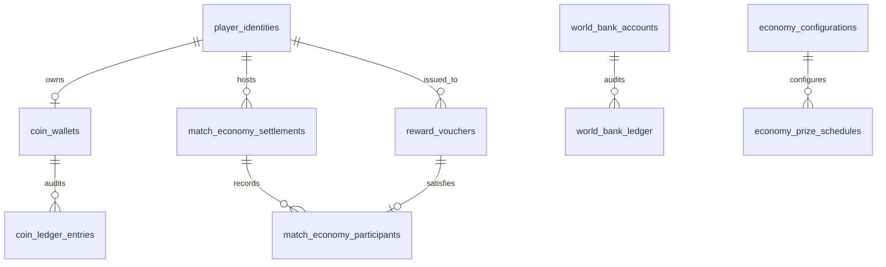

# BHALYAM Economy V1 Specification & Database Architecture

> **Status:** REMEDIATED DRAFT — NOT APPLIED. This revision resolves the BLOCKER/HIGH/MEDIUM
> findings of the hostile NO-GO audit dated 2026-08-26. It has been verified against a real
> local PostgreSQL 17 instance only (`scripts/economy/verifyEconomySchema.mjs`,
> `server/src/persistence/__tests__/economyMigrationStructure.test.ts`). Self-authored
> verification is not a substitute for independent re-audit — see
> `docs/remediation/economy-v1-remediation-report.md` for the full finding-by-finding
> resolution and the required next step.
> **Target Schema Version:** `20260826000000_economy_v1.sql`
> **Scope:** Schema, Accounting Invariants, RPC Contracts, Voucher Security, Treasury Accounting, Rollback Procedures

---

## 1. Executive Summary & Core Tenets

**BHALYAM Economy V1** establishes a server-authoritative, zero-floating-point virtual currency infrastructure and match settlement lifecycle. It replaces all ephemeral in-memory wallet balances with durable, transaction-isolated, and mathematically conserved PostgreSQL persistence.

### 6 Inviolable Economic Tenets
1. **Absolute Server Authority & Zero Float:** All coin amounts use exact integer / `bigint` storage. Clients cannot mutate balances or calculate prizes locally.
2. **Dual-Identity Architecture:** Guests and registered members maintain distinct identity lifecycles. No balance merge or wallet consolidation occurs upon member sign-up.
3. **Strict Mathematical Conservation:** For every match settlement:
   $$\text{Total Collected} = \text{Wallet Payouts} + \text{Guest Escrow Deposited} + \text{Bot Prize Revenue} + \text{World Bank Cut}$$
   and for a refunded settlement, the entire committed amount flows back to the host wallet with no other disbursement.
4. **Bearer Voucher Escrow:** Guest winnings are held in an isolated escrow liability pool (`world_bank_accounts.guest_escrow_liability`) as single-use bearer vouchers. Raw secret codes are never stored or logged in plaintext, and are never generated by this migration (see §3).
5. **Ledger Immutability & Idempotency:** Double-entry ledger entries cannot be updated or deleted — corrections are compensating entries only. Every mutating RPC is idempotent under a `{applied, operation, idempotencyKey, result}` response contract (see §6) and uses row locks plus 64-bit transaction-level advisory locks to guarantee exactly-once effect under concurrency.
6. **Privilege Boundary, Not RLS Alone:** `service_role` bypasses Row Level Security by design in this project. RLS is therefore not a security boundary for `service_role` and is never claimed as one. The real boundary is table-level `REVOKE`/`GRANT`: every Economy V1 table revokes direct `INSERT`/`UPDATE`/`DELETE` from `PUBLIC`, `anon`, `authenticated`, **and `service_role`**; all mutation happens exclusively through `SECURITY DEFINER` RPCs (see §7).

---

## 2. Economic Parameters & Rules

### 2.1 Starter Grants
- **Guest Identity:** 2,000 coins (granted once on initial wallet provisioning).
- **Registered Member Identity:** 5,000 coins (granted once on initial wallet provisioning).
- Grants are non-repeatable (`starter_granted = true`) and recorded with immutable `STARTER_GRANT` ledger entries.

### 2.2 Room Funding Model
- In Economy V1, the **room host commits all seat costs** upfront at match start.
- **Cost per seat:** 100 coins.
- Human, guest, and bot seats are all funded by the host.
- Invitees and joiners are not independently debited in Economy V1.
- `commit_match_entry` is a database RPC. The pre-flight cost preview shown to the client (`quote_match_checkout`) is an **application-level, read-only** operation, not a database RPC — see §6a.

### 2.3 Payout Schedules & House Take
Seat counts are constrained strictly to **1 through 5 seats**. Unsupported seat counts are rejected.

| Tier | Seats | Total Collected | 1st Place | 2nd Place | 3rd Place | World Bank Take |
|---|---|---|---|---|---|---|
| **Solo** | 1 | 100 | 0 (Practice) | — | — | 100 (100%) |
| **2 Players** | 2 | 200 | 150 | 0 | — | 50 (25%) |
| **3 Players** | 3 | 300 | 150 | 100 | 0 | 50 (16.67%) |
| **4 Players** | 4 | 400 | 175 | 125 | 50 | 50 (12.5%) |
| **5 Players** | 5 | 500 | 200 | 150 | 100 | 50 (10%) |

The World Bank take for a solo (1-seat) match is recorded under the ledger type `SOLO_ENTRY_COLLECTION`, distinct from the multiplayer `BASE_FEE_REVENUE` type used for 2-5 seat matches — see §4.

### 2.4 Bot Placement Accounting
- Bots **never** receive wallets, accounts, or reward vouchers.
- If a bot wins a placement prize, that prize is diverted to the World Bank Treasury as platform revenue using the dedicated ledger type `BOT_PRIZE_REVENUE`, credited to `world_bank_accounts.bot_prize_revenue` — a balance column separate from base fee revenue and guest escrow liability (see §5.3).

### 2.5 Invalid Result & Refund Rules
- A match settlement is either fully settled or fully refunded. There is no partial settlement.
- `settle_match_economy` takes an explicit `p_is_valid_ranking boolean` parameter. When `false` (match aborted, disconnected, or lacking an authoritative deterministic ranking, **or any placement ambiguity/tie at a paid position**), the function internally refunds the full committed amount to the host wallet and transitions the settlement to `REFUNDED` — no separate caller-side branch or second RPC call is required or permitted.
- Refunds are recorded as an immutable `MATCH_REFUND` ledger entry and credited to `coin_wallets.lifetime_refunded`, a column distinct from `lifetime_spent`. **`lifetime_spent` never decreases** — a refund is additive restitution, not an undo of the original debit.
- **Tied-prize splitting and secondary tie-breaker heuristics are not supported in Economy V1.** Any ambiguity in a paid placement makes the match result invalid for settlement purposes, full stop — see `docs/economy/game-settlement-map.md` for the per-game determinism contract.

---

## 3. Bearer Voucher Security Model

Guest winnings cannot be credited directly to persistent member bank accounts, nor should guests lose their earned rewards upon closing a browser tab.

```
┌─────────────────────────────────────────────────────────────────────────┐
│                      GUEST VOUCHER ESCROW LIFECYCLE                     │
├─────────────────────────────────────────────────────────────────────────┤
│ 1. Match Settle (Guest wins placement):                                 │
│    FUTURE server code (not this migration) generates a cryptographically│
│    secure random bearer secret, computes a keyed HMAC-SHA256 hash of it,│
│    and calls issue_guest_voucher(voucher_id, code_hash, amount, ...).   │
│    Database stores ONLY code_hash (exactly 64 hex chars), coin_amount,  │
│    status='ACTIVE'. The migration never sees or generates the raw code. │
│    Guest client receives the raw bearer code from the server in a      │
│    transient ack; it is never logged or persisted anywhere.            │
│                                                                         │
│ 2. Escrow Liability:                                                    │
│    world_bank_accounts.guest_escrow_liability increases atomically with │
│    voucher issuance. This is a liability pool, not general revenue —    │
│    see §5.3. No coin_ledger_entries row is written for this step: the   │
│    guest's own wallet does not change, so nothing belongs in the wallet │
│    ledger (coin_ledger_entries represents wallet mutations only).      │
│                                                                         │
│ 3. Member Redemption:                                                   │
│    Registered member submits voucher code.                              │
│    Server hashes code and calls redeem_reward_voucher(code_hash, uid).  │
│    Database verifies member kind, verifies the redeeming wallet is not  │
│    frozen, locks voucher FOR UPDATE, credits member wallet (+amount),   │
│    decreases guest_escrow_liability, increases total_voucher_redeemed,  │
│    marks voucher 'REDEEMED', writes a VOUCHER_REDEMPTION wallet ledger  │
│    row and a GUEST_ESCROW_REDEMPTION World Bank ledger row — all in one │
│    transaction. Single-use enforced by unique code_hash and row lock.   │
└─────────────────────────────────────────────────────────────────────────┘
```

- **Bearer Nature:** No identity binding on issuance; whoever holds the code may redeem it.
- **Redemption Constraint:** Only authenticated registered members (`kind = 'member'`) with a non-frozen wallet can redeem vouchers.
- **Plaintext Ban:** Plaintext voucher codes must **never** be stored in PostgreSQL, telemetry tables, or server log files.
- **Collision Handling:** `issue_guest_voucher` has no `ON CONFLICT` clause on `code_hash`. A hash collision is a hard unique-violation failure — the migration never silently updates an existing voucher row on collision.
- **Migration Scope Boundary:** This migration defines storage and the redemption/issuance RPC contracts only. It does **not** generate raw voucher codes and does not claim to guarantee code entropy — that responsibility belongs to the future server-side generator described below, which is out of scope for this migration.

### 3.1 Required Future Server-Side Generator (Not Implemented Here)
When the application layer that calls `issue_guest_voucher` is built, it must:
- Generate the raw bearer code from a cryptographically secure random source (e.g. Node's `crypto.randomBytes`), never `Math.random()`.
- Hash it with a keyed HMAC (server-held secret key), not a bare unkeyed hash, so the code space cannot be brute-forced offline from a leaked `code_hash` column alone.
- Retry a bounded number of times on a unique-violation from `code_hash` (astronomically unlikely, but must be handled, not ignored).
- Return the raw code to the client exactly once, in the settlement acknowledgment, and never persist or log it.
- Never accept a raw voucher code as client input for anything other than the redemption call itself.

---

## 4. Ledger Taxonomy & Classification

All balance mutations are tracked through append-only, immutable double-entry-style tables: `coin_ledger_entries` (wallet-side) and `world_bank_ledger` (treasury-side). `coin_ledger_entries` represents **wallet mutations only** — an event that never changes a wallet's balance (such as guest prize escrow) is not a wallet ledger entry.

| Ledger Entry Type | Target Ledger | Description |
|---|---|---|
| `STARTER_GRANT` | `coin_ledger_entries` | Initial authoritative wallet onboarding grant (Guest 2k / Member 5k). |
| `ROOM_ENTRY_DEBIT` | `coin_ledger_entries` | Host commitment for multiplayer room seats. |
| `SOLO_ENTRY_DEBIT` | `coin_ledger_entries` | Host commitment for 1-player solo mode. |
| `BOT_ENTRY_DEBIT` | `coin_ledger_entries` | Host commitment for matches against local bot opponents. |
| `MATCH_PRIZE_CREDIT` | `coin_ledger_entries` | Placement payout credited to an authenticated member's wallet. |
| `VOUCHER_REDEMPTION` | `coin_ledger_entries` | Wallet credit when a registered member redeems a bearer voucher. |
| `MATCH_REFUND` | `coin_ledger_entries` | Restitution of committed entry fees to host wallet upon invalid/aborted result. Credits `lifetime_refunded`, never reverses `lifetime_spent`. |
| `ADMIN_ADJUSTMENT` | `coin_ledger_entries` | Reserved entry type for a future, separately-approved admin adjustment capability. **Not implemented by any RPC in Economy V1** — see §7a. |
| `BASE_FEE_REVENUE` | `world_bank_ledger` | Protocol rake/cut collected per 2-5 seat match into World Bank Treasury. |
| `SOLO_ENTRY_COLLECTION` | `world_bank_ledger` | Full entry fee collected into World Bank Treasury for 1-seat solo matches. |
| `BOT_PRIZE_REVENUE` | `world_bank_ledger` | Sweep of bot placement rewards into World Bank Treasury revenue. |
| `GUEST_ESCROW_DEPOSIT` | `world_bank_ledger` | Guest placement payout entering the escrow liability pool as a bearer voucher. |
| `GUEST_ESCROW_REDEMPTION` | `world_bank_ledger` | Escrow liability released when a member redeems a guest-issued voucher. |
| `ADMIN_CORRECTION` | `world_bank_ledger` | Reserved entry type for a future, separately-approved treasury correction capability. **Not implemented by any RPC in Economy V1.** |

There is no `GUEST_PRIZE_ESCROW` wallet-ledger entry type and no merged `HOUSE_CUT`/`BOT_PRIZE_COLLECTION` naming — both were corrected during remediation (see finding [Phase 2], [Phase 3] in the remediation report).

---

## 5. Database Schema Blueprint



### 5.1 Tables Summary
1. `public.economy_configurations`: Singleton active parameters (`guest_starter_coins`, `member_starter_coins`, `seat_cost_coins`), singleton enforced via a partial unique index on `is_active = true`.
2. `public.economy_prize_schedules`: Prize tiers per seat count (1 to 5) with a `prize_schedule_conservation` check constraint.
3. `public.world_bank_accounts`: Singleton treasury account (`id = 'primary'`, enforced by a `check` constraint on the primary key).
4. `public.world_bank_ledger`: Immutable audit trail for treasury inflows/outflows, one row per `entry_type` per event, carrying `affected_balance` naming which of the four `world_bank_accounts` columns it moved.
5. `public.coin_wallets`: Player coin balances, non-negative enforced (`balance >= 0`), plus a `coin_wallets_balance_reconciles` check tying `balance` to `lifetime_granted + lifetime_earned + lifetime_refunded - lifetime_spent`.
6. `public.coin_ledger_entries`: Immutable audit trail for player wallets, carrying `balance_before`/`balance_after` and `wallet_version_before`/`wallet_version_after`, each enforced by a check constraint tying the transition to `amount`.
7. `public.reward_vouchers`: Bearer vouchers storing keyed hashes (`code_hash`, exactly 64 hex characters) and escrow state.
8. `public.match_economy_settlements`: Lifecycle financial records (`COMMITTED`, `SETTLED`, `REFUNDED`), including `refund_reason`.
9. `public.match_economy_participants`: Per-seat placement and payout status. `identity_id` is intentionally not FK-constrained, since bot seats have no `player_identities` row.

### 5.2 Identity Deletion / Erasure Policy
- `coin_wallets.identity_id` and `reward_vouchers`'s guest/member identity columns are `ON DELETE RESTRICT` against `player_identities`, both hops of the chain (`player_identities → coin_wallets → coin_ledger_entries` is enforced at both links, not just one).
- **An identity that has any economy history (a wallet, a ledger entry, an issued or redeemed voucher) can never be physically deleted from `player_identities`.** Attempting to do so raises a foreign-key violation (`23503`) — verified by `verifyEconomySchema.mjs` §13.
- Personal-data erasure ("right to be forgotten" / account deletion) is handled by **anonymizing** the `player_identities`/`player_profiles` row in place (clearing display name, auth linkage, contact fields) rather than deleting it. The row's primary key — and therefore every financial reference to it — remains valid and immutable.
- This migration does not implement an anonymization procedure; it only guarantees, via the FK strategy above, that anonymization-in-place remains possible while physical deletion does not silently succeed and orphan or corrupt ledger history. A dedicated anonymization RPC is out of scope for Economy V1 and should be proposed separately, alongside the existing account-deletion flow.

### 5.3 World Bank Treasury Model
`world_bank_accounts` (singleton row `id = 'primary'`) tracks **four separate, non-fungible balances** rather than one aggregate figure:

| Column | Meaning | Increases via | Decreases via |
|---|---|---|---|
| `base_fee_revenue` | Platform rake from 2-5 seat matches | `BASE_FEE_REVENUE` entries | Never (revenue is not spent back out in V1) |
| `bot_prize_revenue` | Prizes diverted from bot placements | `BOT_PRIZE_REVENUE` entries | Never |
| `guest_escrow_liability` | Outstanding guest voucher liability, **not revenue** | `GUEST_ESCROW_DEPOSIT` entries | `GUEST_ESCROW_REDEMPTION` entries |
| `total_voucher_redeemed` | Lifetime counter of escrow released to members | Never (monotonic) | `GUEST_ESCROW_REDEMPTION` entries increase it; it never decreases |

Solo (1-seat) matches collect their full entry fee under `SOLO_ENTRY_COLLECTION`, which affects `base_fee_revenue` — the same balance column as multiplayer base fees, but a distinct ledger `entry_type` so the two are always separable in an audit query. Merging guest escrow liability into general treasury revenue (as the pre-remediation draft did with a single `balance` column) was audit finding B4/[Phase 3] and has been corrected.

---

## 6. Atomic RPC API Reference

All database mutations occur through atomic PostgreSQL functions defined with `SECURITY DEFINER` and an explicit `search_path = pg_catalog, public, pg_temp`. Direct `EXECUTE` is revoked from `public`, `anon`, and `authenticated`, and granted strictly to `service_role`. Direct table-level `INSERT`/`UPDATE`/`DELETE` is revoked from **every** role including `service_role` (see §7) — these functions are the only mutation path that exists.

Every mutating function below returns `jsonb` shaped as the standardized idempotency envelope described in §6a, with the operation's actual row(s) nested under `result`. `ensure_wallet` is the one exception (an internal composition helper, not a top-level idempotent operation) and returns a `public.coin_wallets_safe` row. `reconcile_match_settlement` and `list_stale_committed_settlements` are read-only and keep their natural `table`/`setof` return shapes. **Every bigint-typed column below crosses PostgREST as `text`, not a JSON number** — see §6c for why and how.

### 1. `ensure_wallet(p_identity_id text)`
- **Behavior:** Ensures a wallet row exists for `p_identity_id`, provided `p_identity_id` already names an existing `player_identities` row. If the wallet itself doesn't yet exist, provisions it and calls `grant_starter_coins` for its side effect, then re-reads the wallet.
- **Returns:** `public.coin_wallets_safe` (bigint columns as `text`)
- **Identity provisioning boundary (resolved, final certification pass):** this function never writes to `player_identities`, for guests or members. An earlier draft auto-created a minimal guest row for any `p_identity_id` matching `guest_%`, which let economy code silently make an identity-management decision it does not own. That auto-provisioning has been removed — `p_identity_id` must already exist in `player_identities`, created by whatever system is authoritative for identity (the auth/guest-session layer). A missing identity raises `IDENTITY_NOT_FOUND`, regardless of what the id string looks like. This means every caller of `commit_match_entry` (host), `settle_match_economy` (member credit path), and `redeem_reward_voucher` (member) must ensure the identity already exists before invoking these RPCs — the economy layer only ever reads `player_identities`.

### 2. `grant_starter_coins(p_identity_id text)`
- **Behavior:** Idempotently grants starter coins (2,000 for guest, 5,000 for member). Row locks wallet `FOR UPDATE`; guarded by `starter_granted` boolean, not just the idempotency key.
- **Returns:** `jsonb` — `{applied, operation: 'grant_starter_coins', idempotencyKey, result: <wallet row>}`

### 3. `commit_match_entry(p_match_id, p_room_code, p_host_identity_id, p_seat_count, p_human_seat_count, p_bot_seat_count, p_is_solo)`
- **Behavior:** Acquires a 64-bit transaction-level advisory lock on the match, validates seat counts (1-5), **verifies the host wallet is not frozen** (raises `WALLET_FROZEN` before any balance check), verifies sufficient funds, debits host wallet, writes `ROOM_ENTRY_DEBIT`/`SOLO_ENTRY_DEBIT`/`BOT_ENTRY_DEBIT`, and creates a settlement in `COMMITTED` state with a configuration snapshot.
- **Returns:** `jsonb` — envelope wrapping a `settlement_to_safe_jsonb()` result (bigint columns as `text`)

### 4. `settle_match_economy(p_match_id, p_is_valid_ranking boolean, p_participants jsonb, p_refund_reason text default null)`
- **Behavior:** Atomically settles a finished match.
  - If `p_is_valid_ranking = false`: delegates entirely to the internal `economy_apply_refund` helper (full refund, `REFUNDED` state) — the caller does not need a separate refund call.
  - If `p_is_valid_ranking = true`, distributes prizes per placement:
    - Members → credited to wallet (`MATCH_PRIZE_CREDIT`). Frozen wallets **are** allowed to receive this credit.
    - Guests → escrow deposit (`GUEST_ESCROW_DEPOSIT` on `world_bank_ledger` + new `reward_vouchers` row + `match_economy_participants` update). No `coin_ledger_entries` row, because the guest's own wallet never changes.
    - Bots → diverted to World Bank Treasury (`BOT_PRIZE_REVENUE`, credited to `bot_prize_revenue`).
    - World Bank cut → `SOLO_ENTRY_COLLECTION` (1-seat) or `BASE_FEE_REVENUE` (2-5 seats), credited to `base_fee_revenue`.
    - Any participant whose `identityKind` is not exactly `member`, `guest`, or `bot` raises `INVALID_IDENTITY_KIND` immediately (final certification correction — an earlier draft silently skipped an unrecognized kind instead of rejecting it).
  - Verifies exact settlement-level conservation before transitioning to `SETTLED`; a violation raises `SETTLEMENT_CONSERVATION_VIOLATION` and aborts the transaction.
  - **Atomicity:** the function has no internal exception handler, so any raised error — `INVALID_IDENTITY_KIND`, `INVALID_VOUCHER_HASH`, `IDENTITY_NOT_FOUND` from a member credit, a `SETTLEMENT_CONSERVATION_VIOLATION`, a voucher `code_hash` collision — aborts the entire enclosing transaction. A settlement that fails partway through a multi-participant array never leaves an earlier participant's wallet credit, ledger row, or `match_economy_participants` row behind; the settlement itself remains `COMMITTED`, unchanged, ready to be retried or refunded.
- **Returns:** `jsonb` — envelope wrapping a `settlement_to_safe_jsonb()` result (bigint columns as `text`)

### 5. `refund_match_entry(p_match_id text, p_reason text)`
- **Behavior:** Public entry point for an out-of-band refund (distinct from the internal invalid-ranking path above). Delegates to the same internal `economy_apply_refund` helper. Does not check `is_frozen` — frozen wallets may receive refunds.
- **Returns:** `jsonb` — envelope wrapping a `settlement_to_safe_jsonb()` result (bigint columns as `text`)

### 6. `issue_guest_voucher(p_voucher_id text, p_code_hash text, p_coin_amount bigint, p_match_id text, p_issued_to_guest_id text)`
- **Behavior:** Stores a bearer voucher record in `ACTIVE` state. `code_hash` must be exactly 64 hex characters. No `ON CONFLICT` — a collision on `code_hash` is a hard failure, never a silent update.
- **Returns:** `jsonb` — envelope wrapping a `voucher_to_safe_jsonb()` result (bigint columns as `text`)

### 7. `redeem_reward_voucher(p_code_hash text, p_member_identity_id text)`
- **Behavior:** Locks the voucher row `FOR UPDATE`, verifies the redeemer is a registered member, **verifies the redeeming wallet is not frozen** (raises `WALLET_FROZEN`, checked after existence/status checks but before crediting), credits member wallet, decreases `guest_escrow_liability`, increases `total_voucher_redeemed`, writes both a `VOUCHER_REDEMPTION` wallet-ledger row and a `GUEST_ESCROW_REDEMPTION` treasury-ledger row, marks voucher `REDEEMED`. Rejects duplicate redemption or guest-identity attempts.
- **Returns:** `jsonb` — envelope wrapping a `voucher_to_safe_jsonb()` result (bigint columns as `text`)

### 8. `reconcile_match_settlement(p_match_id text)`
- **Behavior:** Read-only audit function computing total collected vs. sum of disbursed funds for one settlement. Returns mathematical delta and a verification flag. Performs no writes.
- **Returns:** `TABLE (match_id text, status text, is_balanced boolean, collected text, disbursed text, delta text, details jsonb)` — `collected`/`disbursed`/`delta` are `text`, not `bigint` (bigint transport remediation, §6c); `details` is a `jsonb_build_object` with its own bigint-derived fields (`wallet_rewarded`, `guest_escrow`, `bot_collection`, `world_bank_cut`, `refunded`) also `text`-cast.

### 9. `list_stale_committed_settlements(p_older_than interval default interval '1 hour')`
- **Behavior:** Read-only. Lists settlements stuck in `COMMITTED` status older than the given interval — candidates for manual/administrative reconciliation. Performs no writes and triggers no automatic refund. See §9 for the full reconciliation policy.
- **Returns:** `setof public.match_economy_settlements_safe` (bigint columns as `text`)

### 6a. Standardized Idempotency Response Contract
Every mutating RPC (functions 2-7 above) returns:
```json
{
  "applied": true,
  "operation": "commit_match_entry",
  "idempotencyKey": "match-entry:M_98218",
  "result": { "...the operation's actual row, as jsonb..." }
}
```
On a replay of an already-applied idempotency key, the function returns the **same shape** with `applied: false` and the **original** `result` — never a bare row indistinguishable from a fresh application, and never a different result on replay. The actual concurrency guard is the row's own locked state (`FOR UPDATE` plus a status/boolean column such as `starter_granted` or settlement `status`), not the idempotency key string alone — the key is carried through for observability and client-side deduplication, not as the sole correctness mechanism.

Idempotency keys are scoped per operation, e.g. `starter-grant:<identityId>`, `match-entry:<matchId>`, `match-settlement:<matchId>`, with per-participant sub-keys such as `match-settlement:<matchId>:credit:<identityId>` where a single settlement fans out into multiple independent credits.

### 6b. `quote_match_checkout` — Application-Level, Not a Database RPC
There is no `quote_match_checkout` function in this migration. The pre-flight cost quotation shown to a client before committing a match (seat count × cost, expected prize tier) is computed **in application code** by reading the current `economy_configurations`/`economy_prize_schedules` rows, not via a dedicated database RPC. This is deliberate:
- A quote is informational only. It is never treated as authoritative.
- `commit_match_entry` independently revalidates configuration, seat counts, and host balance at commit time — a stale or client-manipulated quote cannot bypass this revalidation.
- Keeping the quote path in the application layer avoids adding a database round-trip and a function-privilege surface for an operation that carries no authority.

### 6c. Bigint Transport Rule

**Every Economy V1 integer amount is stored as PostgreSQL `bigint` and transported through JSON as a base-10 `text` string.** PostgREST serializes `bigint` as a bare JSON number by default, and standard `JSON.parse` (used throughout this project's `PostgrestClient`) parses that as an IEEE-754 double — silently losing precision for any value above `Number.MAX_SAFE_INTEGER` (`9007199254740991`), before any application code runs. A string conversion applied after that point cannot recover the lost digits.

This is closed at the source, not papered over at the repository layer:
- Every table PostgREST can read from directly is exposed only through a `_safe` view (`coin_wallets_safe`, `coin_ledger_entries_safe`, `match_economy_settlements_safe`, `world_bank_accounts_safe`, `reward_vouchers_safe`, `economy_configurations_safe`, `economy_prize_schedules_safe`) that casts every bigint column to `::text` in its `SELECT` list. `select` on the raw tables is not granted to any PostgREST-reachable role; only the views are.
- Every RPC's `jsonb` return payload is built by one of three internal helper functions (`wallet_to_safe_jsonb`, `settlement_to_safe_jsonb`, `voucher_to_safe_jsonb`) that `jsonb_build_object`-cast every bigint field to text, replacing plain `to_jsonb(row)` calls. These helpers are internal-only — `EXECUTE` is revoked from every role, including `service_role` — and are reachable only from inside the `SECURITY DEFINER` RPCs above, which run with their own owner's privilege regardless of caller.
- `SupabaseEconomyRepository.ts` reads exclusively from the `_safe` views/RPC results and treats a bigint-typed field that arrives as anything other than a well-formed `/^-?\d+$/` string as an infrastructure error (`EconomyInfrastructureError`) — not a value to silently coerce. A JS `number` in this position means the transport contract has regressed, and the repository refuses to guess at the original digits.

Postgres storage, arithmetic, and every conservation/immutability constraint remain unchanged — this rule governs the wire format only. See `docs/economy/economy-v1-bigint-transport-remediation-proposal.md` for the full finding, the options considered, and the verification performed.

---

## 7. Row Level Security & Privilege Governance Matrix

**RLS is not the security boundary for `service_role`.** This Supabase project's `service_role` bypasses RLS entirely by design, and this project additionally has `alter default privileges in schema public grant select, insert, update, delete on tables to service_role` active from an earlier persistence migration — meaning any new table silently inherits blanket `service_role` table access unless that grant is explicitly revoked per table. The real boundary is the table-level `REVOKE`/`GRANT` pass below, verified against a reproduction of that exact starting privilege state (`verifyEconomySchema.mjs` §0b/§3).

| Table | Direct DML (`PUBLIC`/`anon`/`authenticated`/`service_role`) | `authenticated` SELECT (RLS) | `service_role` SELECT |
|---|---|---|---|
| `economy_configurations` | Revoked from all four | None | Granted (narrow) |
| `economy_prize_schedules` | Revoked from all four | None | Granted (narrow) |
| `world_bank_accounts` | Revoked from all four | None | Granted (narrow) |
| `world_bank_ledger` | Revoked from all four | None | Granted (narrow) |
| `coin_wallets` | Revoked from all four | `SELECT (owns_player_row)` | Granted (narrow) |
| `coin_ledger_entries` | Revoked from all four | `SELECT (owns_player_row)` | Granted (narrow) |
| `reward_vouchers` | Revoked from all four | None | Granted (narrow) |
| `match_economy_settlements` | Revoked from all four | None | Granted (narrow) |
| `match_economy_participants` | Revoked from all four | None | Granted (narrow) |

The base-table `service_role` `SELECT` grants above remain in place for internal RPC logic (row locks, joins, invariant checks) and for direct-SQL tooling (`verifyEconomySchema.mjs`). **PostgREST itself, and `SupabaseEconomyRepository`, never read these raw tables** — every PostgREST-facing read goes through the `_safe` views below (bigint transport remediation, §6c), which is where the text-cast happens:

| View | Direct DML (`PUBLIC`/`anon`/`authenticated`/`service_role`) | `service_role` SELECT |
|---|---|---|
| `coin_wallets_safe` | Revoked from all four (also non-updatable by construction — a cast-expression view) | Granted |
| `coin_ledger_entries_safe` | Revoked from all four | Granted |
| `match_economy_settlements_safe` | Revoked from all four | Granted |
| `world_bank_accounts_safe` | Revoked from all four | Granted |
| `reward_vouchers_safe` | Revoked from all four | Granted |
| `economy_configurations_safe` | Revoked from all four | Granted |
| `economy_prize_schedules_safe` | Revoked from all four | Granted |

All mutation — including by `service_role` — happens exclusively through the `SECURITY DEFINER` RPCs in §6, each individually granted `EXECUTE` to `service_role` only. Five internal-only helpers (`economy_apply_refund`, `prevent_ledger_mutation`, `wallet_to_safe_jsonb`, `settlement_to_safe_jsonb`, `voucher_to_safe_jsonb`) are revoked from every role including `service_role`; they are callable only from within another `SECURITY DEFINER` function's own execution context.

Verified directly (not merely asserted) by `verifyEconomySchema.mjs` §3: a direct `UPDATE` on `coin_wallets`, direct `INSERT` on `coin_ledger_entries`, direct `UPDATE` on `match_economy_settlements`, direct `INSERT` on `reward_vouchers`, and direct `UPDATE` on `world_bank_accounts` — each attempted as `service_role` — are all denied with `permission denied for table ...`, while the approved RPCs succeed for the same role.

### 7a. Admin Adjustment Capability — Explicitly Not Implemented
Economy V1 implements **no** administrative balance-adjustment or wallet-freeze-mutation RPC. The `ADMIN_ADJUSTMENT` and `ADMIN_CORRECTION` ledger entry types exist in the taxonomy (§4) as reserved values for a future, separately-approved capability, but no function in this migration writes them, and `coin_wallets.is_frozen` can be read but is not mutated by anything in this migration. See `docs/economy/economy-admin-dashboard-plan.md` for the read-only admin surface that is in scope.

---

## 8. Rollback & Disaster Recovery Procedures

Rollback script: `supabase/rollbacks/20260826000000_economy_v1_rollback.sql` (kept outside `supabase/migrations/` deliberately — a rollback sharing its forward migration's version timestamp collides with the CLI's migration-history table).

Order of destruction: triggers → all 11 functions (9 top-level RPCs, `economy_apply_refund`, `prevent_ledger_mutation`) → leaf tables (`match_economy_participants`, `reward_vouchers`) → trunk tables (`match_economy_settlements`, `coin_ledger_entries`, `coin_wallets`, `world_bank_ledger`, `world_bank_accounts`, prize schedules, configurations).

Verified with **populated transaction history**, not an empty schema (`verifyEconomySchema.mjs` §15): starter grants, a committed and settled match, an issued and redeemed voucher, and a refund are all created first; row counts are confirmed non-zero; the rollback script is then executed and confirmed to leave no Economy V1 tables behind; the forward migration is then re-applied cleanly. Running the rollback test only against a freshly-created empty schema (as the pre-remediation draft did) was audit finding H6 and is corrected.

---

## 9. Reconciliation & Crash Recovery Policy

Economy V1 does **not** implement an automatic refund sweep, startup reconciliation job, or timed persistence audit of any kind. This is a deliberate scope decision, not an oversight:

- `list_stale_committed_settlements(p_older_than interval)` (§6, item 9) is a **read-only** query. Nothing in this migration calls it automatically, on a schedule, or on server startup.
- A settlement stuck in `COMMITTED` status (e.g. because the server crashed between `commit_match_entry` and `settle_match_economy`) is surfaced by this query as a candidate for reconciliation — it is never auto-refunded, because the database alone cannot distinguish "the server crashed and the match never happened" from "the match is still legitimately in progress and hasn't finished yet."
- The intended V1 operational flow is: an admin dashboard surfaces the output of `list_stale_committed_settlements` as "reconciliation required"; a human (or a server-controlled, explicitly-invoked, idempotent recovery command) decides whether to call `refund_match_entry` based on authoritative room-state evidence external to this migration (e.g. the in-memory `RoomManager` state, if the process never restarted, or explicit operator judgment otherwise).
- No recovery path in Economy V1 runs without that authoritative evidence or explicit operator action. This intentionally leaves automatic crash recovery as a follow-up scope item, not a V1 guarantee.

---

## 10. Verification & Audit Sign-Off

Verification scripts:
- `scripts/economy/verifyEconomySchema.mjs` — full schema/privilege/invariant/concurrency verification against a real local PostgreSQL 17 instance, including §14a's bigint boundary-value serialization checks (exact digits at "0", "1", "-1", `Number.MAX_SAFE_INTEGER ± 1`, and the PostgreSQL `bigint` maximum/minimum, both via the raw `::text` cast and via real rows read back through the `_safe` views) — 90/90 checks passing as of the bigint transport remediation.
- `server/src/persistence/__tests__/economyMigrationStructure.test.ts` — fast, DB-free static structural checks (run via the normal `vitest` suite).
- `server/src/persistence/__tests__/SupabaseEconomyRepository.test.ts` — repository-layer bigint boundary tests (§6c) proving digit-for-digit preservation through raw JSON fixture bodies with bigint values beyond 2^53, and that a number or malformed string in a bigint position is rejected, not coerced.
- `server/src/persistence/__tests__/economyRealPostgrestRequired.todo.test.ts` — the still-pending real-PostgREST-HTTP verification inventory (Docker unavailable in this environment); its "Bigint transport remediation" block is the one claim no local tool can close.

```bash
node scripts/economy/verifyEconomySchema.mjs
cd server && npx vitest run src/persistence/__tests__/economyMigrationStructure.test.ts
```

### Current Status
```
ECONOMY V1 MIGRATION — REMEDIATED, NOT APPLIED, PENDING INDEPENDENT RE-AUDIT
```
All findings from the 2026-08-26 hostile NO-GO audit that were within this migration's scope have concrete, locally-verified fixes (see `docs/remediation/economy-v1-remediation-report.md` for the finding-by-finding trace). This verification is self-authored and exercises a real local database, but per explicit project constraint it does **not** constitute approval on its own — the migration remains blocked on independent re-audit before any `supabase db push` is considered.
